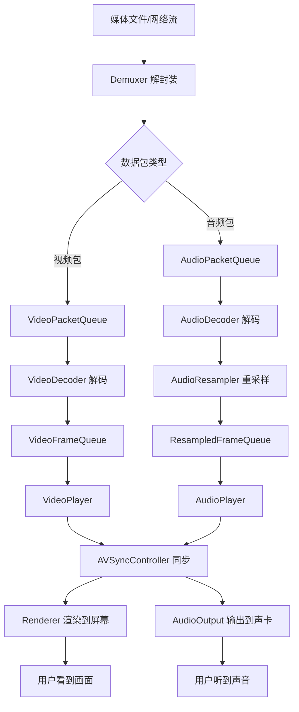

# 📐 ZenPlay 整体架构设计

> **文档版本**: v1.0  
> **最后更新**: 2025-11-18  
> **相关文档**: [核心组件详解](core_components.md) | [状态管理系统](state_management.md)

---

## 📋 文档概览

本文档从宏观视角介绍 ZenPlay 媒体播放器的整体架构设计，包括：
- 五层架构分层模型
- 核心设计原则与技术决策
- 数据流转与处理流程
- 多线程协作模型
- 关键技术亮点

**阅读建议**: 
- 首次阅读建议从头到尾完整阅读
- 深入了解各模块后，可跳转到 [核心组件详解](core_components.md)
- 了解状态机制后，可参考 [状态管理系统](state_management.md)

---

## 🏛️ 五层架构设计

ZenPlay 采用经典的分层架构设计，从上到下分为五层，每层职责清晰、依赖关系明确。

```
┌─────────────────────────────────────────────────────────────────┐
│                        Layer 1: UI 层                            │
│                      (Qt6 Widgets + QML)                         │
│  ┌──────────────┐  ┌──────────────┐  ┌──────────────────────┐  │
│  │ MainWindow   │  │VideoDisplay  │  │  ControlBar/Slider   │  │
│  │              │  │   Widget     │  │  (Play/Pause/Seek)   │  │
│  └──────────────┘  └──────────────┘  └──────────────────────┘  │
├─────────────────────────────────────────────────────────────────┤
│                     Layer 2: 应用层                              │
│                        (ZenPlayer)                               │
│  ┌──────────────────────────────────────────────────────────┐   │
│  │  • Open/Close 媒体文件                                    │   │
│  │  • Play/Pause/Stop/Seek 控制                             │   │
│  │  • SetRenderWindow 设置渲染窗口                          │   │
│  │  • 状态变更回调注册                                      │   │
│  │  • 统一的生命周期管理                                    │   │
│  └──────────────────────────────────────────────────────────┘   │
├─────────────────────────────────────────────────────────────────┤
│                      Layer 3: 核心层                             │
│                   (PlaybackController)                           │
│  ┌───────────────┐  ┌─────────────────┐  ┌─────────────────┐   │
│  │PlaybackCtrl   │  │AVSyncController │  │ BlockingQueue<T>│   │
│  │ • 线程管理    │  │ • 主时钟选择    │  │ • 线程安全队列  │   │
│  │ • 数据流协调  │  │ • 同步算法      │  │ • 生产者-消费者 │   │
│  │ • 播放控制    │  │ • 时钟更新      │  │ • 背压控制      │   │
│  └───────────────┘  └─────────────────┘  └─────────────────┘   │
├─────────────────────────────────────────────────────────────────┤
│                     Layer 4: 组件层                              │
│  ┌──────────────┐  ┌──────────────┐  ┌──────────────────────┐  │
│  │  Demuxer     │  │  Decoders    │  │   Players            │  │
│  │ • 解封装     │  │ • VideoDecoder│ │ • AudioPlayer        │  │
│  │ • 流选择     │  │ • AudioDecoder│ │ • VideoPlayer        │  │
│  │ • Seek跳转   │  │ • 硬件加速   │  │ • 播放队列管理       │  │
│  └──────────────┘  └──────────────┘  └──────────────────────┘  │
│                                                                  │
│  ┌──────────────────┐  ┌──────────────────────────────────┐    │
│  │ AudioResampler   │  │  HWDecoderContext / Renderer     │    │
│  │ • 格式转换       │  │ • D3D11设备管理 / 纹理渲染       │    │
│  │ • SIMD优化       │  │ • 零拷贝支持    / 硬件加速       │    │
│  └──────────────────┘  └──────────────────────────────────┘    │
├─────────────────────────────────────────────────────────────────┤
│                      Layer 5: 平台层                             │
│  ┌──────────────┐  ┌──────────────┐  ┌──────────────────────┐  │
│  │AudioOutput   │  │  Renderer    │  │  Threading           │  │
│  │• WASAPI(Win) │  │ • SDL2渲染器 │  │ • std::thread        │  │
│  │• ALSA(Linux) │  │ • D3D11渲染器│  │ • std::atomic        │  │
│  │• CoreAudio   │  │ • 零拷贝渲染 │  │ • std::mutex/cv      │  │
│  │  (macOS)     │  │              │  │ • BlockingQueue      │  │
│  └──────────────┘  └──────────────┘  └──────────────────────┘  │
└─────────────────────────────────────────────────────────────────┘
```

### 分层职责说明

| 层级 | 名称 | 核心职责 | 关键类 |
|------|------|---------|--------|
| **L1** | **UI 层** | 用户交互、界面展示 | `MainWindow`, `VideoDisplayWidget` |
| **L2** | **应用层** | 统一接口、生命周期管理 | `ZenPlayer` |
| **L3** | **核心层** | 线程协调、同步控制、数据流管理 | `PlaybackController`, `AVSyncController` |
| **L4** | **组件层** | 解封装、解码、播放、重采样 | `Demuxer`, `Decoder`, `AudioPlayer`, `VideoPlayer` |
| **L5** | **平台层** | 跨平台抽象、硬件访问 | `AudioOutput`, `Renderer` |

### 架构优势

1. **职责分离**: 每层只关注自己的职责，降低耦合
2. **依赖单向**: 上层依赖下层，下层不依赖上层，避免循环依赖
3. **易于测试**: 每层可独立测试，平台层可 Mock
4. **跨平台支持**: 平台差异封装在最底层
5. **易于扩展**: 新增功能只需在对应层实现

---

## 🎯 核心设计原则

### 1. **单一职责原则 (SRP)**

每个类/模块只负责一项明确的职责：

- `ZenPlayer`: 统一对外接口，不涉及具体实现
- `PlaybackController`: 协调所有线程，不处理具体解码
- `AudioPlayer`: 管理音频播放队列，不负责重采样
- `AudioResampler`: 独立的重采样模块，不涉及播放逻辑

### 2. **依赖倒置原则 (DIP)**

依赖抽象接口，而非具体实现：

```cpp
// 抽象接口
class Renderer {
 public:
  virtual Result<void> Init(void* window_handle, int width, int height) = 0;
  virtual bool RenderFrame(AVFrame* frame) = 0;
  virtual void Clear() = 0;
  virtual void Present() = 0;
  // ...
};

// 具体实现
class SDL2Renderer : public Renderer { /*...*/ };
class D3D11Renderer : public Renderer { /*...*/ };
```

类似的抽象还有：
- `AudioOutput` (WASAPI、ALSA、CoreAudio)
- `Decoder` (VideoDecoder、AudioDecoder)

### 3. **关注点分离 (SoC)**

**音视频对称设计** - AudioPlayer 和 VideoPlayer 地位平等：

```cpp
class PlaybackController {
 private:
  std::unique_ptr<AudioPlayer> audio_player_;  // 音频播放器
  std::unique_ptr<VideoPlayer> video_player_;  // 视频播放器
  std::unique_ptr<AVSyncController> av_sync_controller_;  // 同步控制器
};
```

两者都：
- 拥有独立的帧队列 (`BlockingQueue<T>`)
- 拥有独立的线程 (AudioCallback、VideoRenderThread)
- 实现相同的控制接口 (`Start/Stop/Pause/Resume`)
- 通过 `AVSyncController` 协作同步

### 4. **状态管理统一化**

使用 `PlayerStateManager` 作为**单一状态源 (Single Source of Truth)**：

```cpp
// 所有组件共享同一个状态管理器
class PlaybackController {
  std::shared_ptr<PlayerStateManager> state_manager_;
};

class AudioPlayer {
  PlayerStateManager* state_manager_;  // 引用（不拥有）
};

class VideoPlayer {
  PlayerStateManager* state_manager_;  // 引用（不拥有）
};
```

**优势**:
- 避免状态不一致
- 线程安全的状态查询和转换
- 统一的状态变更通知
- 详见 [状态管理系统](state_management.md)

### 5. **现代 C++ 最佳实践**

- **智能指针**: `std::unique_ptr`、`std::shared_ptr` 管理资源
- **RAII**: 资源获取即初始化，自动释放
- **原子操作**: `std::atomic` 保证线程安全
- **移动语义**: `std::move` 避免不必要的拷贝
- **Result<T> 模式**: 类型安全的错误处理 

```cpp
// Result<T> 错误传播示例
Result<void> ZenPlayer::Open(const std::string& url) {
  return demuxer_->Open(url)
      .AndThen([this]() { return InitializeVideoRenderingPipeline(); })
      .AndThen([this]() { return InitializeAudioDecoder(); })
      .AndThen([this]() { 
        playback_controller_ = std::make_unique<PlaybackController>(...);
        return Result<void>::Ok();
      })
      .MapErr([this](ErrorCode code) {
        CleanupResources();
        return code;
      });
}
```

[ResultT详细使用指南](result_quick_reference.md)

---

## 🔄 数据流转全流程

### 整体流程图




## 🧵 多线程协作模型

ZenPlay 使用 **5 个核心线程** 协同工作，通过 `BlockingQueue` 实现生产者-消费者模式。

### 线程架构图

```
┌──────────────────────────────────────────────────────────────┐
│                     Main Thread (UI)                         │
│  • 用户交互处理                                               │
│  • 状态变更回调                                               │
│  • RendererProxy 跨线程调用                                   │
└──────────────────────────────────────────────────────────────┘
           │
           ▼
┌──────────────────────────────────────────────────────────────┐
│                  PlaybackController                          │
│                   (管理所有工作线程)                          │
└──────────────────────────────────────────────────────────────┘
    │          │          │          │          │
    ▼          ▼          ▼          ▼          ▼
┌─────────┐ ┌─────────┐ ┌─────────┐ ┌─────────┐ ┌─────────────┐
│ Demux   │ │Video    │ │Audio    │ │Video    │ │Audio        │
│ Thread  │ │Decode   │ │Decode   │ │Render   │ │Callback     │
│         │ │Thread   │ │Thread   │ │Thread   │ │(系统驱动)   │
└─────────┘ └─────────┘ └─────────┘ └─────────┘ └─────────────┘
    │          │          │          │          │
    ▼          ▼          ▼          ▼          ▼
┌─────────┐ ┌─────────┐ ┌─────────┐ ┌─────────┐ ┌─────────────┐
│Video    │ │Video    │ │Audio    │ │Renderer │ │AudioOutput  │
│Packet   │ │Frame    │ │Frame    │ │         │ │             │
│Queue    │ │Queue    │ │Queue    │ │         │ │             │
└─────────┘ └─────────┘ └─────────┘ └─────────┘ └─────────────┘
```

### 线程详细说明

| 线程名称 | 创建者 | 生命周期 | 核心职责 |
|---------|--------|---------|---------|
| **DemuxTask** | `PlaybackController` | Start() → Stop() | 解封装，数据包分发 |
| **VideoDecodeTask** | `PlaybackController` | Start() → Stop() | 视频解码，零拷贝验证 |
| **AudioDecodeTask** | `PlaybackController` | Start() → Stop() | 音频解码 + 预重采样 |
| **VideoRenderThread** | `VideoPlayer` | Init() → Stop() | 视频渲染，时序控制 |
| **AudioCallback** | `AudioOutput` | Start() → Stop() | 音频输出，时钟更新 |
| **SyncControlTask** | `PlaybackController` | Start() → Stop() | 同步监控，统计上报 |
| **SeekTask** | `PlaybackController` | Start() → Stop() | 异步 Seek 处理 |


#### 2. **PlayerStateManager 状态同步**

```cpp
// 线程安全的状态查询
bool should_stop = state_manager_->ShouldStop();

// 暂停时等待恢复
if (state_manager_->ShouldPause()) {
  state_manager_->WaitForResume();  // 阻塞直到 Resume()
}
```

详见 [状态管理系统](state_management.md)

#### 3. **AVSyncController 时钟同步**

```cpp
// AudioCallback 更新主时钟
av_sync_controller_->UpdateAudioClock(audio_pts);

// VideoPlayer 查询主时钟
double master_clock = av_sync_controller_->GetMasterClock();
double delay = video_pts - master_clock;
```

---

## 🎨 关键技术亮点

### 1. **零拷贝硬件加速渲染**

**问题**: 传统软件解码 + CPU 拷贝耗费大量性能

**解决方案**: 硬件解码与硬件渲染共享 D3D11 设备

```cpp
// 1. 创建共享的 D3D11 设备
auto hw_context = std::make_unique<HWDecoderContext>();
hw_context->Initialize(HWDecoderType::kD3D11VA, codec_id, width, height);

// 2. VideoDecoder 使用硬件解码
video_decoder_->Open(codec_params, nullptr, hw_context.get());

// 3. D3D11Renderer 直接访问硬件帧的纹理
ID3D11Texture2D* texture = hw_context->GetD3D11Texture(frame);
device_context->CopyResource(render_texture, texture);  // GPU 内部拷贝
```

**性能提升**:
- CPU 占用降低 30-50%
- 4K 视频流畅播放
- 降低功耗

### 2. **音频预重采样架构**

**问题**: 在音频回调中重采样会阻塞实时线程

**解决方案**: 在解码线程完成重采样

```cpp
// AudioDecodeTask (解码线程)
auto frame = audio_decoder_->ReceiveFrame();
auto resampled = audio_resampler_->Resample(frame);  // ← 在这里重采样
audio_player_->PushFrame(std::move(resampled));

// FillAudioBuffer (音频回调)
std::memcpy(stream, frame.data, len);  // ← 仅拷贝，不做任何处理
```

**优势**:
- 音频回调延迟降低 90%
- 避免 Underrun (音频断续)
- SIMD 优化有充足时间

### 3. **渲染路径智能选择**

**问题**: 不同平台、不同硬件支持的加速方式不同

**解决方案**: `RenderPathSelector` 自动检测并降级

```cpp
auto selection = RenderPathSelector::Select(codec_id, width, height);

// 选择逻辑:
// Windows: D3D11VA → DXVA2 → SDL2 软件渲染
// Linux:   VA-API → SDL2 软件渲染
// macOS:   VideoToolbox → SDL2 软件渲染
```

**关键特性**:
- 配置驱动（可通过配置文件强制软件渲染）
- 自动降级（硬件失败时回退）
- 零拷贝验证（检测是否真正实现零拷贝）

### 4. **统一的错误处理 Result<T>**

**问题**: 传统 C++ 错误处理混乱（返回值、异常、错误码）

**解决方案**: 使用 `Result<T>` 类型安全的错误传播

```cpp
// 链式错误处理
return demuxer_->Open(url)
    .AndThen([this]() { return InitializeVideoRenderingPipeline(); })
    .AndThen([this]() { return InitializeAudioDecoder(); })
    .MapErr([this](ErrorCode code) {
      CleanupResources();  // 自动清理
      return code;
    });
```

**优势**:
- 类型安全，编译期检查
- 强制错误处理
- 自动资源清理（RAII）

### 5. **异步 Seek 机制**

**问题**: 同步 Seek 会阻塞 UI 线程

**解决方案**: 专用 Seek 线程 + 请求队列

```cpp
// SeekAsync 立即返回
void PlaybackController::SeekAsync(int64_t timestamp_ms, bool backward) {
  seek_request_queue_.Push(SeekRequest{timestamp_ms, backward, current_state});
}

// SeekTask 在后台处理
void PlaybackController::SeekTask() {
  while (!should_stop) {
    auto request = seek_request_queue_.Pop();
    ExecuteSeek(request);  // 执行 Seek（可能耗时）
  }
}
```

**优势**:
- UI 永不卡顿
- 支持 Seek 请求队列（合并连续 Seek）
- 状态恢复（Seek 后自动恢复 Playing/Paused）

---

## 🔗 相关文档

深入了解各个模块的实现细节：

### 核心架构
- [核心组件详解](core_components.md) - ZenPlayer、PlaybackController 等核心类的详细设计
- [状态管理系统](state_management.md) - PlayerStateManager 的状态机设计与实现

### 音视频同步
- [音视频同步原理与实现](av_sync_design.md) - 同步算法、时钟管理、丢帧策略

### 渲染与解码
- [渲染路径选择器设计](render_path_selector.md) - 智能选择硬件加速方案
- [零拷贝渲染详解](zero_copy_rendering.md) - 硬件解码与渲染的协同
- [解码器设计](decoder_design.md) - VideoDecoder、AudioDecoder 实现

### 线程与同步
- [线程模型详解](threading_model.md) - 5 个核心线程的详细说明
- [Seek 专用线程](seek_thread.md) - 异步 Seek 实现

### 配置与日志
- [全局配置系统](global_config.md) - GlobalConfig 配置管理
- [日志系统架构](logging_system.md) - LogManager 与 spdlog 集成

### 其他组件
- [ResultT设计](result_design.md)
- [BlockingQueue设计](blocking_queue_design.md)
- [Timer设计](timer_design.md)

---

## 📝 总结

ZenPlay 的架构设计体现了以下核心思想：

1. **清晰的分层**: 五层架构确保职责分离和依赖单向
2. **对称的设计**: 音视频播放器地位平等，便于理解和维护
3. **统一的状态管理**: 避免状态不一致的常见问题
4. **现代化的 C++**: 充分利用 C++17 特性提升代码质量
5. **性能优化**: 零拷贝、预重采样、硬件加速等多项优化
