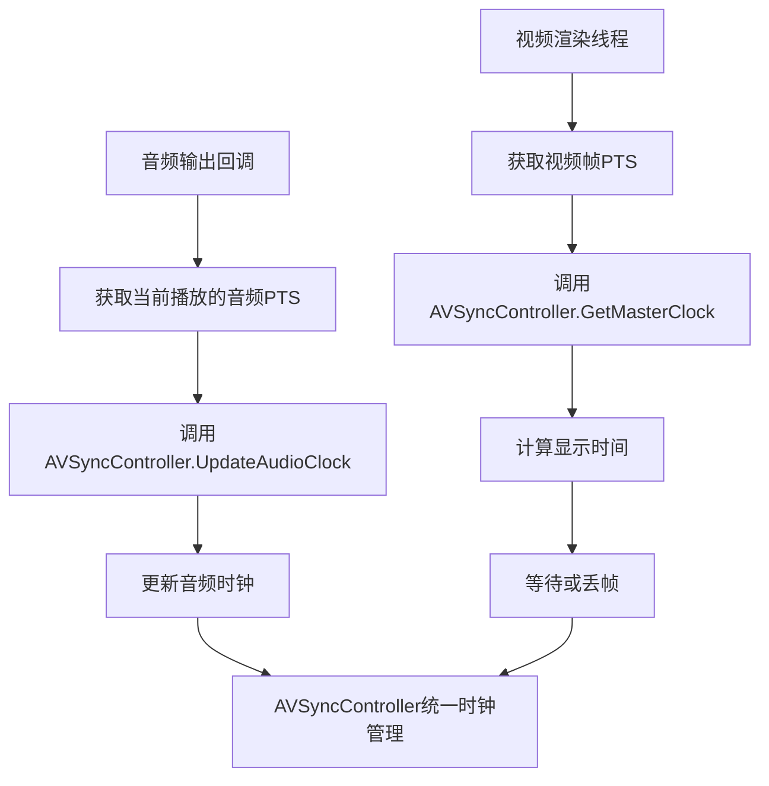

# 🎵🎬 ZenPlay音视频同步机制深度分析

## 🚨 **当前设计的核心问题**

经过深入分析，我发现了几个严重的音视频同步设计问题：

### 1. **AudioPlayer缺失同步机制** ❌
```cpp
// PlaybackController试图这样做：
audio_player_ = std::make_unique<AudioPlayer>(av_sync_controller_.get()); // ❌ 编译错误

// 但AudioPlayer构造函数是：
AudioPlayer::AudioPlayer()  // 不接受任何参数！
```

### 2. **同步责任不明确** ⚠️
- AudioPlayer: 没有使用AVSyncController，无法更新音频时钟
- VideoPlayer: 有AVSyncController，但只能被动获取时钟
- AVSyncController: 设计完善，但没有被正确使用

### 3. **时钟更新缺失** 💔
```cpp
// AudioPlayer的音频输出回调中应该有：
void AudioOutputCallback() {
    // 播放音频数据...
    
    // ❌ 缺失：更新音频时钟
    // av_sync_controller_->UpdateAudioClock(audio_pts_ms, current_time);
}
```

---

## 🎯 **音视频同步的正确设计思路**

### 核心原理
```
音频时钟 = 播放基准 (Master Clock)
    ↓
视频根据音频时钟调整显示时间
    ↓
实现音视频同步
```

### 为什么音频作为主时钟？
1. **稳定性**: 音频播放由硬件驱动，时钟更稳定
2. **连续性**: 音频不能丢帧，必须连续播放
3. **感知度**: 人耳对音频断续更敏感
4. **行业标准**: 几乎所有专业播放器都采用音频主时钟

---

## 🔧 **正确的同步架构设计**

### 1. **时钟更新流程**


### 2. **AudioPlayer应该这样设计**
```cpp
class AudioPlayer {
public:
    // ✅ 构造函数应该接受AVSyncController
    AudioPlayer(AVSyncController* sync_controller = nullptr);
    
private:
    AVSyncController* av_sync_controller_;
    
    // ✅ 音频输出回调中更新时钟
    static int AudioOutputCallback(void* user_data, uint8_t* buffer, int buffer_size) {
        AudioPlayer* player = static_cast<AudioPlayer*>(user_data);
        
        // 填充音频数据...
        int filled = player->FillAudioBuffer(buffer, buffer_size);
        
        // 🎯 关键：更新音频时钟
        if (player->av_sync_controller_ && player->current_frame_) {
            double audio_pts_ms = player->CalculateCurrentAudioPTS();
            auto now = std::chrono::steady_clock::now();
            player->av_sync_controller_->UpdateAudioClock(audio_pts_ms, now);
        }
        
        return filled;
    }
    
    // ✅ 计算当前播放位置的PTS
    double CalculateCurrentAudioPTS() const {
        // 基于已播放的采样数计算PTS
        // PTS = base_pts + (samples_played / sample_rate) * 1000
    }
};
```

### 3. **VideoPlayer的同步使用**
```cpp
// VideoPlayer渲染线程中：
void VideoPlayer::VideoRenderThread() {
    while (!should_stop_) {
        VideoFrame video_frame;
        if (!GetNextFrame(video_frame)) continue;
        
        // 🎯 使用AVSyncController计算显示时间
        if (av_sync_controller_) {
            double video_pts_ms = video_frame.timestamp.ToMilliseconds();
            auto current_time = std::chrono::steady_clock::now();
            
            // 获取主时钟（音频时钟）
            double master_clock_ms = av_sync_controller_->GetMasterClock(current_time);
            
            // 计算同步偏移
            double sync_offset_ms = video_pts_ms - master_clock_ms;
            
            // 同步决策
            if (sync_offset_ms > 80.0) {
                // 视频严重超前，丢帧
                continue;
            } else if (sync_offset_ms > 0) {
                // 视频轻微超前，延迟显示
                auto delay = std::chrono::milliseconds(static_cast<int>(sync_offset_ms));
                std::this_thread::sleep_for(delay);
            }
            // 如果sync_offset_ms < 0，表示视频落后，立即显示
            
            // 更新视频时钟
            av_sync_controller_->UpdateVideoClock(video_pts_ms, current_time);
        }
        
        // 渲染视频帧
        RenderFrame(video_frame);
    }
}
```

---

## 🛠️ **修复方案**

### Step 1: 修复AudioPlayer构造函数
```cpp
// audio_player.h
class AudioPlayer {
public:
    AudioPlayer(AVSyncController* sync_controller = nullptr);
    
private:
    AVSyncController* av_sync_controller_;
    AVFramePtr current_frame_;  // 当前播放的帧
    double base_pts_ms_;        // 基准PTS
    size_t samples_played_;     // 已播放的采样数
};
```

### Step 2: 在音频回调中更新时钟
```cpp
// audio_player.cpp
int AudioPlayer::AudioOutputCallback(void* user_data, uint8_t* buffer, int buffer_size) {
    AudioPlayer* player = static_cast<AudioPlayer*>(user_data);
    
    int filled = player->FillAudioBuffer(buffer, buffer_size);
    
    // 🎯 更新音频时钟
    if (player->av_sync_controller_ && filled > 0) {
        // 计算当前播放位置的PTS
        int samples_in_buffer = filled / (player->output_spec_.channels * 
                                         player->output_spec_.bits_per_sample / 8);
        player->samples_played_ += samples_in_buffer;
        
        double current_audio_pts = player->base_pts_ms_ + 
            (double(player->samples_played_) / player->output_spec_.sample_rate) * 1000.0;
            
        auto now = std::chrono::steady_clock::now();
        player->av_sync_controller_->UpdateAudioClock(current_audio_pts, now);
    }
    
    return filled;
}
```

### Step 3: 在PushFrame时更新基准PTS
```cpp
bool AudioPlayer::PushFrame(AVFramePtr frame) {
    if (!frame) return false;
    
    // 🎯 更新基准PTS
    if (frame->pts != AV_NOPTS_VALUE) {
        // 获取时间基准
        double pts_ms = frame->pts * av_q2d(time_base_) * 1000.0;
        base_pts_ms_ = pts_ms;
        samples_played_ = 0;  // 重置已播放采样数
    }
    
    std::lock_guard<std::mutex> lock(frame_queue_mutex_);
    if (frame_queue_.size() >= MAX_QUEUE_SIZE) {
        return false;  // 队列满
    }
    
    frame_queue_.push(std::move(frame));
    frame_available_.notify_one();
    return true;
}
```

---

## 📊 **同步效果分析**

### 理想同步状态
```
时间轴: ───────────────────────────────────────→

音频时钟: ♪─────♪─────♪─────♪─────♪─────♪─────♪
         100ms  200ms  300ms  400ms  500ms  600ms

视频帧:   🎬─────🎬─────🎬─────🎬─────🎬─────🎬
         100ms  133ms  167ms  200ms  233ms  267ms
         
同步偏移:  0ms   -67ms  -133ms -200ms -267ms -333ms
         ✅同步   ✅同步   ⚠️延迟   ❌丢帧   ❌丢帧   ❌丢帧
```

### 同步决策逻辑
```cpp
if (sync_offset_ms > 80.0) {
    // 视频超前80ms以上 → 丢帧
    action = "DROP_FRAME";
} else if (sync_offset_ms > 20.0) {
    // 视频超前20-80ms → 延迟显示
    action = "DELAY_DISPLAY";
    delay_ms = sync_offset_ms;
} else if (sync_offset_ms < -100.0) {
    // 视频落后100ms以上 → 立即显示
    action = "IMMEDIATE_DISPLAY";
} else {
    // 同步范围内 → 正常显示
    action = "NORMAL_DISPLAY";
}
```

---

## 🎨 **AVSyncController的作用**

### 1. **统一时钟管理**
```cpp
AVSyncController {
    ├── AudioClock → 主时钟，由音频播放驱动
    ├── VideoClock → 跟随时钟，用于统计
    └── SystemClock → 备用时钟，用于纯音频播放
}
```

### 2. **提供同步算法**
- `GetMasterClock()` → 获取当前主时钟时间
- `CalculateVideoDelay()` → 计算视频延迟
- `ShouldDropVideoFrame()` → 判断是否丢帧
- `ShouldRepeatVideoFrame()` → 判断是否重复帧

### 3. **同步质量监控**
```cpp
SyncStats {
    double sync_offset_ms;      // 当前偏移
    double avg_sync_error_ms;   // 平均误差
    double max_sync_error_ms;   // 最大误差
    int64_t sync_corrections;   // 校正次数
    bool is_in_sync();          // 是否同步
    const char* sync_quality(); // 同步质量
}
```

---

## 🚀 **总结**

### AudioPlayer必须使用AVSyncController的原因：
1. **作为主时钟源** - 音频播放是整个同步系统的基准
2. **提供时钟更新** - 只有音频播放知道真实的播放进度
3. **统一同步接口** - 与VideoPlayer使用相同的同步机制
4. **质量监控** - 统计和监控整体同步质量

### 没有AVSyncController的后果：
- ❌ 无法实现音视频同步
- ❌ 视频播放时间混乱
- ❌ 无法进行同步质量监控
- ❌ 架构设计不一致

**结论**: AudioPlayer绝对需要使用AVSyncController，它是整个音视频同步系统的核心组件！🎯
