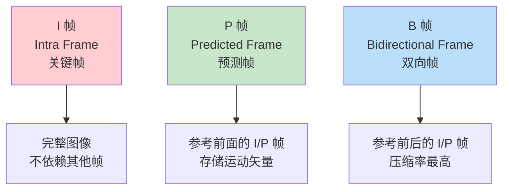

# 02. 视频编码原理：为什么 1 小时电影只有几百 MB

> **专栏导读**：上一篇我们了解了播放器的工作流程，这一篇深入视频压缩的魔法世界。你会发现，1 小时电影从 500GB 压缩到 1GB，背后竟然藏着如此精妙的数学和心理学。

---

## 🤔 开场：一个惊人的数字

让我们算一笔账：

```
未压缩视频的大小 = 分辨率 × 帧率 × 色彩深度 × 时长

1080p 视频（1 小时）:
= 1920 × 1080 像素              （分辨率）
× 30 帧/秒                       （帧率）
× 24 bit/像素                    （RGB 各 8 位）
× 3600 秒                        （1 小时）
= 5,970,432,000,000 bit
≈ 746 GB 😱
```

但你下载的电影通常只有 **1-2 GB**，压缩比高达 **400 倍**！

**这是怎么做到的？** 🪄

---

## 🎯 核心思想：视频中 95% 的信息是冗余的

视频编码器像一个聪明的打包工，会扔掉大部分"废话"：

### 冗余类型 1：空间冗余（同一帧内）

**观察这张图片**：

📊 **配图位置 1：空间冗余示意图**
> **可灵 AI 绘图提示词**：
> ```
> 一张风景照片，蓝天部分用网格划分成多个小块，相邻的蓝天格子用箭头连接，箭头上标注"相似"二字，底部文字"空间冗余：相邻像素高度相似"，干净的教学插图风格
> ```

**发现了吗？**
- 天空的蓝色，左边和右边**几乎一样**
- 草地的绿色，相邻像素**差别很小**

**传统存储**：
```
像素1: RGB(135, 206, 250)  蓝色
像素2: RGB(135, 206, 250)  蓝色
像素3: RGB(136, 206, 250)  蓝色（几乎一样）
... 重复 100 万次
```

**聪明的做法**：
```
"这一片天空都是 RGB(135, 206, 250)，只有第 3 个像素稍微亮一点 (+1)"
```

节省了 **90%** 的存储！这就是 **帧内预测（Intra Prediction）**。

---

### 冗余类型 2：时间冗余（相邻帧之间）

**观察这两帧**：

📊 **配图位置 2：时间冗余示意图**
> **可灵 AI 绘图提示词**：
> ```
> 两张并排的视频帧截图，左边标注"第100帧"，右边标注"第101帧"，两帧内容几乎相同，只有一个人物向右移动了一小步，用红色箭头标注人物的移动方向，底部文字"时间冗余：相邻帧高度相似"，技术说明图风格
> ```

**发现了吗？**
- 30fps 视频，相邻两帧间隔只有 **0.033 秒**
- 除了移动的人物，背景**完全一样**

**传统存储**：
```
第 100 帧: 存储完整画面（2MB）
第 101 帧: 存储完整画面（2MB）
第 102 帧: 存储完整画面（2MB）
```

**聪明的做法**：
```
第 100 帧: 存储完整画面（2MB）
第 101 帧: "背景不变，人物向右移动 10 像素"（5KB）
第 102 帧: "背景不变，人物向右移动 10 像素"（5KB）
```

节省了 **99.75%** 的存储！这就是 **帧间预测（Inter Prediction）**。

---

### 冗余类型 3：视觉冗余（人眼察觉不到的）

人眼有个特点：**对细节不敏感**。

📊 **配图位置 3：视觉冗余对比图**
> **可灵 AI 绘图提示词**：
> ```
> 左右对比图，左侧是原始高清照片标注"原图 10MB"（中文），右侧是轻微压缩后的照片标注"压缩后 1MB"（中文），两张图几乎看不出差别，中间用等号连接，底部文字"人眼几乎无法分辨"（中文），对比测试图风格，16:9
> ```

**编码器的策略**：
- 保留**主要轮廓**和**明显颜色变化**
- 丢弃**细微纹理**和**高频噪声**

这就像 MP3 音频删掉人耳听不见的高频，H.264 视频删掉人眼看不清的细节。

---

## 🧩 H.264 编码的三大武器

H.264（也叫 AVC）是目前最流行的视频编码标准，它用三大技术实现压缩：


---

## 🔧 武器 1：帧内预测（Intra Prediction）

**目标**：压缩单张图像内的空间冗余。

### 原理：预测 + 差值

**步骤**：
1. 把图像分成 **4×4 或 16×16 的小块**（宏块）
2. 用**已编码的相邻块**预测当前块的内容
3. 只存储**预测值和实际值的差**

📊 **配图位置 4：帧内预测原理图**
> **可灵 AI 绘图提示词**：
> ```
> 技术示意图，一个16×16像素的方块被分成4个小块，左上角的小块已填充蓝色标注"已编码"（中文），右上角的小块用虚线表示，旁边有箭头指向它，箭头上写"根据左边预测"（中文），底部显示公式"实际值 - 预测值 = 残差"（中文），清爽的教学图风格，白色背景，16:9
> ```

**举例**：
```
已编码块（左边）: 平均亮度 = 128
当前块预测值: 128（假设和左边一样）
当前块实际值: 130
只需存储: +2（差值）
```

**9 种预测模式**：

| 模式编号 | 模式名称 | 适用场景 |
|---------|---------|---------|
| 0 | DC（平均值） | 平坦区域（天空、墙壁） |
| 1 | Horizontal | 水平纹理（百叶窗） |
| 2 | Vertical | 垂直纹理（栅栏） |
| 3-8 | Diagonal | 斜向纹理（斜坡） |

编码器会**自动选择**误差最小的模式。

---

## 🎬 武器 2：帧间预测（Inter Prediction）

**目标**：利用相邻帧的相似性，只存储变化部分。

### 关键技术：运动估计（Motion Estimation）

**核心思想**：这一帧的内容，可能只是上一帧的"平移版本"。

📊 **配图位置 5：运动估计示意图**
> **可灵 AI 绘图提示词**：
> ```
> 动画风格示意图，左侧是"参考帧"（中文标注），显示一个蓝色小球在左边，右侧是"当前帧"（中文标注），同样的小球出现在右边，两个小球之间用红色箭头连接，箭头上标注"运动矢量 (+10, 0)"（中文），底部文字"只需存储运动信息，无需重复编码"（中文），简洁的动画教学风格，16:9
> ```

**步骤**：
1. 在**参考帧**中搜索最匹配的块
2. 记录**运动矢量**（偏移量）
3. 只存储**运动矢量 + 残差**

**示例**：
```
当前帧的块: 小球在坐标 (100, 50)
参考帧中找到: 小球在坐标 (90, 50)
存储: 运动矢量 (+10, 0) + 少量残差
```

---

### I/P/B 帧：三种不同的编码帧

H.264 把视频分成三种帧类型：



**详细对比**：

| 帧类型 | 中文名 | 依赖关系 | 压缩率 | 大小比例 | 解码难度 |
|-------|--------|---------|-------|---------|---------|
| **I 帧** | 关键帧 | 不依赖其他帧 | 低 | 1.0× | 简单 |
| **P 帧** | 前向预测帧 | 依赖前面的 I/P 帧 | 中 | 0.2-0.3× | 中等 |
| **B 帧** | 双向预测帧 | 依赖前后的 I/P/B 帧 | 高 | 0.1-0.15× | 复杂 |

**📊 配图位置 6：I/P/B 帧序列图**
> **可灵 AI 绘图提示词**：
> ```
> 时间轴示意图，从左到右排列12个方框代表视频帧，第1、7帧标注"I"用红色表示，第2、3、5、6、8、9、11、12帧标注"P"用绿色表示，第4、10帧标注"B"用蓝色表示，每个B帧向前后都有箭头指向相邻的I/P帧，底部文字"GOP结构示例"，技术时间轴风格
> ```

**举例**：
```
帧序列: I P B P B P I P B P B P
大小:    100KB 20KB 10KB 20KB 10KB 20KB 100KB ...

平均每帧: (100 + 20×3 + 10×2) / 6 ≈ 30KB
vs 原始: 2MB/帧
压缩比: 67 倍
```

---

### GOP（Group of Pictures）：关键帧间隔

**GOP** 是从一个 I 帧到下一个 I 帧之间的所有帧。

**常见 GOP 结构**：
```
GOP = 12, M = 3
I B B P B B P B B P B B I ...
↑                       ↑
└───── 12 帧 ──────────┘
```

**参数含义**：
- **GOP 大小**：多少帧出现一个 I 帧（常见 12、30、60）
- **M 参数**：多少个 B 帧夹在两个参考帧之间

**权衡**：
```
GOP 越大:
  优点: 压缩率更高（更多 P/B 帧）
  缺点: Seek 慢（必须从上一个 I 帧开始解码）
  
GOP 越小:
  优点: Seek 快（I 帧更多）
  缺点: 文件更大（I 帧占空间）
```

**实际应用**：
- **直播**：GOP = 1-2 秒（30-60 帧），快速响应
- **点播**：GOP = 2-10 秒，追求压缩率
- **广播**：GOP = 0.5 秒（12 帧），方便剪辑

---

## 📊 武器 3：熵编码（Entropy Coding）

**目标**：进一步压缩数据的表示形式。

**原理**：高频出现的数据用短编码，低频数据用长编码。

### CAVLC vs CABAC

H.264 提供两种熵编码方式：

| 特性 | CAVLC | CABAC |
|------|-------|-------|
| 全称 | Context-Adaptive VLC | Context-Adaptive Binary AC |
| 压缩率 | 中等 | 高（多 10-15%） |
| 复杂度 | 简单 | 复杂 |
| 解码速度 | 快 | 慢 |
| 适用场景 | 实时编码 | 离线编码 |

**类比**：
```
原始数据: AAAAABBBCCCCCCCDE
频率统计: A=5, B=3, C=7, D=1, E=1

霍夫曼编码:
  C → 0       （最常见，1 位）
  A → 10      （较常见，2 位）
  B → 110     （3 位）
  D → 1110    （4 位）
  E → 1111    （4 位）

压缩后: 0010101010...
vs 原始: AAAAA... (每个字符 8 位)
节省: 约 60%
```

---

## 🎨 完整的编码流程

让我们把三大武器串起来：


**详细步骤**：

1. **预测（Prediction）**
   - 选择帧内或帧间预测模式
   - 计算残差：实际值 - 预测值

2. **变换（Transform）**
   - DCT（离散余弦变换）
   - 把空间域转为频域

3. **量化（Quantization）**
   - 丢弃人眼不敏感的高频信息
   - 这一步是**有损压缩**的关键

4. **熵编码（Entropy Coding）**
   - CABAC 或 CAVLC
   - 无损压缩数据表示

5. **打包（Bitstream）**
   - 加上 NAL 单元头
   - 写入 SPS/PPS 参数集

---

## 💾 码率（Bitrate）与画质的平衡

**码率**：单位时间的数据量（单位：Kbps 或 Mbps）。

### 常见码率参考

| 分辨率 | 帧率 | 推荐码率（H.264） | 文件大小（1小时） |
|-------|------|------------------|------------------|
| 480p | 30fps | 1-2 Mbps | 450-900 MB |
| 720p | 30fps | 2-4 Mbps | 900-1.8 GB |
| 1080p | 30fps | 4-8 Mbps | 1.8-3.6 GB |
| 1080p | 60fps | 8-12 Mbps | 3.6-5.4 GB |
| 4K | 30fps | 15-25 Mbps | 6.8-11.3 GB |
| 4K | 60fps | 25-40 Mbps | 11.3-18 GB |

**📊 配图位置 7：码率与画质关系图**
> **可灵 AI 绘图提示词**：
> ```
> 坐标轴图表，横轴标注"码率 Bitrate (Mbps)"（英文），纵轴标注"画质 Quality (PSNR dB)"（英文），一条蓝色曲线从左下上升到右上但逐渐平缓，曲线左侧标注"欠码"（中文），中间标注"最佳区间"（中文，用绿色高亮），右侧标注"过码"（中文），图表风格简洁专业，白色背景，16:9
> ```

**三种编码模式**：

1. **CBR（Constant Bitrate）** - 固定码率
   ```
   优点: 文件大小可预测
   缺点: 静态场景浪费码率，动作场景画质差
   适用: 直播流
   ```

2. **VBR（Variable Bitrate）** - 可变码率
   ```
   优点: 画质更稳定
   缺点: 文件大小不可预测
   适用: 视频点播
   ```

3. **CRF（Constant Rate Factor）** - 恒定质量
   ```
   优点: 保证视觉质量
   参数: 0-51（18-28 最常用）
   适用: 离线编码
   ```

---

## 🛠️ 实战：FFmpeg 编码命令

### 实验 1：对比不同码率的效果

```bash
# 原始视频信息
ffprobe input.mp4

# 低码率编码（1 Mbps）
ffmpeg -i input.mp4 -c:v libx264 -b:v 1M -c:a aac output_1M.mp4

# 中等码率编码（4 Mbps）
ffmpeg -i input.mp4 -c:v libx264 -b:v 4M -c:a aac output_4M.mp4

# 高码率编码（10 Mbps）
ffmpeg -i input.mp4 -c:v libx264 -b:v 10M -c:a aac output_10M.mp4

# 查看文件大小
ls -lh output_*.mp4
```

**预期结果**：
```
output_1M.mp4  →  60 MB  （画质一般，压缩块明显）
output_4M.mp4  →  240 MB （画质良好，推荐）
output_10M.mp4 →  600 MB （画质优秀，但体积大）
```

---

### 实验 2：使用 CRF 模式（推荐）

```bash
# CRF 模式（自动调节码率，保证质量）
ffmpeg -i input.mp4 -c:v libx264 -crf 23 -preset medium output_crf23.mp4

# 不同 CRF 值对比
ffmpeg -i input.mp4 -c:v libx264 -crf 18 -preset slow output_crf18.mp4   # 高质量
ffmpeg -i input.mp4 -c:v libx264 -crf 28 -preset fast output_crf28.mp4   # 低质量
```

**CRF 值建议**：
```
0-17:  视觉无损（文件极大）
18-23: 高质量（推荐用于存档）
23-28: 中等质量（推荐用于网络分发）
28-51: 低质量（不推荐）
```

---

### 实验 3：调整 GOP 大小

```bash
# 默认 GOP（通常 250 帧）
ffmpeg -i input.mp4 -c:v libx264 -crf 23 output_default.mp4

# 小 GOP（30 帧 = 1 秒）
ffmpeg -i input.mp4 -c:v libx264 -crf 23 -g 30 output_gop30.mp4

# 大 GOP（300 帧 = 10 秒）
ffmpeg -i input.mp4 -c:v libx264 -crf 23 -g 300 output_gop300.mp4

# 测试 Seek 速度
ffmpeg -ss 00:01:30 -i output_gop30.mp4 -frames:v 1 frame_gop30.jpg
ffmpeg -ss 00:01:30 -i output_gop300.mp4 -frames:v 1 frame_gop300.jpg
```

**观察**：
- `gop30.mp4` 文件更大，但 Seek 更快
- `gop300.mp4` 文件更小，但 Seek 需要解码更多帧

---

### 实验 4：查看帧类型分布

```bash
# 分析视频的帧类型
ffprobe -select_streams v -show_frames -show_entries frame=pict_type \
        -of csv output.mp4 | head -30

# 统计 I/P/B 帧数量
ffprobe -select_streams v -show_frames -show_entries frame=pict_type \
        -of csv output.mp4 | grep -v "frame" | sort | uniq -c
```

**输出示例**：
```
frame,I
frame,P
frame,B
frame,B
frame,P
frame,B
frame,B
...

统计结果:
  45 I  （关键帧）
  680 P （预测帧）
  1275 B（双向帧）
```

---

## 📈 H.264 vs H.265 vs AV1

新一代编码器的对比：

| 特性 | H.264 (AVC) | H.265 (HEVC) | AV1 |
|------|------------|-------------|-----|
| 发布年份 | 2003 | 2013 | 2018 |
| 压缩效率 | 基准 | +50% | +30%（相比H.265） |
| 编码速度 | 快 | 中等 | 慢 |
| 解码速度 | 快 | 中等 | 慢 |
| 硬件支持 | 广泛 | 较广泛 | 新设备 |
| 专利费用 | 已过期 | 高昂 | 免费 |
| 适用场景 | 通用 | 4K/8K | YouTube/Netflix |

**同等画质下的码率对比**（1080p）：
```
H.264: 8 Mbps
H.265: 4 Mbps  （节省 50%）
AV1:   3 Mbps  （节省 62.5%）
```

---

## 🧠 深入理解：为什么 B 帧压缩率最高？

**B 帧的秘密**：可以参考**前后两个方向**的帧。

📊 **配图位置 8：B 帧双向预测图**
> **可灵 AI 绘图提示词**：
> ```
> 三张视频帧排成一行，左边标注"前参考帧 I"（中文），中间标注"当前帧 B"（中文），右边标注"后参考帧 P"（中文），从左边帧和右边帧分别有蓝色和绿色箭头指向中间的B帧，底部文字"双向运动补偿：选择最佳预测方向"（中文），技术示意图风格，16:9
> ```

**示例场景**：一个球从左飞到右

```
第 10 帧（I 帧）: 球在左边
第 11 帧（B 帧）: 球在中间
第 12 帧（P 帧）: 球在右边

B 帧的选择:
  方案1: 参考第 10 帧（前向）→ 运动矢量 (+50, 0)
  方案2: 参考第 12 帧（后向）→ 运动矢量 (-50, 0)
  方案3: 同时参考两帧（双向）→ 平均预测，残差最小 ✅

编码器选择方案3，压缩率最高！
```

---

## 🎓 思考题

**Q1**：为什么直播流通常不使用 B 帧？

<details>
<summary>点击查看答案</summary>

因为 B 帧需要**未来的帧**作为参考，这会引入额外的**编码延迟**：

```
不使用 B 帧:
  编码延迟: 1 帧（33ms）
  适合: 实时直播

使用 B 帧:
  编码延迟: 3-5 帧（100-167ms）
  适合: 点播视频
```

直播追求低延迟，所以通常只用 I 帧和 P 帧（GOP 结构：I P P P I P P P ...）。
</details>

---

**Q2**：如果视频是纯黑画面（全是 RGB(0,0,0)），理论上能压缩到多小？

<details>
<summary>点击查看答案</summary>

**接近 0 字节**！因为：

1. **帧内预测**：整个画面都是黑色，预测完美，残差为 0
2. **帧间预测**：每一帧都和前一帧一样，运动矢量为 0
3. **熵编码**：大量重复的 0 值，压缩率极高

实际测试：
```bash
# 生成 10 秒纯黑视频
ffmpeg -f lavfi -i color=c=black:s=1920x1080:d=10 -c:v libx264 black.mp4

# 文件大小约 10KB（几乎全是容器开销和元数据）
ls -lh black.mp4
# 10K black.mp4
```

对比：未压缩视频应该是 **3.7 GB**！
</details>

---

**Q3**：为什么游戏录屏的视频文件比电影大得多？

<details>
<summary>点击查看答案</summary>

因为游戏画面**变化剧烈**，**时间冗余少**：

```
电影场景:
  - 大量静态镜头（对话、风景）
  - 镜头切换相对缓慢
  - P/B 帧压缩效率高

游戏录屏:
  - 快速移动、旋转（FPS 游戏）
  - 大量粒子特效（爆炸、烟雾）
  - 屏幕每一帧都有变化
  - P/B 帧压缩效率低，更多依赖 I 帧
```

**实测对比**（1080p 30fps）：
```
电影: 4 Mbps → 1.8 GB/小时
游戏: 15 Mbps → 6.8 GB/小时（高 3.7 倍）
```

**解决方案**：
- 使用 NVENC（NVIDIA GPU 编码器）
- 降低分辨率或帧率
- 使用 H.265 或 AV1 编码
</details>

---

## 📚 下一篇预告

下一篇《音频编码原理：人耳听不见的频率都被删掉了》，我们将探索：
- 音频采样和量化
- 心理声学模型（为什么 MP3 只有原始大小的 1/10）
- AAC 和 MP3 的区别
- 如何用 FFmpeg 分析音频频谱

敬请期待！🎵

---

## 🔗 相关资源

- **H.264 官方标准**：ISO/IEC 14496-10
- **FFmpeg H.264 编码指南**：https://trac.ffmpeg.org/wiki/Encode/H.264
- **推荐阅读**：《数字视频编码技术原理》（毕厚杰）
- **在线工具**：https://streaminglearningcenter.com/codecs （编码器对比）

