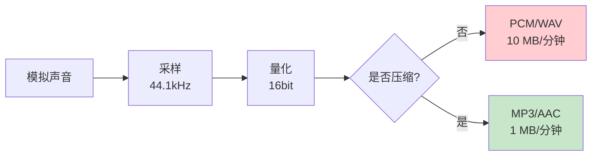
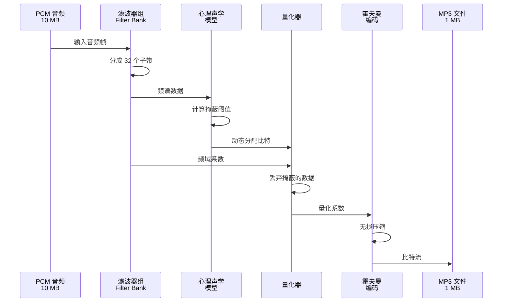

# 03. 音频编码原理：人耳听不见的频率都被删掉了

> **专栏导读**：视频能压缩 400 倍，音频也不遑多让！这一篇带你探索声音的秘密——为什么 MP3 只有 CD 音质的 1/10 大小，但听起来几乎一样？答案藏在人耳的"盲区"里。

---

## 🎵 开场：一段音频有多大？

先算一笔账：

```
CD 音质的大小计算:
= 采样率 × 位深度 × 声道数 × 时长

1 分钟 CD 音质:
= 44100 Hz              （每秒采样 44100 次）
× 16 bit                （每个样本 16 位）
× 2 声道                （立体声）
× 60 秒
= 84,672,000 bit
≈ 10 MB
```

**1 小时 CD 音质 = 600 MB** 😱

但你下载的 MP3 音乐通常只有 **4-5 MB/首**（约 4 分钟），压缩比高达 **30 倍**！

**秘密在哪？** 🎧

---

## 👂 核心思想：人耳不是完美的

人的听觉系统有很多"缺陷"，音频编码器正是利用这些缺陷来压缩数据。

### 缺陷 1：听觉频率范围有限

**人耳能听到的频率**：20 Hz - 20,000 Hz（20 kHz）

📊 **配图位置 1：人耳听觉范围图**
> **可灵 AI 绘图提示词**：
> ```
> 专业音频频谱图，白色背景，16:9横版。横轴标注"Frequency (Hz)"，刻度从左到右依次显示：20, 100, 500, 1k, 2k, 5k, 10k, 20k（使用对数刻度）。纵轴标注"Hearing Sensitivity (dB SPL)"，刻度从下到上：0, 20, 40, 60, 80, 100。图中绘制一条绿色平滑曲线代表人耳灵敏度，曲线在1kHz-4kHz区域达到最低点（约10dB，表示最敏感），在20Hz和20kHz两端上升到100dB（表示不敏感）。在曲线最低点上方用红色标注"最敏感区域"（中文，14号字体）。横轴左侧20Hz之前和右侧20kHz之后用灰色半透明区域填充，分别标注"听不到"（中文，12号字体）。整体风格：坐标网格线浅灰色虚线，字体Arial，数字12号，标签14号加粗。
> ```

**关键数据**：

| 频率范围 | 声音类型 | 人耳感知 |
|---------|---------|---------|
| < 20 Hz | 次声波 | ❌ 听不到（但能感受到震动） |
| 20-250 Hz | 低频（贝斯、鼓） | 🟢 能听到 |
| 250-2000 Hz | 中频（人声） | 🟢🟢 最敏感 |
| 2000-20000 Hz | 高频（镲片、鸟鸣） | 🟢 能听到 |
| > 20 kHz | 超声波 | ❌ 听不到 |

**编码器的策略**：
```
原始音频: 包含 0-96 kHz 的所有频率（高清录音）
MP3 编码: 只保留 20 Hz - 16 kHz
丢弃: 16 kHz 以上的超高频（人耳听不到）
节省: 约 30% 数据量
```

---

### 缺陷 2：掩蔽效应（Masking Effect）

**关键发现**：强烈的声音会"掩盖"附近的弱声音。

📊 **配图位置 2：频域掩蔽效应图**
> **可灵 AI 绘图提示词**：
> ```
> 音频频谱图，横轴"Frequency (Hz)"，纵轴"Amplitude (dB)"，中心有一个高峰标注"强音 1kHz"，峰的两侧画出一个阴影区域标注"掩蔽区域：弱音会被遮住"，阴影内有几个小峰用虚线表示并标注"可以删除"，科技感音频分析图，深色背景，16:9
> ```

**两种掩蔽效应**：

#### 1. 频域掩蔽（同时发生）

**实验**：
```
播放一个 1000 Hz 的强音（80 dB）
同时播放一个 1100 Hz 的弱音（30 dB）
→ 你只能听到 1000 Hz，听不到 1100 Hz
```

**原理**：
- 强音会在**临近频率**产生"遮蔽带"
- 遮蔽带内的弱音可以删掉，人耳察觉不到

**编码器的应用**：
```
编码前:
  1000 Hz: 80 dB （强音，保留）
  1050 Hz: 25 dB （在掩蔽区，删除）
  1100 Hz: 30 dB （在掩蔽区，删除）
  1200 Hz: 40 dB （超出掩蔽区，保留）

编码后: 只保留 1000 Hz 和 1200 Hz
节省: 40% 数据量
```

---

#### 2. 时域掩蔽（前后发生）

**实验**：
```
先播放一个强音（爆炸声）
紧接着播放一个弱音（耳语）
→ 弱音会被"淹没"，听不清
```

**两种时域掩蔽**：

| 类型 | 发生时机 | 持续时间 | 原因 |
|------|---------|---------|------|
| **前掩蔽** | 强音**之前** 5-20 ms | 很短 | 大脑处理延迟 |
| **后掩蔽** | 强音**之后** 50-200 ms | 较长 | 听觉神经疲劳 |

📊 **配图位置 3：时域掩蔽示意图**
> **可灵 AI 绘图提示词**：
> ```
> 时间轴图表，横轴"Time (ms)"从0到300ms，纵轴"Sound Level (dB)"，在100ms位置有一个高峰标注"强音（爆炸）"（中文），峰前5ms和峰后50ms区域用浅蓝色阴影标注"掩蔽区域"（中文），阴影内有小波浪线标注"弱音可删除"（中文），时间序列图风格，白色背景，16:9
> ```

---

### 缺陷 3：临界频带（Critical Bands）

**发现**：人耳把频谱分成 24 个"频带"，每个频带内部分辨率有限。

📊 **配图位置 4：临界频带分布图**
> **可灵 AI 绘图提示词**：
> ```
> 频谱分段图，横轴"Frequency (Hz)"从20Hz到20kHz用对数刻度，将频谱分成24个彩色条带，每个条带标注编号1-24，低频段条带较窄，高频段条带较宽，底部标注"24 Critical Bands"（英文），每个频带内部显示细腻的波形但用半透明表示不敏感，音频教学图风格，16:9
> ```

**编码器的利用**：
```
传统做法: 按固定频率间隔分析音频（例如每 10 Hz 一个点）
→ 计算量大，且浪费

聪明做法: 按临界频带分析（24 个频带）
→ 每个频带用一个值代表
→ 计算量降低到 1/100
```

**实际应用**（MP3）：
- 低频段（< 500 Hz）：频带宽度 100 Hz
- 中频段（500-2000 Hz）：频带宽度 200 Hz
- 高频段（> 2000 Hz）：频带宽度 500-1000 Hz

---

## 🔬 从模拟到数字：采样和量化

在讲编码之前，先理解声音是如何数字化的。

### 步骤 1：采样（Sampling）

**目标**：把连续的模拟声音波形变成离散的数字样本。

📊 **配图位置 5：采样过程示意图**
> **可灵 AI 绘图提示词**：
> ```
> 上下分屏对比图，上半部分显示平滑的蓝色正弦波标注"Analog Signal 模拟信号"（中英双语），下半部分显示相同波形但用红色垂直线段采样标注"Digital Samples 数字采样"（中英双语），采样点用红点标注，底部标注"Sampling Rate: 44.1 kHz"（英文），技术教学图，白色背景，16:9
> ```

**采样率（Sample Rate）**：每秒采样多少次。

| 采样率 | 应用场景 | 音质 |
|-------|---------|------|
| 8 kHz | 电话通话 | 低（只能听清人声） |
| 16 kHz | 语音识别 | 中等 |
| 22.05 kHz | 网络电台 | 中等 |
| **44.1 kHz** | **CD 音质** | **高（行业标准）** |
| 48 kHz | 专业录音、视频 | 高 |
| 96 kHz | 高清音频 | 极高（发烧友） |
| 192 kHz | 母带制作 | 极高 |

**奈奎斯特定理**（Nyquist Theorem）：
```
要完整还原频率为 f 的声音，采样率必须 ≥ 2f

示例:
  人耳最高频率: 20 kHz
  理论最低采样率: 40 kHz
  实际 CD 采样率: 44.1 kHz（留有余量）
```

---

### 步骤 2：量化（Quantization）

**目标**：把连续的振幅值变成离散的数字。

**位深度（Bit Depth）**：用多少位二进制数表示一个样本。

| 位深度 | 动态范围 | 应用场景 |
|-------|---------|---------|
| 8 bit | 48 dB | 低质量（早期游戏音效） |
| **16 bit** | **96 dB** | **CD 音质（行业标准）** |
| 24 bit | 144 dB | 专业录音 |
| 32 bit | 192 dB | 音频后期制作 |

**动态范围计算**：
```
动态范围 (dB) ≈ 6 × 位深度

16 bit: 6 × 16 = 96 dB
（最强音和最弱音的比例 = 65536:1）
```

📊 **配图位置 6：量化示意图**
> **可灵 AI 绘图提示词**：
> ```
> 对比图，左侧显示平滑的波形标注"Continuous Amplitude"（英文），右侧显示阶梯状波形标注"Quantized (16 bit)"（英文），阶梯的每一级用虚线标注量化级别，波形和阶梯之间的差异用红色箭头标注"Quantization Error"（英文），底部标注"位深度越高，阶梯越细腻"（中文），技术对比图，16:9
> ```

---

### 步骤 3：编码（Encoding）

量化后的数据仍然很大，需要进一步压缩。

**未压缩 PCM vs 压缩格式**：



---

## 🎼 MP3 编码原理：心理声学模型的胜利

**MP3**（MPEG-1 Audio Layer 3）是第一个流行的有损音频编码格式。

### MP3 编码流程



**关键步骤详解**：

#### 1. 滤波器组（Filter Bank）

把音频分成 **32 个子带**（Subbands）：

```
子带 1:  0 - 688 Hz
子带 2:  688 - 1375 Hz
子带 3:  1375 - 2063 Hz
...
子带 32: 21375 - 22050 Hz
```

**为什么要分子带？**
- 不同频带的重要性不同
- 可以为每个子带分配不同的比特数

---

#### 2. 心理声学模型（Psychoacoustic Model）

**核心任务**：计算每个频率的**掩蔽阈值**。

```
掩蔽阈值 = 低于这个阈值的声音可以删掉

示例:
  1000 Hz 强音: 80 dB
  → 计算得出掩蔽阈值
  1050 Hz: 阈值 50 dB（只需保留 > 50 dB 的声音）
  1100 Hz: 阈值 40 dB
```

**掩蔽曲线**：

📊 **配图位置 7：MP3 掩蔽曲线图**
> **可灵 AI 绘图提示词**：
> ```
> 音频分析图，横轴"Frequency (Hz)"，纵轴"Amplitude (dB)"，画一条红色的音频频谱线，叠加一条蓝色的掩蔽阈值曲线，频谱线超出阈值的部分用绿色标注"保留"（中文），低于阈值的部分用灰色虚线标注"删除"（中文），专业音频处理图表，深色背景，16:9
> ```

---

#### 3. 动态比特分配（Bit Allocation）

**策略**：重要的频带多给比特，不重要的少给或不给。

```
中频（人声区 1-4 kHz）:
  → 分配 8-10 bit/样本（高精度）
  
低频（< 250 Hz）:
  → 分配 4-6 bit/样本（中等精度）
  
高频（> 15 kHz）:
  → 分配 0-2 bit/样本（低精度或直接删除）
```

**实际分配示例**（128 kbps MP3）：
```
总可用比特: 128,000 bits/秒
每帧时长: 26 ms
每帧比特数: 128,000 × 0.026 ≈ 3328 bits

分配方案:
  子带 1-8 (低频): 800 bits
  子带 9-20 (中频): 2000 bits （重点！）
  子带 21-32 (高频): 528 bits
```

---

#### 4. 霍夫曼编码（Huffman Coding）

**最后一步**：无损压缩量化系数。

```
高频值（如 0, 1, -1）: 用短编码
低频值（如 42, -38）: 用长编码

示例:
  原始: 0 0 0 1 0 -1 0 0 42
  编码: 0 0 0 10 0 11 0 0 11110110
  
压缩比: 再提升 20-30%
```

---

## 🆚 AAC vs MP3：新一代的胜利

**AAC**（Advanced Audio Coding）是 MP3 的继任者，被广泛用于：
- 📱 iPhone/iTunes
- 📺 YouTube/Netflix
- 🎮 游戏音效

### 关键改进

| 特性 | MP3 | AAC |
|------|-----|-----|
| 发布年份 | 1993 | 1997 |
| 子带数量 | 32 | **1024**（精细 32 倍） |
| 频率分辨率 | 低 | **高** |
| 压缩效率 | 基准 | **+30%**（同等质量） |
| 最高码率 | 320 kbps | 512 kbps |
| 立体声编码 | 基础 | **联合立体声**（更高效） |
| 时频分辨率 | 固定 | **自适应**（动态切换） |

**同等音质对比**：
```
MP3:  128 kbps → "可接受"的音质
AAC:  96 kbps  → 相同的"可接受"音质

AAC 节省: 25% 文件大小
```

---

### AAC 的技术优势

#### 1. MDCT（改进的离散余弦变换）

**MP3 的问题**：
- 使用固定大小的滤波器组
- 瞬态信号（鼓声、敲击）会产生"预回声"失真

**AAC 的解决**：
```
静态信号（持续音）: 使用长窗口（2048 样本）
  → 频率分辨率高，时间分辨率低
  
瞬态信号（打击乐）: 切换到短窗口（256 样本）
  → 时间分辨率高，避免预回声
```

---

#### 2. TNS（时域噪声整形）

**原理**：把量化噪声"整形"到掩蔽曲线之下。

```
量化噪声分布:
  传统: 均匀分布在所有频率
  TNS:  集中在被掩蔽的频率（听不到）
```

---

#### 3. PNS（感知噪声替代）

**发现**：高频噪声（如风声、摩擦声）的特征是"无序"。

**AAC 的策略**：
```
编码前: 检测高频是否为噪声
如果是: 不存储实际数据，只存储"这是噪声"的标记
解码时: 用随机数生成器生成噪声

节省: 高频段比特数降低 50%
```

---

## 📊 常见音频格式对比

### 无损 vs 有损

| 格式 | 类型 | 压缩比 | 音质 | 文件大小（3分钟） | 适用场景 |
|------|------|-------|------|------------------|---------|
| **WAV/PCM** | 无损（未压缩） | 1:1 | 原始 | 30 MB | 专业制作 |
| **FLAC** | 无损（压缩） | 2:1 | 原始 | 15 MB | 发烧友 |
| **ALAC** | 无损（压缩） | 2:1 | 原始 | 15 MB | Apple 生态 |
| **AAC** | 有损 | 10:1 | 优秀 | 3 MB | 通用（推荐） |
| **MP3** | 有损 | 10:1 | 良好 | 3.5 MB | 兼容性好 |
| **Opus** | 有损 | 15:1 | 优秀 | 2 MB | 实时通话 |
| **Vorbis** | 有损 | 12:1 | 良好 | 2.5 MB | 开源项目 |

---

### 码率推荐

| 音质需求 | MP3 | AAC | Opus |
|---------|-----|-----|------|
| **低音质**（语音） | 64 kbps | 48 kbps | 24 kbps |
| **中等音质**（播客） | 128 kbps | 96 kbps | 64 kbps |
| **高音质**（音乐） | 192 kbps | 128 kbps | 96 kbps |
| **极高音质**（接近 CD） | 320 kbps | 256 kbps | 192 kbps |

---

## 🛠️ 实战：FFmpeg 音频分析与编码

### 实验 1：查看音频详细信息

```bash
# 查看音频基本信息
ffprobe -hide_banner input.wav

# 查看详细流信息（JSON 格式）
ffprobe -v quiet -print_format json -show_streams -show_format input.wav
```

**输出示例**：
```json
{
  "streams": [
    {
      "codec_name": "pcm_s16le",
      "codec_type": "audio",
      "sample_rate": "44100",
      "channels": 2,
      "channel_layout": "stereo",
      "bits_per_sample": 16,
      "duration": "180.500000"
    }
  ],
  "format": {
    "format_name": "wav",
    "size": "31805044",
    "bit_rate": "1411200"
  }
}
```

**计算验证**：
```
比特率 = 采样率 × 位深度 × 声道数
       = 44100 × 16 × 2
       = 1,411,200 bps
       = 1411 kbps ✅ 符合输出
```

---

### 实验 2：频谱分析（用 Audacity）

虽然 FFmpeg 可以生成频谱，但 **Audacity** 更直观。

#### 安装 Audacity
```bash
# macOS
brew install --cask audacity

# Ubuntu
sudo apt install audacity

# Windows: 下载 https://www.audacityteam.org/
```

#### 操作步骤
1. **打开音频文件**：File → Open → 选择 `music.mp3`
2. **显示频谱**：点击音轨名称 → Spectrogram
3. **分析频谱**：Analyze → Plot Spectrum

📊 **配图位置 8：音频频谱图示例**
> **可灵 AI 绘图提示词**：
> ```
> 音频频谱图截图风格，横轴"Frequency (Hz)"从0到20kHz，纵轴"Amplitude (dB)"从-60到0，显示音乐频谱：低频(100-300Hz)有强峰值标注"贝斯"（中文），中频(1-4kHz)有密集波形标注"人声"（中文），高频(8-15kHz)有稀疏尖峰标注"镲片"（中文），Audacity软件界面风格，16:9
> ```

**观察要点**：
- **低频（< 250 Hz）**：贝斯、鼓的基频
- **中频（250-4000 Hz）**：人声、吉他、钢琴
- **高频（> 4000 Hz）**：镲片、泛音、空气感
- **15 kHz 以上**：MP3 通常会"截断"（看不到能量）

---

### 实验 3：不同格式编码对比

```bash
# 原始 WAV 文件
ls -lh input.wav
# 31 MB

# 编码为 MP3（128 kbps）
ffmpeg -i input.wav -c:a libmp3lame -b:a 128k output_mp3_128k.mp3

# 编码为 AAC（96 kbps）
ffmpeg -i input.wav -c:a aac -b:a 96k output_aac_96k.m4a

# 编码为 Opus（64 kbps）
ffmpeg -i input.wav -c:a libopus -b:a 64k output_opus_64k.opus

# 编码为 FLAC（无损）
ffmpeg -i input.wav -c:a flac output_flac.flac

# 查看文件大小
ls -lh output_*
```

**预期结果**：
```
input.wav          31 MB   (PCM 原始数据)
output_flac.flac   16 MB   (无损压缩 50%)
output_mp3_128k    3.8 MB  (有损压缩 88%)
output_aac_96k     2.9 MB  (有损压缩 91%)
output_opus_64k    1.9 MB  (有损压缩 94%)
```

---

### 实验 4：听力测试（ABX 盲听）

**目标**：测试你能否分辨不同码率的差异。

#### 准备三个文件
```bash
# A: 高质量（320 kbps MP3）
ffmpeg -i input.wav -c:a libmp3lame -b:a 320k test_A.mp3

# B: 中等质量（128 kbps AAC）
ffmpeg -i input.wav -c:a aac -b:a 128k test_B.m4a

# X: 随机选择 A 或 B（闭眼选）
cp test_A.mp3 test_X.mp3  # 或 test_B.m4a
```

#### 盲听步骤
1. 用音乐播放器随机播放 A、B、X
2. 听 3 遍，每遍换一首歌
3. 猜测 X 是 A 还是 B

**结论**：
- 大多数人在 128 kbps AAC 以上无法分辨差异
- 除非你是"金耳朵"或用高端耳机 🎧

---

### 实验 5：可视化采样率和位深度的影响

```bash
# 原始: 44.1 kHz, 16 bit
ffprobe input.wav

# 降低采样率（22.05 kHz）
ffmpeg -i input.wav -ar 22050 -c:a pcm_s16le output_22k.wav

# 降低位深度（8 bit）
ffmpeg -i input.wav -ar 44100 -c:a pcm_u8 output_8bit.wav

# 用 Audacity 打开对比波形和频谱
```

**观察**：
- **22.05 kHz**：频谱只到 11 kHz（丢失高频）
- **8 bit**：波形有明显的"阶梯感"，噪声增加

---

## 🎧 声道布局：从单声道到 7.1 环绕

### 常见声道配置

| 声道数 | 名称 | 布局 | 应用 |
|-------|------|------|------|
| 1.0 | Mono | C | 电话、广播 |
| 2.0 | Stereo | L, R | 音乐、耳机 |
| 2.1 | Stereo + Sub | L, R, LFE | 桌面音箱 |
| 5.1 | Surround | L, R, C, LFE, SL, SR | 家庭影院 |
| 7.1 | Surround | L, R, C, LFE, SL, SR, BL, BR | 高端影院 |

**声道缩写**：
```
L:   Left（左）
R:   Right（右）
C:   Center（中）
LFE: Low Frequency Effects（低音炮）
SL:  Surround Left（环绕左）
SR:  Surround Right（环绕右）
BL:  Back Left（后左）
BR:  Back Right（后右）
```

📊 **配图位置 9：7.1 环绕声布局图**
> **可灵 AI 绘图提示词**：
> ```
> 俯视图，圆形听音区域，中心有一个座位图标标注"听者"（中文），围绕座位放置8个扬声器图标，正前方标注"C"，左右标注"L""R"，左右环绕标注"SL""SR"，后方标注"BL""BR"，前方地面标注"LFE (Subwoofer)"（英文），每个扬声器用箭头指向中心，底部标注"7.1 Surround Layout"（英文），技术示意图，16:9
> ```

---

### 立体声编码技术

#### 1. Joint Stereo（联合立体声）

**问题**：很多立体声音频的左右声道**高度相似**。

**策略**：
```
传统 Stereo: 分别编码左声道和右声道
  → 浪费比特（大量重复信息）

Joint Stereo: 编码为 Mid/Side
  Mid (M) = (L + R) / 2  （相同部分）
  Side (S) = (L - R) / 2 （差异部分）
  
如果差异小: Side 通道用很少比特
节省: 20-40%
```

---

#### 2. Binaural Audio（双耳音频）

**应用**：VR/AR、3D 音频游戏

**原理**：模拟人耳的 HRTF（头相关传递函数）

```
左耳听到的声音 ≠ 右耳听到的声音
差异包括:
  - 时间差（声音到达的延迟）
  - 强度差（头部遮挡）
  - 频率差（耳廓滤波）
```

**实现**：
```bash
# FFmpeg 生成双耳音频（需要 HRTF 数据）
ffmpeg -i input.wav -af "sofalizer=sofa=/path/to/hrtf.sofa" output_binaural.wav
```

---

## 🧠 思考题

**Q1**：为什么电话通话的声音听起来"不自然"？

<details>
<summary>点击查看答案</summary>

因为电话使用 **8 kHz 采样率**，只能还原 **0-4 kHz** 的频率：

```
人声基频: 100-300 Hz ✅ 保留
人声泛音: 300-4000 Hz ✅ 保留
高频共鸣: 4000-8000 Hz ❌ 丢失（声音变"闷"）
环境高频: 8000+ Hz ❌ 丢失（缺少"空气感"）
```

这就是为什么电话里的声音听起来"不像真人"。

**现代改进**：
- HD Voice（宽带语音）：16 kHz 采样率
- VoLTE（4G 通话）：支持 16-48 kHz
</details>

---

**Q2**：无损音频（FLAC）真的"无损"吗？

<details>
<summary>点击查看答案</summary>

**是的**，FLAC 是真正的无损压缩：

```
压缩前: PCM 数据（例如 100 MB）
FLAC 编码: 使用数学压缩算法（类似 ZIP）
压缩后: FLAC 文件（例如 50 MB）
解码: 可以完美还原 100% 的原始数据
```

**验证方法**：
```bash
# 编码
ffmpeg -i input.wav -c:a flac output.flac

# 解码
ffmpeg -i output.flac -c:a pcm_s16le restored.wav

# 对比 MD5（应该完全一致）
md5sum input.wav restored.wav
```

**对比**：
- FLAC/ALAC：无损，可逆
- MP3/AAC：有损，不可逆（丢弃的数据无法恢复）
</details>

---

**Q3**：为什么游戏音效文件通常很小（几 KB），但听起来还不错?

<details>
<summary>点击查看答案</summary>

因为游戏音效（枪声、脚步声）通常：

1. **时长很短**（< 1 秒）
   ```
   0.5 秒音效 @ 44.1 kHz, 16 bit, stereo
   = 44100 × 16 × 2 × 0.5 / 8
   = 88 KB（未压缩）
   ```

2. **可以用高压缩率**（Opus @ 24 kbps）
   ```
   88 KB PCM → 1.5 KB Opus
   压缩比: 58 倍
   ```

3. **在嘈杂环境中播放**
   ```
   游戏音效混在背景音乐、其他音效中
   → 人耳对单个音效的质量要求降低
   → 可以用更激进的压缩
   ```

4. **使用音效库**
   ```
   很多游戏共享同一套音效库（枪声、爆炸）
   → 只需存储一次
   ```
</details>

---

## 📚 下一篇预告

下一篇《时间戳与同步：音画不同步的罪魁祸首》，我们将探讨：
- PTS/DTS 时间戳的概念
- 时间基（Time Base）的转换
- 为什么 B 帧会导致 DTS ≠ PTS
- 音视频同步的数学原理

敬请期待！⏱️

---

## 🔗 相关资源

- **AAC 官方标准**：ISO/IEC 13818-7
- **MP3 官方标准**：ISO/IEC 11172-3
- **FFmpeg 音频编码指南**：https://trac.ffmpeg.org/wiki/Encode/AAC
- **Audacity 官网**：https://www.audacityteam.org/
- **推荐阅读**：《音频编码技术》（高文）

---

> **作者**：ZenPlay 团队  
> **更新时间**：2025-01-24  
> **专栏地址**：[音视频开发入门专栏](../av_column_plan.md)  
> **上一篇**：[02. 视频编码原理](02_video_encoding.md)
