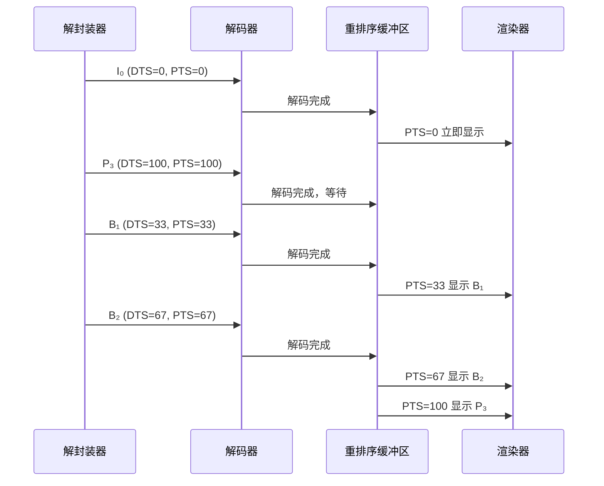
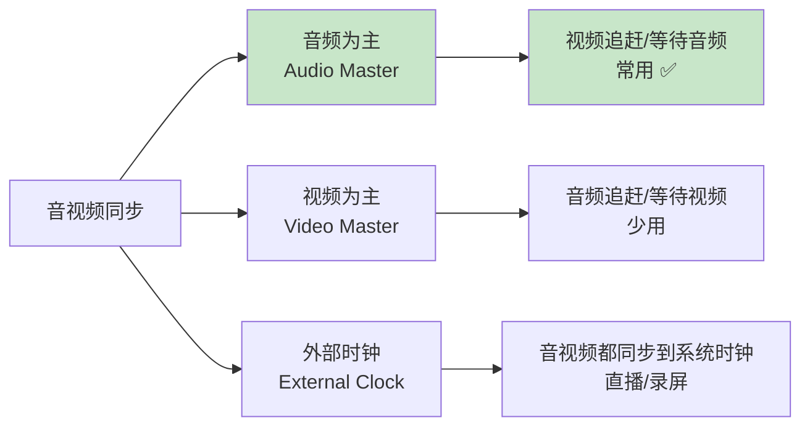

# 04. 时间戳与同步：音画不同步的罪魁祸首

> **专栏导读**：你有没有遇到过视频中人物"对不上口型"的情况？这背后涉及音视频播放器最核心的技术——时间戳管理和同步。这一篇带你理解 PTS/DTS，掌握音视频同步的数学原理。

---

## ⏱️ 开场：音画不同步有多难受？

想象这样的场景：

```
视频画面: 演员张嘴说话 👄
音频声音: 0.5 秒后才传来声音 🔊
→ 像在看配音不准的烂片 😖
```

**为什么会不同步？**

```
视频流: 每秒 30 帧，每帧间隔 33.3 ms
音频流: 每秒 44100 个样本，每个样本间隔 0.023 ms

问题:
  1. 视频和音频的"时钟"不一样
  2. 解码速度不一致（视频慢，音频快）
  3. 网络传输有延迟（直播场景）
```

**人眼的容忍度**：
```
音频超前视频 < 20 ms:  基本察觉不到 ✅
视频超前音频 < 40 ms:  可以接受 🆗
差距 > 100 ms:        明显不同步 ❌
```

**核心问题**：如何确保视频帧和音频样本在**正确的时刻**播放？

答案：**时间戳（Timestamp）**！

---

## 📏 核心概念：PTS 和 DTS

### PTS（Presentation Time Stamp）

**定义**：这一帧/样本应该**呈现**（显示/播放）的时间。

```
视频 PTS 示例:
  帧 0: PTS = 0 ms       → 立即显示
  帧 1: PTS = 33.3 ms    → 33.3 ms 时显示
  帧 2: PTS = 66.6 ms    → 66.6 ms 时显示
  帧 3: PTS = 100 ms     → 100 ms 时显示
```

```
音频 PTS 示例:
  样本 0-1023:   PTS = 0 ms
  样本 1024-2047: PTS = 23.2 ms  （1024/44100 ≈ 23.2 ms）
  样本 2048-3071: PTS = 46.4 ms
```

📊 **配图位置 1：PTS 时间轴示意图**
> **可灵 AI 绘图提示词**：
> ```
> 时间轴图表，白色背景，16:9横版。横轴标注"Time (ms)"，刻度从左到右：0, 33, 67, 100, 133, 167。时间轴上方画视频帧图标（小方块），每个方块内标注"Frame 0""Frame 1""Frame 2"等，每个方块正下方用红色箭头指向对应时间刻度，箭头旁标注"PTS=0""PTS=33""PTS=67"（英文，12号字体）。时间轴下方画音频波形图标（蓝色正弦波），波形分段标注"Audio Chunk 0 (PTS=0)""Audio Chunk 1 (PTS=23)"（英文，10号字体）。整体风格：清晰的技术示意图，Arial字体，标签14号加粗。
> ```

---

### DTS（Decoding Time Stamp）

**定义**：这一帧应该**解码**的时间。

**为什么需要 DTS？**

因为视频编码中有 **B 帧**（双向预测帧），它依赖**未来的帧**：

```
解码顺序 (DTS):    I₀  P₃  B₁  B₂  P₆  B₄  B₅
显示顺序 (PTS):    I₀  B₁  B₂  P₃  B₄  B₅  P₆

解释:
  B₁ 需要参考 I₀ 和 P₃，所以必须先解码 P₃
  → DTS(B₁) > DTS(P₃)，但 PTS(B₁) < PTS(P₃)
```

📊 **配图位置 2：I/P/B 帧的 PTS/DTS 关系图**
> **可灵 AI 绘图提示词**：
> ```
> 双层时间轴对比图，白色背景，16:9横版。上层标注"Decoding Order (DTS)"，时间轴从左到右显示帧序列：I₀, P₃, B₁, B₂, P₆, B₄, B₅，每个帧用彩色方块表示（I帧绿色，P帧蓝色，B帧橙色），方块内标注帧类型和DTS值"DTS=0""DTS=100""DTS=33"等。下层标注"Display Order (PTS)"，时间轴从左到右显示相同的帧但顺序不同：I₀, B₁, B₂, P₃, B₄, B₅, P₆，方块内标注PTS值"PTS=0""PTS=33""PTS=67""PTS=100"等。用红色虚线箭头连接同一帧在两层中的位置，标注"Reorder"（英文）。整体风格：专业技术图表，Arial字体，网格线浅灰色。
> ```

**关键规律**：
```
对于 I 帧和 P 帧:
  DTS = PTS  （解码即显示）

对于 B 帧:
  DTS > PTS  （解码后要等待，按 PTS 显示）
```

---

## 🔢 时间基（Time Base）：统一的时钟

### 问题：不同流的时间单位不同

```
视频流: 1 秒 = 90000 ticks  (常见的 90 kHz 时间基)
音频流: 1 秒 = 44100 ticks  (采样率)
系统时钟: 1 秒 = 1000 ms
```

**如何统一？**

FFmpeg 使用**时间基（Time Base）**的概念：

```
Time Base = 1 / frequency

示例:
  视频 Time Base = 1/90000  (每 tick = 1/90000 秒)
  音频 Time Base = 1/44100  (每 tick = 1/44100 秒)
```

---

### 时间戳转换公式

**核心公式**：
```
实际时间 (秒) = PTS × Time Base

示例 1 (视频):
  PTS = 3000 (ticks)
  Time Base = 1/90000
  实际时间 = 3000 / 90000 = 0.0333 秒 = 33.3 ms

示例 2 (音频):
  PTS = 1024 (样本数)
  Time Base = 1/44100
  实际时间 = 1024 / 44100 = 0.0232 秒 = 23.2 ms
```

**转换到毫秒**：
```c++
// ZenPlay 项目中的实际代码（简化版）
double pts_seconds = packet->pts * av_q2d(stream->time_base);
int64_t pts_ms = static_cast<int64_t>(pts_seconds * 1000);
```

📊 **配图位置 3：时间基转换流程图**
> **可灵 AI 绘图提示词**：
> ```
> 流程图风格，白色背景，16:9横版。左侧画一个数据包图标标注"Packet: PTS=3000 ticks"（英文），中间画一个齿轮图标标注"Time Base: 1/90000"（英文），右侧画一个时钟图标标注"Real Time: 33.3 ms"（英文）。三个图标之间用蓝色粗箭头连接，箭头上方标注转换公式"PTS × Time Base = 3000/90000 = 0.0333s"（英文，12号字体）。底部用灰色虚线框标注"适用于视频、音频、字幕所有流"（中文，10号字体）。整体风格：技术流程图，Arial字体，图标简洁扁平化。
> ```

---

### FFmpeg 中的时间基

**常见时间基**：

| 流类型 | 常见时间基 | 含义 |
|-------|-----------|------|
| 视频 | 1/90000 | MPEG 标准时钟频率 |
| 音频 | 1/采样率 | 例如 1/44100, 1/48000 |
| 字幕 | 1/1000 | 毫秒级精度 |
| 容器 | 1/1000 或 1/90000 | 取决于容器格式 |

**注意**：同一视频文件中，**容器的时间基** ≠ **流的时间基**！

```
示例:
  MP4 容器: Time Base = 1/1000 (毫秒)
  H.264 流: Time Base = 1/90000 (90 kHz)
  
转换: 需要用 av_rescale_q()
```

---

## 🎬 实战案例：B 帧的时间戳顺序

### 编码顺序 vs 显示顺序

假设视频帧序列：

```
I₀  B₁  B₂  P₃  B₄  B₅  P₆  ...
```

**依赖关系**：
- B₁ 依赖 I₀ 和 P₃
- B₂ 依赖 I₀ 和 P₃
- B₄ 依赖 P₃ 和 P₆
- B₅ 依赖 P₃ 和 P₆

**实际编码和传输顺序（DTS）**：
```
I₀ → P₃ → B₁ → B₂ → P₆ → B₄ → B₅
```

**播放器的处理流程**：



**关键点**：
1. 解码器必须**提前解码** P₃
2. 解码后的帧放入**缓冲区**
3. 渲染器按 **PTS 排序**后显示

---

### ZenPlay 项目中的实现

**视频解码器的时间戳处理**：

```cpp
// src/player/VideoDecoder.cpp (简化版)
Result<AVFrame*> VideoDecoder::DecodeFrame() {
  AVFrame* frame = av_frame_alloc();
  int ret = avcodec_receive_frame(codec_context_, frame);
  
  if (ret == 0) {
    // 将解码时间戳 (DTS) 转换为显示时间戳 (PTS)
    if (frame->pts == AV_NOPTS_VALUE) {
      // 如果没有 PTS，使用 best_effort_timestamp
      frame->pts = frame->best_effort_timestamp;
    }
    
    // 转换为秒
    double pts_seconds = frame->pts * av_q2d(stream_->time_base);
    frame->pts = static_cast<int64_t>(pts_seconds * 1000);  // 转为 ms
    
    return Result<AVFrame*>::Ok(frame);
  }
  
  return Result<AVFrame*>::Err("Failed to decode frame");
}
```

**关键 API**：
- `frame->pts`：显示时间戳
- `frame->pkt_dts`：解码时间戳（原始 packet 的 DTS）
- `frame->best_effort_timestamp`：FFmpeg 估算的最佳时间戳
- `av_q2d(time_base)`：将时间基转换为 double（秒）

---

## 🔄 音视频同步策略

### 三种同步模式



**为什么通常选择"音频为主"？**

1. **人耳对延迟更敏感**
   ```
   音频卡顿 > 50 ms: 明显听到断续 ❌
   视频丢帧:        人眼不易察觉 🆗
   ```

2. **音频播放是连续的**
   ```
   音频: 每秒输出 44100 个样本，不能中断
   视频: 每秒 30 帧，可以偶尔跳帧/重复帧
   ```

3. **音频时钟更稳定**
   ```
   音频: 硬件声卡提供精确的采样率时钟
   视频: 解码时间不固定（I 帧慢，P/B 帧快）
   ```

---

### 同步算法：视频追音频

**核心思想**：计算视频帧的 PTS 与音频时钟的差距，决定是否显示/跳帧。

```cpp
// ZenPlay 项目中的同步逻辑（简化版）
class AudioClock {
public:
  // 获取当前音频播放到哪里了（毫秒）
  int64_t GetCurrentTime() const {
    return audio_pts_ms_ + (SDL_GetTicks() - last_update_time_);
  }
  
  void Update(int64_t audio_pts_ms) {
    audio_pts_ms_ = audio_pts_ms;
    last_update_time_ = SDL_GetTicks();
  }

private:
  int64_t audio_pts_ms_ = 0;
  uint32_t last_update_time_ = 0;
};

// 视频渲染循环
void VideoRenderer::RenderFrame(AVFrame* frame) {
  int64_t frame_pts = frame->pts;  // 视频帧的 PTS (ms)
  int64_t audio_pts = audio_clock_->GetCurrentTime();  // 音频时钟 (ms)
  
  int64_t diff = frame_pts - audio_pts;  // 时间差
  
  if (diff > 100) {
    // 视频超前音频太多，等待
    SDL_Delay(diff - 10);  // 等待到合适时机
  } else if (diff < -100) {
    // 视频落后音频太多，跳帧
    LOG_WARN("Drop frame: PTS={}, Audio={}, Diff={}", frame_pts, audio_pts, diff);
    av_frame_unref(frame);  // 丢弃这一帧
    return;
  }
  
  // 正常显示
  RenderToScreen(frame);
}
```

📊 **配图位置 4：音视频同步策略图**
> **可灵 AI 绘图提示词**：
> ```
> 决策树图表，白色背景，16:9横版。顶部画一个菱形判断框标注"视频PTS - 音频PTS = ?"（中文），向下分三个分支。左分支：菱形框标注"diff > +100ms"指向绿色圆角矩形"等待 (Sleep)"；中分支：菱形框标注"-100ms < diff < +100ms"指向蓝色圆角矩形"正常渲染"；右分支：菱形框标注"diff < -100ms"指向红色圆角矩形"跳帧 (Drop)"。每个分支下方用小字标注具体数值示例"例: diff=+150ms, 等待140ms"（中文，10号字体）。整体风格：流程图风格，Arial字体，箭头带标签。
> ```

**关键参数**：

| 时间差 | 策略 | 说明 |
|-------|------|------|
| > +100 ms | **等待** | 视频太快，暂停渲染 |
| -100 ~ +100 ms | **正常渲染** | 同步良好 ✅ |
| < -100 ms | **跳帧** | 视频太慢，丢弃帧 |

---

### 音频时钟的实现

**问题**：音频是**连续流**，如何知道"播放到哪里了"？

**方案 1：基于硬件回调**（ZenPlay 使用）

```cpp
// 音频播放回调（由 SDL 或 WASAPI 触发）
void AudioCallback(void* userdata, uint8_t* stream, int len) {
  // 填充音频数据
  int samples_written = FillAudioBuffer(stream, len);
  
  // 更新音频时钟
  int64_t duration_ms = samples_written * 1000 / sample_rate_;
  audio_clock_->Update(current_pts_ms_ + duration_ms);
}
```

**方案 2：基于系统时间推算**

```cpp
int64_t AudioClock::GetCurrentTime() const {
  uint32_t elapsed_ms = SDL_GetTicks() - last_update_time_;
  return audio_pts_ms_ + elapsed_ms;
}
```

**方案 3：查询硬件缓冲区**（最精确）

```cpp
// Windows WASAPI 示例
UINT64 position = 0;
audio_client_->GetPosition(&position);
int64_t audio_pts_ms = position * 1000 / sample_rate_;
```

---

## 📊 实战：FFmpeg 时间戳分析

### 实验 1：查看数据包的时间戳

```bash
# 显示视频流的前 20 个数据包的 PTS/DTS
ffprobe -show_packets -select_streams v:0 -read_intervals "%+#20" input.mp4

# 只显示关键字段（PTS, DTS, 帧类型）
ffprobe -show_packets -show_entries packet=pts,dts,flags -select_streams v:0 \
        -read_intervals "%+#20" input.mp4
```

**输出示例**（H.264 视频）：
```
[PACKET]
pts=0
dts=0
flags=K_      # K = 关键帧 (I 帧)
[/PACKET]

[PACKET]
pts=3003
dts=1001      # DTS < PTS，这是 B 帧
flags=__
[/PACKET]

[PACKET]
pts=1001
dts=2002      # DTS > PTS，B 帧解码后需要重排序
flags=__
[/PACKET]

[PACKET]
pts=2002
dts=3003
flags=__
[/PACKET]

[PACKET]
pts=6006
dts=4004      # P 帧
flags=__
[/PACKET]
```

**观察**：
- **I 帧**：`pts == dts`，标记 `K_`
- **B 帧**：`pts < dts`，标记 `__`
- **P 帧**：`pts == dts`，标记 `__`

---

## 🧠 思考题

**Q1**：为什么 I 帧一定是 `DTS == PTS`，而 B 帧一定是 `DTS > PTS`？

<details>
<summary>点击查看答案</summary>

**I 帧（独立帧）**：
```
I 帧不依赖任何其他帧
→ 收到即可解码
→ 解码完成即可显示
→ DTS == PTS
```

**B 帧（双向预测帧）**：
```
B₁ 依赖 I₀ 和 P₃
→ 必须等 P₃ 先解码完成
→ 传输顺序: I₀, P₃, B₁
→ 解码时间 DTS(B₁) 晚于 DTS(P₃)
→ 但显示时间 PTS(B₁) 早于 PTS(P₃)
→ 因此 DTS(B₁) > PTS(B₁)
```

**数值示例**（时间单位：毫秒）：
```
帧序列: I₀  B₁  B₂  P₃

显示顺序 (PTS):
  I₀: PTS=0
  B₁: PTS=33
  B₂: PTS=67
  P₃: PTS=100

传输顺序 (DTS):
  I₀: DTS=0   (第一个解码)
  P₃: DTS=100 (第二个解码)
  B₁: DTS=133 (第三个解码)
  B₂: DTS=167 (第四个解码)

对比:
  I₀: DTS=0,   PTS=0    → DTS == PTS ✅
  P₃: DTS=100, PTS=100  → DTS == PTS ✅
  B₁: DTS=133, PTS=33   → DTS > PTS ✅
  B₂: DTS=167, PTS=67   → DTS > PTS ✅
```
</details>

---

**Q2**：为什么播放器通常选择"音频为主"的同步策略，而不是"视频为主"？

<details>
<summary>点击查看答案</summary>

**原因 1：人耳对延迟更敏感**
```
音频断续阈值: 50 ms  （人耳能明显察觉）
视频丢帧阈值: 100 ms （人眼不易察觉）
```

**原因 2：音频必须连续输出**
```
音频硬件 (声卡): 每秒需要 44100 个样本
→ 如果数据供应不及时 → 产生"咔咔"爆音
→ 无法容忍中断

视频硬件 (显卡): 可以偶尔重复帧/跳帧
→ 人眼不易察觉（视觉暂留效应）
```

**原因 3：音频时钟更稳定**
```
音频时钟: 由硬件晶振提供，精度 ±10 ppm
视频解码: 受 CPU 负载影响，时间不固定
  - I 帧解码慢 (10-20 ms)
  - P/B 帧解码快 (2-5 ms)
```

**实际策略**：
```
正常播放: 音频为主，视频追音频 ✅
静音模式: 视频为主（无音频参考）
直播场景: 外部时钟为主（服务器时间）
```
</details>

---

**Q3**：如果视频文件没有 B 帧（例如 `-bf 0` 编码），是否就不需要 DTS 了？

<details>
<summary>点击查看答案</summary>

**理论上：是的！**

如果只有 I 帧和 P 帧：
```
I₀  P₁  P₂  P₃  P₄ ...

依赖关系:
  P₁ 依赖 I₀  → 必须先解码 I₀
  P₂ 依赖 P₁  → 必须先解码 P₁
  ...

解码顺序 = 显示顺序
→ DTS == PTS（始终相等）
→ 不需要单独的 DTS 字段
```

**实际情况**：
```
某些容器格式 (如 raw H.264 bitstream) 确实不存储 DTS
→ 解码器根据帧依赖关系推算

但大多数容器 (MP4/MKV) 仍然会写入 DTS
→ 便于 seek 和流处理
→ 即使 DTS == PTS，也会冗余存储
```

**ZenPlay 的处理**：
```cpp
// 即使没有 B 帧，也优先使用 PTS
if (frame->pts != AV_NOPTS_VALUE) {
  use_timestamp = frame->pts;
} else if (frame->pkt_dts != AV_NOPTS_VALUE) {
  use_timestamp = frame->pkt_dts;  // 回退到 DTS
} else {
  use_timestamp = frame->best_effort_timestamp;
}
```
</details>

---

## 📚 下一篇预告

下一篇《解封装：打开视频文件的第一步》，我们将深入探讨：
- 容器格式（MP4/MKV/FLV）的结构
- Demuxer 的工作原理（如何分离音视频流）
- Seek 操作的实现（快进/快退的秘密）
- ZenPlay 项目中的 `Demuxer` 类实现

敬请期待！📦

---

## 🔗 相关资源

- **FFmpeg 时间基文档**：https://ffmpeg.org/ffmpeg-utils.html#time-duration-syntax
- **MPEG 时间戳标准**：ISO/IEC 13818-1 (PTS/DTS 定义)
- **ZenPlay 代码**：
  - `src/player/AudioClock.h` - 音频时钟实现
  - `src/player/VideoDecoder.cpp` - 时间戳转换
  - `src/player/VideoRenderer.cpp` - 同步逻辑
- **推荐阅读**：《FFmpeg 从入门到精通》（第 6 章：时间戳与同步）

---

> **作者**：ZenPlay 团队  
> **更新时间**：2025-01-24  
> **专栏地址**：[音视频开发入门专栏](../av_column_plan.md)  
> **上一篇**：[03. 音频编码原理](03_audio_encoding.md)
