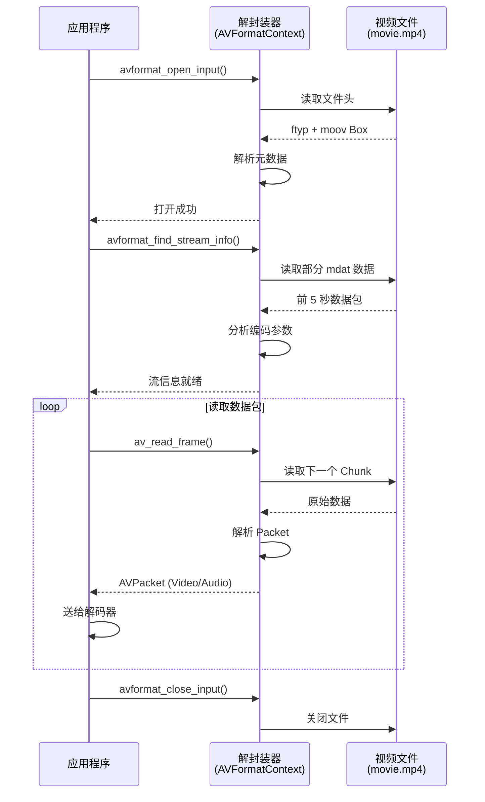

# 05. 解封装：打开视频文件的第一步

> **专栏导读**：视频文件就像一个"快递盒子"，里面装着视频流、音频流、字幕流等多个"包裹"。解封装（Demuxing）就是拆开这个盒子，取出每个包裹的过程。这一篇带你理解容器格式的原理，掌握解封装和 Seek 操作。

---

## 📦 开场：一个视频文件里装了什么？

下载一个电影文件 `movie.mp4`（2 GB），它里面到底有什么？

```
表面上看: 一个文件 movie.mp4
实际结构:
  📦 MP4 容器 (Container)
    ├─ 🎬 视频流 (Video Stream)
    │   └─ H.264 编码数据 (1.5 GB)
    ├─ 🔊 音频流 (Audio Stream)
    │   └─ AAC 编码数据 (150 MB)
    ├─ 📝 字幕流 (Subtitle Stream)
    │   └─ SRT 文本数据 (50 KB)
    └─ 📊 元数据 (Metadata)
        └─ 标题、时长、编码器信息等
```

**类比**：
- **容器（Container）** = 快递盒子（决定外观和标签格式）
- **编码器（Codec）** = 包裹内的压缩方式（决定内容如何压缩）
- **流（Stream）** = 每个独立的包裹（视频、音频、字幕）

```
重要区分:
  文件扩展名 (.mp4)  → 容器格式
  编码格式 (H.264)   → 压缩算法
  
示例:
  movie.mp4  → MP4 容器 + H.264 视频 + AAC 音频
  movie.mkv  → MKV 容器 + H.264 视频 + AAC 音频
  (相同编码，不同容器)
```

---

## 🗂️ 常见容器格式对比

### 主流容器格式

| 容器格式 | 扩展名 | 特点 | 常见编码组合 | 适用场景 |
|---------|-------|------|------------|---------|
| **MP4** | `.mp4`, `.m4v`, `.m4a` | 兼容性最好 | H.264/H.265 + AAC | 通用 ✅ |
| **MKV** | `.mkv` | 功能最强大 | 任意编码 + 多音轨/字幕 | 高清电影 |
| **AVI** | `.avi` | 古老格式 | MPEG-4/DivX + MP3 | 老旧设备 |
| **FLV** | `.flv` | Adobe 开发 | H.264/VP6 + AAC/MP3 | 在线视频（已过时） |
| **WebM** | `.webm` | 开源格式 | VP8/VP9 + Vorbis/Opus | 网页播放 |
| **MOV** | `.mov` | Apple 开发 | H.264 + AAC | Apple 生态 |
| **TS** | `.ts`, `.m2ts` | 传输流 | H.264/H.265 + AAC | 直播、广播 |

---

### 容器格式的核心功能

**1. 多路复用（Multiplexing）**

```
单独的流:
  video.h264   (1.5 GB)
  audio.aac    (150 MB)
  subtitle.srt (50 KB)

多路复用后:
  movie.mp4    (1.65 GB)
  ├─ 视频流 (Stream #0)
  ├─ 音频流 (Stream #1)
  └─ 字幕流 (Stream #2)
```

**2. 时间同步**

容器存储每个数据包（Packet）的时间戳（PTS/DTS），确保播放时同步：

```
Packet 0: Video, PTS=0 ms
Packet 1: Audio, PTS=0 ms
Packet 2: Video, PTS=33 ms
Packet 3: Audio, PTS=23 ms
...
```

**3. 随机访问（Seek）**

容器内建索引（Index），支持快进/快退：

```
时间 → 文件偏移量:
  0:00   → Offset 0
  0:10   → Offset 15,234,567
  0:20   → Offset 30,123,456
  1:00   → Offset 120,456,789
```

**4. 元数据（Metadata）**

```
标题: "Inception"
导演: "Christopher Nolan"
时长: "02:28:00"
编码器: "FFmpeg 4.4.2"
创建时间: "2010-07-16"
```

---

## 🏗️ 容器格式的内部结构

### MP4 容器结构

MP4（MPEG-4 Part 14）基于 **Box** 结构（也叫 Atom）：

```
movie.mp4
├─ ftyp (File Type Box)           # 文件类型标识
├─ moov (Movie Box)                # 元数据容器 ⭐
│   ├─ mvhd (Movie Header)        # 时长、创建时间等
│   ├─ trak (Video Track)         # 视频轨道
│   │   ├─ tkhd (Track Header)
│   │   └─ mdia (Media)
│   │       ├─ mdhd (Media Header)
│   │       ├─ hdlr (Handler)     # 流类型 (video/audio)
│   │       └─ minf (Media Info)
│   │           ├─ stbl (Sample Table) # 索引表 ⭐
│   │           │   ├─ stts (Time-to-Sample)
│   │           │   ├─ stsc (Sample-to-Chunk)
│   │           │   ├─ stsz (Sample Size)
│   │           │   └─ stco (Chunk Offset)
│   ├─ trak (Audio Track)         # 音频轨道
│   └─ ...
└─ mdat (Media Data Box)           # 实际音视频数据 ⭐
    └─ 压缩后的音视频包 (1.5 GB)
```

📊 **配图位置 1：MP4 容器结构图**

> **中文提示词**：
> ```
> 分层结构图，白色背景，16:9横版。顶层显示文件图标标注"movie.mp4"，向下分三个分支。左分支：蓝色矩形框标注"ftyp"下方小字"文件类型"；中分支：绿色大矩形框标注"moov (元数据)"，内部嵌套三层：第二层显示"mvhd""trak (Video)""trak (Audio)"，第三层在trak下显示"mdia"，第四层显示"stbl (索引表)"用橙色高亮并标注"⭐ 关键：记录每个数据包的位置和时间"；右分支：红色大矩形框标注"mdat (媒体数据)"，内部显示二进制数据图标"010101"，下方标注"实际的 H.264/AAC 数据 (1.5GB)"。整体风格：技术架构图，Arial字体，关键部分用星标突出。
> ```

> **英文提示词**：
> ```
> Hierarchical structure diagram, white background, 16:9 landscape. Top level shows file icon labeled "movie.mp4", branching down to three sections. Left branch: blue rectangle labeled "ftyp" with small text "File Type" below; Center branch: large green rectangle labeled "moov (Metadata)", containing nested layers - second layer shows "mvhd", "trak (Video)", "trak (Audio)", third layer shows "mdia" under trak, fourth layer shows "stbl (Index Table)" highlighted in orange with annotation "⭐ Key: Records position and timestamp of each packet"; Right branch: large red rectangle labeled "mdat (Media Data)", containing binary data icon "010101", with annotation below "Actual H.264/AAC data (1.5GB)". Overall style: technical architecture diagram, Arial font, key parts emphasized with stars.
> ```

---

### MKV 容器结构

MKV（Matroska）基于 **EBML**（类似 XML 的二进制格式）：

```
movie.mkv
├─ EBML Header                     # EBML 版本信息
├─ Segment
│   ├─ SeekHead                   # 快速索引 ⭐
│   ├─ Info                       # 时长、标题等
│   ├─ Tracks                     # 轨道信息
│   │   ├─ Track #0 (Video)
│   │   │   └─ Codec: V_MPEG4/ISO/AVC (H.264)
│   │   ├─ Track #1 (Audio: 中文)
│   │   │   └─ Codec: A_AAC
│   │   ├─ Track #2 (Audio: 英文)
│   │   └─ Track #3 (Subtitle: 中文)
│   ├─ Chapters                   # 章节标记
│   ├─ Attachments                # 附件（字体、封面）
│   ├─ Cluster                    # 数据簇 (0-10s)
│   │   ├─ Timecode: 0
│   │   ├─ SimpleBlock (Video, PTS=0)
│   │   ├─ SimpleBlock (Audio, PTS=0)
│   │   └─ ...
│   ├─ Cluster                    # 数据簇 (10-20s)
│   └─ Cues                       # 索引表 ⭐
└─ Tags                           # 元数据标签
```

**MKV vs MP4**：

| 特性 | MP4 | MKV |
|------|-----|-----|
| 多音轨 | ❌ 单音轨 | ✅ 无限多音轨 |
| 多字幕 | ❌ 需外挂 | ✅ 内嵌多字幕 |
| 章节标记 | ❌ 不支持 | ✅ 支持 |
| 附件 | ❌ 不支持 | ✅ 支持（字体、封面） |
| 兼容性 | ✅ 极好 | 🆗 较好（部分设备不支持） |
| 文件大小 | 稍小 | 稍大（元数据更多） |

---

### FLV 容器结构

FLV（Flash Video）是简单的流式结构：

```
movie.flv
├─ FLV Header (9 bytes)           # 文件签名 "FLV"
│   └─ Version: 1, HasAudio: Yes, HasVideo: Yes
└─ FLV Body
    ├─ Tag 0 (Metadata)           # 元数据
    │   └─ onMetaData: {duration: 120, width: 1920, height: 1080}
    ├─ Tag 1 (Video)              # 视频数据包
    │   └─ Timestamp: 0, Data: [H.264 NAL Unit]
    ├─ Tag 2 (Audio)              # 音频数据包
    │   └─ Timestamp: 0, Data: [AAC Frame]
    ├─ Tag 3 (Video)
    │   └─ Timestamp: 33
    └─ ...
```

**FLV 的特点**：
- ✅ 结构简单，易于实时传输
- ✅ 支持直播流（RTMP）
- ❌ 不支持 Seek（流式播放）
- ❌ 已被 HLS/DASH 取代

---

## 🎬 解封装流程详解

### 核心概念

**解封装（Demuxing）** = 从容器中分离出各个流的数据包

```
输入: movie.mp4 (2 GB)
解封装:
  → 读取 moov Box（元数据）
  → 根据索引表定位到 mdat Box
  → 逐个读取数据包（Packet）
  
输出:
  → Packet 0: Video, PTS=0, Size=50 KB
  → Packet 1: Audio, PTS=0, Size=2 KB
  → Packet 2: Video, PTS=33, Size=5 KB
  → Packet 3: Audio, PTS=23, Size=2 KB
  → ...
```

---

### FFmpeg 解封装流程



---

### FFmpeg 核心 API

#### 1. 打开文件

```c
#include <libavformat/avformat.h>

AVFormatContext *fmt_ctx = NULL;

// 打开输入文件
int ret = avformat_open_input(&fmt_ctx, "movie.mp4", NULL, NULL);
if (ret < 0) {
    fprintf(stderr, "Cannot open file: %s\n", av_err2str(ret));
    return -1;
}

// 读取流信息
ret = avformat_find_stream_info(fmt_ctx, NULL);
if (ret < 0) {
    fprintf(stderr, "Cannot find stream info: %s\n", av_err2str(ret));
    return -1;
}

// 打印文件信息
av_dump_format(fmt_ctx, 0, "movie.mp4", 0);
```

**关键字段**：
```c
fmt_ctx->nb_streams       // 流的数量（通常 2-3 个）
fmt_ctx->duration         // 总时长（微秒，需除以 AV_TIME_BASE）
fmt_ctx->bit_rate         // 总比特率
fmt_ctx->streams[i]       // 第 i 个流的详细信息
```

---

#### 2. 查找视频/音频流

```c
int video_stream_index = -1;
int audio_stream_index = -1;

for (int i = 0; i < fmt_ctx->nb_streams; i++) {
    AVCodecParameters *codecpar = fmt_ctx->streams[i]->codecpar;
    
    if (codecpar->codec_type == AVMEDIA_TYPE_VIDEO && video_stream_index < 0) {
        video_stream_index = i;
        printf("Video Stream: #%d\n", i);
        printf("  Codec: %s\n", avcodec_get_name(codecpar->codec_id));
        printf("  Resolution: %dx%d\n", codecpar->width, codecpar->height);
        printf("  Frame Rate: %.2f fps\n", 
               av_q2d(fmt_ctx->streams[i]->avg_frame_rate));
    }
    
    if (codecpar->codec_type == AVMEDIA_TYPE_AUDIO && audio_stream_index < 0) {
        audio_stream_index = i;
        printf("Audio Stream: #%d\n", i);
        printf("  Codec: %s\n", avcodec_get_name(codecpar->codec_id));
        printf("  Sample Rate: %d Hz\n", codecpar->sample_rate);
        printf("  Channels: %d\n", codecpar->ch_layout.nb_channels);
    }
}
```

---

#### 3. 读取数据包

```c
AVPacket *packet = av_packet_alloc();

while (av_read_frame(fmt_ctx, packet) >= 0) {
    if (packet->stream_index == video_stream_index) {
        // 这是视频包
        printf("Video Packet: PTS=%ld, DTS=%ld, Size=%d, Flags=%d\n",
               packet->pts, packet->dts, packet->size, packet->flags);
        
        // 送给视频解码器
        // avcodec_send_packet(video_decoder, packet);
        
    } else if (packet->stream_index == audio_stream_index) {
        // 这是音频包
        printf("Audio Packet: PTS=%ld, Size=%d\n",
               packet->pts, packet->size);
        
        // 送给音频解码器
        // avcodec_send_packet(audio_decoder, packet);
    }
    
    av_packet_unref(packet);  // 释放数据包
}

av_packet_free(&packet);
```

**AVPacket 关键字段**：
```c
packet->pts              // 显示时间戳
packet->dts              // 解码时间戳
packet->size             // 数据大小（字节）
packet->data             // 原始数据指针
packet->stream_index     // 所属流的索引
packet->flags            // AV_PKT_FLAG_KEY (关键帧)
packet->duration         // 持续时间（时间基单位）
```

---

#### 4. 关闭文件

```c
avformat_close_input(&fmt_ctx);  // 自动释放内存
```

---

## 🔍 Seek 操作：快进快退的秘密

### Seek 的挑战

**问题**：用户点击进度条跳到 `01:30`，播放器如何快速定位？

```
错误方案:
  从头开始读取 → 逐帧解码 → 直到 01:30
  耗时: 90 秒（不可接受！）❌

正确方案:
  查找索引表 → 定位到最近的关键帧 → 只解码 0.5 秒
  耗时: 0.1 秒 ✅
```

---

### 关键帧（Keyframe）的重要性

**回顾 I/P/B 帧**：
- **I 帧（关键帧）**：独立解码，不依赖其他帧
- **P 帧**：依赖前面的 I 或 P 帧
- **B 帧**：依赖前后的 I 或 P 帧

**Seek 规则**：
```
目标时间: 01:30:00 (90 秒)
最近关键帧: 01:29:27 (89.27 秒, I 帧)

Seek 流程:
  1. 跳转到 89.27 秒的 I 帧
  2. 从 I 帧开始解码 P/B 帧
  3. 丢弃 89.27 ~ 90 秒之间的帧（不显示）
  4. 从 90 秒开始正常显示
```

📊 **配图位置 2：Seek 操作示意图**

> **中文提示词**：
> ```
> 时间轴流程图，白色背景，16:9横版。横轴标注"Time (seconds)"刻度0到120秒。时间轴上方标注关键帧位置：0s(I), 30s(I), 60s(I), 90s(I)用绿色大星标表示，中间散布P帧(蓝色小圆点)和B帧(橙色小三角)。用户点击位置95s用红色箭头标注"用户点击 Seek to 95s"。从95s向左画一条虚线指向90s的I帧，标注"定位到最近的关键帧 (90s)"。从90s向右画一条实线箭头到95s，标注"从I帧解码到目标位置"，这段区域用浅黄色阴影标注"快速解码但不显示"。整体风格：清晰的技术流程图，Arial字体，关键步骤用数字1、2、3标注。
> ```

> **英文提示词**：
> ```
> Timeline flowchart, white background, 16:9 landscape. Horizontal axis labeled "Time (seconds)" with scale 0 to 120. Above timeline, mark keyframe positions: 0s(I), 30s(I), 60s(I), 90s(I) with large green stars, interspersed with P-frames (blue dots) and B-frames (orange triangles). User click at 95s marked with red arrow "User clicks Seek to 95s". Draw dashed line from 95s leftward to 90s I-frame, labeled "Locate nearest keyframe (90s)". Draw solid arrow from 90s rightward to 95s, labeled "Decode from I-frame to target position", shade this region light yellow with annotation "快速解码但不显示 (Fast decode without display)". Overall style: clear technical flowchart, Arial font, key steps numbered 1, 2, 3.
> ```

---

### FFmpeg Seek API

#### 1. 基于时间的 Seek

```c
// Seek 到 90 秒位置
int64_t target_timestamp = 90 * AV_TIME_BASE;  // 转换为微秒

int ret = av_seek_frame(
    fmt_ctx,               // 格式上下文
    -1,                    // 流索引（-1 表示自动选择）
    target_timestamp,      // 目标时间戳
    AVSEEK_FLAG_BACKWARD   // 向后查找最近的关键帧
);

if (ret < 0) {
    fprintf(stderr, "Seek failed: %s\n", av_err2str(ret));
}

// 清空解码器缓冲区
avcodec_flush_buffers(video_decoder);
avcodec_flush_buffers(audio_decoder);
```

**Seek 标志**：

| 标志 | 含义 |
|------|------|
| `AVSEEK_FLAG_BACKWARD` | 向后查找（≤ 目标时间的最近关键帧）⭐ |
| `AVSEEK_FLAG_FORWARD` | 向前查找（≥ 目标时间的最近关键帧） |
| `AVSEEK_FLAG_ANY` | 任意帧（不限关键帧，可能无法解码） |
| `AVSEEK_FLAG_BYTE` | 按字节偏移量 Seek |

---

#### 2. 基于流的精确 Seek

```c
AVStream *video_stream = fmt_ctx->streams[video_stream_index];

// 将秒转换为流的时间基
int64_t target_timestamp = av_rescale_q(
    90 * AV_TIME_BASE,           // 90 秒（微秒）
    {1, AV_TIME_BASE},           // 源时间基（微秒）
    video_stream->time_base      // 目标时间基（流的时间基）
);

int ret = av_seek_frame(
    fmt_ctx,
    video_stream_index,          // 指定视频流
    target_timestamp,
    AVSEEK_FLAG_BACKWARD
);
```

---

#### 3. 基于字节偏移的 Seek

```c
// 适用于没有索引的流式文件（如 FLV）
int64_t byte_offset = 120000000;  // 跳到 120 MB 位置

int ret = av_seek_frame(
    fmt_ctx,
    -1,
    byte_offset,
    AVSEEK_FLAG_BYTE
);
```

---

### 容器格式的索引机制

#### MP4 的 stbl（Sample Table）

MP4 使用 4 个表构建索引：

```
1. stts (Sample-to-Time Table): 样本 → 时间
   Entry 0: 300 samples, duration=1001 ticks each
   Entry 1: 200 samples, duration=1001 ticks each
   → 前 300 个样本都是 1001 ticks，后 200 个也是 1001 ticks

2. stsc (Sample-to-Chunk Table): 样本 → 块
   Entry 0: Chunk 1-10, 30 samples per chunk
   Entry 1: Chunk 11-50, 20 samples per chunk

3. stsz (Sample Size Table): 每个样本的大小
   Sample 0: 50,000 bytes
   Sample 1: 5,000 bytes
   Sample 2: 8,000 bytes
   ...

4. stco (Chunk Offset Table): 块在文件中的偏移量
   Chunk 0: Offset 1,234,567
   Chunk 1: Offset 1,345,678
   ...
```

**Seek 计算过程**：
```
目标时间: 90 秒
1. stts: 90 秒 → Sample #2700
2. stsc: Sample #2700 → Chunk #90
3. stco: Chunk #90 → Offset 120,456,789
4. fseek(file, 120456789, SEEK_SET)  // 直接跳到文件位置
```

📊 **配图位置 3：MP4 索引表关系图**

> **中文提示词**：
> ```
> 数据流转图，白色背景，16:9横版。左侧画一个时钟图标标注"目标: 90 秒"，通过蓝色箭头指向第一个橙色矩形"stts 时间表"（内部显示"90s → Sample #2700"），箭头上标注"1. 时间到样本"。第一个矩形通过箭头指向第二个绿色矩形"stsc 样本-块表"（内部显示"Sample #2700 → Chunk #90"），箭头上标注"2. 样本到块"。第二个矩形通过箭头指向第三个紫色矩形"stco 块偏移表"（内部显示"Chunk #90 → Offset 120MB"），箭头上标注"3. 块到偏移量"。第三个矩形通过红色粗箭头指向右侧文件图标标注"movie.mp4"（内部显示指针跳转示意），箭头上标注"4. 直接跳转"。底部用灰色虚线框标注"4步查找，耗时 < 1ms"。整体风格：数据流图，Arial字体，步骤编号清晰。
> ```

> **英文提示词**：
> ```
> Data flow diagram, white background, 16:9 landscape. Left side shows clock icon labeled "Target: 90 seconds", with blue arrow pointing to first orange rectangle "stts Time Table" (displaying "90s → Sample #2700"), arrow labeled "1. Time to Sample". First rectangle connects via arrow to second green rectangle "stsc Sample-to-Chunk Table" (displaying "Sample #2700 → Chunk #90"), arrow labeled "2. Sample to Chunk". Second rectangle connects via arrow to third purple rectangle "stco Chunk Offset Table" (displaying "Chunk #90 → Offset 120MB"), arrow labeled "3. Chunk to Offset". Third rectangle connects via thick red arrow to right-side file icon labeled "movie.mp4" (showing pointer jump illustration), arrow labeled "4. Direct Jump". Bottom shows gray dashed box with annotation "4 steps lookup, < 1ms". Overall style: data flow diagram, Arial font, clear step numbering.
> ```

---

#### MKV 的 Cues（提示点）

MKV 使用 **Cues** 元素存储关键帧索引：

```
Cues
├─ CuePoint (0s)
│   └─ CueTrackPositions
│       ├─ Track: 1 (Video)
│       ├─ Timecode: 0
│       └─ ClusterPosition: 4096
├─ CuePoint (10s)
│   └─ CueTrackPositions
│       ├─ Track: 1
│       ├─ Timecode: 10000000000 (纳秒)
│       └─ ClusterPosition: 15234567
└─ ...
```

**Seek 流程**：
```
目标时间: 90 秒
1. 在 Cues 中二分查找 → 找到 CuePoint (90s)
2. 读取 ClusterPosition → 120456789
3. 跳转到文件偏移 120456789
4. 读取 Cluster 并解析 SimpleBlock
```

---

## 🧪 实战：FFmpeg 解封装实验

### 实验 1：查看容器信息

```bash
# 查看完整信息
ffprobe -hide_banner movie.mp4

# 只显示容器格式信息
ffprobe -v quiet -print_format json -show_format movie.mp4
```

**输出示例**：
```json
{
  "format": {
    "filename": "movie.mp4",
    "nb_streams": 2,
    "format_name": "mov,mp4,m4a,3gp,3g2,mj2",
    "format_long_name": "QuickTime / MOV",
    "duration": "7200.000000",
    "size": "2147483648",
    "bit_rate": "2386092",
    "probe_score": 100,
    "tags": {
      "major_brand": "isom",
      "minor_version": "512",
      "compatible_brands": "isomiso2avc1mp41",
      "title": "Inception",
      "encoder": "Lavf58.76.100"
    }
  }
}
```

---

### 实验 2：提取单个流

```bash
# 提取视频流（不解码，直接复制）
ffmpeg -i movie.mp4 -vcodec copy -an video.h264

# 提取音频流
ffmpeg -i movie.mp4 -acodec copy -vn audio.aac

# 提取字幕流
ffmpeg -i movie.mkv -map 0:s:0 -c copy subtitle.srt
```

**验证**：
```bash
# 查看提取的视频流
ffprobe video.h264

# 查看提取的音频流
ffprobe audio.aac
```

---

### 实验 3：转换容器格式（Remuxing）

```bash
# MP4 → MKV（不重新编码，只改变容器）
ffmpeg -i movie.mp4 -c copy movie.mkv

# MKV → MP4
ffmpeg -i movie.mkv -c copy movie_converted.mp4

# FLV → MP4
ffmpeg -i video.flv -c copy video.mp4
```

**速度对比**：
```
重新编码 (Transcode):
  ffmpeg -i movie.mp4 -c:v libx264 -c:a aac output.mp4
  耗时: 60 分钟（重新压缩）

仅转换容器 (Remux):
  ffmpeg -i movie.mp4 -c copy output.mkv
  耗时: 30 秒（只改变封装）✅
```

---

### 实验 4：分析关键帧分布

```bash
# 显示所有关键帧的位置
ffprobe -v quiet -print_format json \
        -show_frames -select_streams v:0 \
        -show_entries frame=pkt_pts_time,pict_type \
        movie.mp4 | grep -E 'pict_type|pkt_pts_time'
```

**输出示例**：
```json
"pict_type": "I",
"pkt_pts_time": "0.000000"

"pict_type": "B",
"pkt_pts_time": "0.033333"

"pict_type": "B",
"pkt_pts_time": "0.066667"

"pict_type": "P",
"pkt_pts_time": "0.100000"
...
"pict_type": "I",
"pkt_pts_time": "10.000000"  ← 第二个关键帧（GOP 为 10 秒）
```

**统计关键帧间隔**：
```bash
ffprobe -v quiet -show_frames -select_streams v:0 \
        -show_entries frame=pict_type,pkt_pts_time \
        movie.mp4 | \
awk '/pict_type=I/ {if (prev) print $0 - prev; prev=$0}'
```

---

### 实验 5：测试 Seek 性能

**创建测试脚本**：
```bash
#!/bin/bash
# test_seek.sh

VIDEO="movie.mp4"
POSITIONS="10 30 60 90 120 180 240 300"

for pos in $POSITIONS; do
    echo "Seeking to ${pos}s..."
    
    # 计时 Seek 操作
    START=$(date +%s%N)
    
    ffmpeg -ss $pos -i $VIDEO -vframes 1 -f null - 2>&1 | \
        grep "time=" | tail -1
    
    END=$(date +%s%N)
    ELAPSED=$(( (END - START) / 1000000 ))
    
    echo "  Time: ${ELAPSED} ms"
done
```

**运行测试**：
```bash
chmod +x test_seek.sh
./test_seek.sh
```

**预期结果**：
```
Seeking to 10s...
  Time: 120 ms
Seeking to 30s...
  Time: 150 ms
Seeking to 60s...
  Time: 180 ms
...
```

---

### 实验 6：修复损坏的容器索引

**问题**：某些视频文件（如录屏中断）可能缺少索引表。

**症状**：
- 无法 Seek（进度条拖不动）
- `ffprobe` 显示 `Duration: N/A`

**修复方法**：
```bash
# 重建索引（Remux）
ffmpeg -i broken.mp4 -c copy -movflags +faststart fixed.mp4
```

**参数说明**：
- `-c copy`：不重新编码
- `-movflags +faststart`：将 `moov` Box 移到文件开头（便于在线播放）

**验证**：
```bash
# 修复前
ffprobe broken.mp4 | grep Duration
# Duration: N/A

# 修复后
ffprobe fixed.mp4 | grep Duration
# Duration: 02:00:00.00
```

---

## 📊 容器格式的性能对比

### 文件大小对比

**测试视频**：1 小时电影，H.264 视频 + AAC 音频

| 容器格式 | 文件大小 | 元数据大小 | 占比 |
|---------|---------|-----------|------|
| **原始流** | 1,500 MB | 0 | 0% |
| **MP4** | 1,502 MB | 2 MB | 0.13% |
| **MKV** | 1,505 MB | 5 MB | 0.33% |
| **AVI** | 1,510 MB | 10 MB | 0.66% |

**结论**：容器开销很小（< 1%），主要差异在于元数据丰富程度。

---

### Seek 性能对比

**测试条件**：2 小时电影，SSD 存储

| 容器格式 | 有索引 | 无索引 |
|---------|-------|-------|
| **MP4** | 50-100 ms ✅ | 30-60 秒 ❌ |
| **MKV** | 80-150 ms ✅ | 30-60 秒 ❌ |
| **FLV** | 不支持 ❌ | 30-60 秒 ❌ |

**结论**：索引表至关重要！

---

### 兼容性对比

| 容器格式 | 浏览器 | iOS | Android | 智能电视 | 游戏主机 |
|---------|-------|-----|---------|---------|---------|
| **MP4** | ✅ | ✅ | ✅ | ✅ | ✅ |
| **MKV** | ❌ | ❌ | 🆗 | 🆗 | ❌ |
| **WebM** | ✅ | ❌ | ✅ | 🆗 | ❌ |
| **AVI** | ❌ | ❌ | 🆗 | ✅ | ❌ |

**结论**：MP4 兼容性最好，MKV 功能最强但兼容性差。

📊 **配图位置 4：容器格式选择决策树**

> **中文提示词**：
> ```
> 决策树图表，白色背景，16:9横版。顶部菱形框"你的需求是？"，向下分三个分支。左分支：矩形框"在线播放/移动设备"指向绿色圆角矩形"选择 MP4"，下方标注"✅ 兼容性最好"。中分支：矩形框"多音轨/字幕/高清收藏"指向蓝色圆角矩形"选择 MKV"，下方标注"✅ 功能最强"。右分支：矩形框"网页播放/开源项目"指向橙色圆角矩形"选择 WebM"，下方标注"✅ 开源免费"。每个终点下方用小字标注典型编码组合："MP4: H.264+AAC""MKV: H.265+AC3+SRT""WebM: VP9+Opus"。整体风格：清晰的决策树，Arial字体，颜色区分不同选择。
> ```

> **英文提示词**：
> ```
> Decision tree diagram, white background, 16:9 landscape. Top diamond "What's your need?", branching down to three paths. Left branch: rectangle "Online Playback / Mobile Devices" points to green rounded rectangle "Choose MP4", annotation below "✅ Best compatibility". Center branch: rectangle "Multi-audio/Subtitles/HD Collection" points to blue rounded rectangle "Choose MKV", annotation below "✅ Most powerful features". Right branch: rectangle "Web Playback / Open Source" points to orange rounded rectangle "Choose WebM", annotation below "✅ Open source & free". Below each endpoint, show typical codec combinations in small text: "MP4: H.264+AAC", "MKV: H.265+AC3+SRT", "WebM: VP9+Opus". Overall style: clear decision tree, Arial font, colors differentiate choices.
> ```

---

## 🧠 思考题

**Q1**：为什么 MP4 文件的 `moov` Box 通常在文件末尾，而在线播放需要 `-movflags +faststart` 移到开头？

<details>
<summary>点击查看答案</summary>

**原因**：`moov` Box 包含元数据和索引表，播放器必须先读取它才能开始播放。

**传统录制流程**：
```
1. 开始录制 → 写入 mdat (媒体数据)
2. 不断追加视频/音频包到 mdat
3. 录制结束 → 此时才能计算总时长、构建索引
4. 写入 moov Box 到文件末尾
```

**问题**：
```
在线播放:
  1. 浏览器开始下载 movie.mp4
  2. 读取文件头 → 只有 ftyp Box
  3. 需要下载整个 mdat → 才能读到末尾的 moov
  4. 文件 2 GB → 需要下载 2 GB 才能开始播放 ❌
```

**解决方案**：
```bash
ffmpeg -i input.mp4 -c copy -movflags +faststart output.mp4
```

**效果**：
```
faststart 后的结构:
  ftyp → moov (索引表) → mdat (媒体数据)

在线播放:
  1. 下载前 2 MB (ftyp + moov)
  2. 解析索引 → 知道每个关键帧位置
  3. 开始播放第一个关键帧 ✅
  4. 后台继续下载 mdat
```

**流式传输的优化**：
```
HLS/DASH 方案:
  将视频切分成小片段 (2-10 秒)
  每个片段都是独立的 MP4，moov 在开头
  → 无需 faststart，天然支持流式播放
```
</details>

---

**Q2**：MKV 可以装任意编码，为什么 MP4 只支持部分编码（如 H.264/H.265/AAC）？

<details>
<summary>点击查看答案</summary>

**技术原因**：容器格式的**规范限制**。

**MP4 规范**（ISO/IEC 14496-14）：
```
支持的编码:
  视频: H.264 (AVC), H.265 (HEVC), MPEG-4 Part 2, AV1
  音频: AAC, MP3, AC-3 (Dolby Digital)
  
不支持:
  视频: VP8, VP9, Theora
  音频: Vorbis, Opus, FLAC
```

**MKV 规范**（Matroska）：
```
设计理念: "Universal Container"（通用容器）
支持: 任意编码格式
实现: 使用 CodecID 字符串标识编码类型
  
示例:
  "V_MPEG4/ISO/AVC"  → H.264
  "V_VP9"            → VP9
  "A_OPUS"           → Opus
  "A_FLAC"           → FLAC
```

**为什么 MP4 有限制？**

1. **历史原因**：MP4 基于 QuickTime MOV，设计于 1990 年代
2. **商业考量**：MPEG-LA 授权体系，只认可特定编码
3. **兼容性**：限制编码种类 → 提升设备支持率

**实际影响**：
```
场景 1: 想用 VP9 编码（开源免费）
  MP4: ❌ 不支持 VP9
  MKV: ✅ 支持 VP9
  WebM: ✅ 支持 VP9（WebM 是 MKV 的子集）

场景 2: 想用 Opus 音频（低码率高质量）
  MP4: ❌ 不支持 Opus
  MKV: ✅ 支持 Opus
  WebM: ✅ 支持 Opus

场景 3: 需要最大兼容性
  MP4 (H.264 + AAC): ✅ 所有设备都支持
  MKV (H.264 + AAC): 🆗 PC 支持好，移动设备部分支持
```

**FFmpeg 的巧妙之处**：
```bash
# FFmpeg 可以强制写入不支持的编码（非标准 MP4）
ffmpeg -i input.webm -c copy output.mp4
# 生成的 MP4 包含 VP9，但大多数播放器无法播放
```
</details>

---

**Q3**：如果视频文件损坏（如下载中断），播放器如何处理？能否部分播放？

<details>
<summary>点击查看答案</summary>

**取决于损坏的位置**：

### 情况 1：`moov` Box 损坏/缺失

```
文件结构:
  ftyp ✅
  moov ❌ (损坏)
  mdat ✅ (完整数据)

播放器行为:
  → 无法解析元数据
  → 不知道有几个流、编码参数、时长
  → 无法播放 ❌
```

**修复方法**：
```bash
# FFmpeg 可以尝试重建索引
ffmpeg -i broken.mp4 -c copy -movflags +faststart fixed.mp4

# 如果 FFmpeg 也失败，用 untrunc 工具（需要相同编码的参考视频）
untrunc reference.mp4 broken.mp4
```

---

### 情况 2：`mdat` 部分损坏

```
文件结构:
  ftyp ✅
  moov ✅
  mdat (前 80% ✅, 后 20% ❌)

播放器行为:
  → 可以读取元数据
  → 可以播放前 80% ✅
  → 播放到损坏位置 → 解码失败 → 卡住或退出
```

**高级播放器的处理**：
```cpp
while (av_read_frame(fmt_ctx, packet) >= 0) {
    ret = avcodec_send_packet(decoder, packet);
    if (ret < 0) {
        LOG_ERROR("Decode error at PTS={}", packet->pts);
        // 跳过这一帧，继续读取下一帧
        continue;  ✅ 容错处理
    }
}
```

---

### 情况 3：关键帧丢失

```
GOP 结构:
  I₀ ✅  B₁ ✅  B₂ ✅  P₃ ❌  B₄ ✅  B₅ ✅  I₆ ✅

依赖关系:
  B₄ 依赖 P₃ → P₃ 损坏 → B₄ 无法解码 ❌
  B₅ 依赖 P₃ → P₃ 损坏 → B₅ 无法解码 ❌
  I₆ 独立 → 可以解码 ✅

播放器行为:
  播放 I₀, B₁, B₂ ✅
  尝试解码 P₃ → 失败 ❌
  跳过 B₄, B₅
  恢复播放 I₆ ✅
```

---

### 情况 4：流式传输中断

**直播场景**（RTMP/HLS）：
```
服务器传输:
  Chunk 0 (0-10s) ✅
  Chunk 1 (10-20s) ✅
  Chunk 2 (20-30s) ❌ 网络中断
  Chunk 3 (30-40s) ✅ 恢复连接

播放器行为:
  播放 Chunk 0, 1 ✅
  等待 Chunk 2 → 超时 (5 秒)
  跳过 Chunk 2，请求 Chunk 3 ✅
  → 用户看到 10 秒跳跃（20s → 30s）
```

**点播场景**（HTTP 渐进式下载）：
```
下载进度:
  0-50% ✅ 已下载
  50-60% ❌ 中断
  60-100% 未下载

播放器行为:
  播放前 50% ✅
  到达 50% → 缓冲等待
  用户可以 Seek 到 0-50% 任意位置 ✅
  无法 Seek 到 50% 以后 ❌
```

---

**最佳实践**：
```
1. 录制时使用分段录制（每 10 分钟一个文件）
   → 单个文件损坏不影响其他文件

2. 使用 CRC/校验和验证文件完整性
   ffmpeg -i input.mp4 -f md5 -

3. 关键内容使用无损或高码率编码
   → 增加容错能力

4. 定期备份重要视频
```
</details>

---

## 📚 下一篇预告

下一篇《视频解码：从压缩数据到原始画面》，我们将深入探讨：
- 解码器（Decoder）的工作原理
- H.264/H.265 解码流程详解
- 硬件加速解码（GPU/专用芯片）
- ZenPlay 项目中的 `VideoDecoder` 实现
- 解码性能优化技巧

敬请期待！🎬

---

## 🔗 相关资源

- **MP4 文件格式规范**：ISO/IEC 14496-14
- **MKV 规范**：https://www.matroska.org/technical/specs/index.html
- **FFmpeg 容器格式文档**：https://ffmpeg.org/ffmpeg-formats.html
- **推荐工具**：
  - `mp4box`：MP4 文件分析工具
  - `mkvtoolnix`：MKV 文件编辑工具
  - `mediainfo`：通用媒体信息查看工具
- **推荐阅读**：《数字视频和高清》（第 12 章：容器格式）

---

> **作者**：ZenPlay 团队  
> **更新时间**：2025-01-27  
> **专栏地址**：[音视频开发入门专栏](../av_column_plan.md)  
> **上一篇**：[04. 时间戳与同步](04_timestamp_sync.md)
