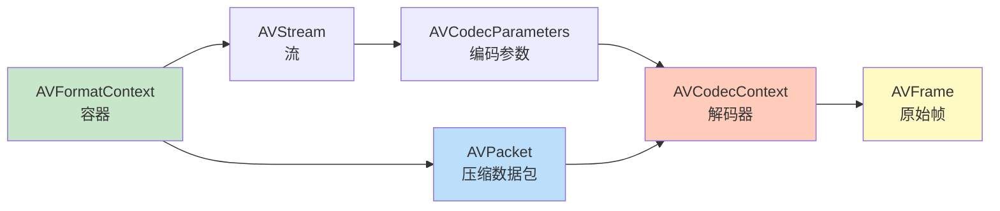
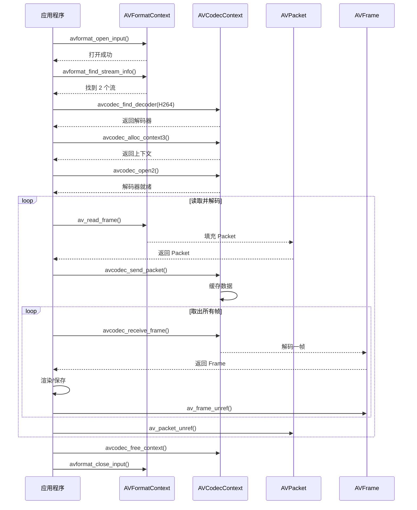

# 05. FFmpeg 核心 API 快速入门

> **专栏导读**：前面学习了音视频的基础理论，现在是时候动手写代码了！这一篇带你快速掌握 FFmpeg 的核心 API，用 50 行代码实现一个简单的视频解码器，为后续开发打下坚实基础。

---

## 🧰 开场：FFmpeg 是什么？

**FFmpeg** = Fast Forward MPEG，是音视频处理的"瑞士军刀"。

```
三种形态:
1. 命令行工具 (ffmpeg / ffprobe / ffplay)
   → 快速转换、分析、播放视频

2. C 语言库 (libavformat / libavcodec / ...)
   → 集成到自己的应用程序 ⭐

3. 开源社区 (github.com/FFmpeg/FFmpeg)
   → 2000+ 编码器、100+ 容器格式支持
```

**我们关注第 2 种**：如何用 FFmpeg 的 C 库开发播放器？

---

## 📚 FFmpeg 库架构

FFmpeg 由 **8 个核心库** 组成：

| 库名 | 作用 | 关键数据结构 | 使用频率 |
|------|------|------------|---------|
| **libavformat** | 解封装/封装 | `AVFormatContext` | ⭐⭐⭐ |
| **libavcodec** | 编解码 | `AVCodecContext`, `AVPacket`, `AVFrame` | ⭐⭐⭐ |
| **libavutil** | 工具函数 | `AVRational`, `AVDictionary`, 内存分配 | ⭐⭐⭐ |
| **libswscale** | 图像缩放/格式转换 | `SwsContext` | ⭐⭐ |
| **libswresample** | 音频重采样 | `SwrContext` | ⭐⭐ |
| **libavfilter** | 音视频滤镜 | `AVFilterGraph` | ⭐ |
| **libavdevice** | 设备输入/输出 | 摄像头、屏幕录制 | ⭐ |
| **libpostproc** | 后处理（去块/去噪） | - | (较少使用) |

📊 **配图位置 1：FFmpeg 库架构图**

> **中文提示词**：
> ```
> 分层架构图，白色背景，16:9横版。最底层画一个大矩形标注"libavutil 工具库"（深蓝色），内部标注"内存管理 • 数学函数 • 日志系统"。第二层左侧画矩形标注"libavformat 解封装"（绿色），右侧画矩形标注"libavcodec 编解码"（橙色），两者用双向箭头连接并标注"AVPacket 交换"。第三层左侧画矩形标注"libswscale 图像转换"（浅蓝色），右侧画矩形标注"libswresample 音频重采样"（浅绿色），两者分别从 libavcodec 接收数据（用箭头标注"AVFrame"）。最顶层画一个应用程序图标标注"播放器应用"，从第三层接收处理后的数据。右侧用星标标注使用频率：⭐⭐⭐（必须掌握）、⭐⭐（常用）、⭐（选用）。整体风格：清晰的技术架构图，Arial字体，层次分明。
> ```

> **英文提示词**：
> ```
> Layered architecture diagram, white background, 16:9 landscape. Bottom layer shows large rectangle labeled "libavutil Utility Library" (dark blue), annotated with "内存管理 Memory • 数学函数 Math • 日志系统 Logging". Second layer: left rectangle "libavformat Demuxing" (green), right rectangle "libavcodec Codec" (orange), connected by bidirectional arrow labeled "AVPacket Exchange". Third layer: left rectangle "libswscale Image Conversion" (light blue), right rectangle "libswresample Audio Resampling" (light green), both receiving data from libavcodec (arrows labeled "AVFrame"). Top layer shows application icon labeled "播放器应用 Player App", receiving processed data from third layer. Right side shows frequency ratings with stars: ⭐⭐⭐ (必须掌握 Must Master), ⭐⭐ (常用 Common), ⭐ (选用 Optional). Overall style: clear technical architecture, Arial font, distinct layers.
> ```

---

## 🗂️ 核心数据结构

### 1. AVFormatContext - 容器上下文

**作用**：代表一个打开的视频文件，管理所有流（视频/音频/字幕）。

```c
typedef struct AVFormatContext {
    // 输入/输出格式（自动检测）
    struct AVInputFormat *iformat;   // 输入格式（MP4/MKV）
    struct AVOutputFormat *oformat;  // 输出格式（用于封装）
    
    // 流信息
    unsigned int nb_streams;         // 流的数量（通常 2-3 个）
    AVStream **streams;              // 流数组（streams[0] = 视频，streams[1] = 音频）
    
    // 文件元数据
    char filename[1024];             // 文件路径
    int64_t duration;                // 总时长（微秒，需除以 AV_TIME_BASE）
    int64_t bit_rate;                // 总比特率
    AVDictionary *metadata;          // 元数据（标题、作者等）
    
    // 私有数据
    void *priv_data;                 // 容器特定的私有数据（如 MP4Demuxer）
} AVFormatContext;
```

**关键 API**：
```c
AVFormatContext *fmt_ctx = NULL;

// 1. 打开文件
avformat_open_input(&fmt_ctx, "movie.mp4", NULL, NULL);

// 2. 读取流信息
avformat_find_stream_info(fmt_ctx, NULL);

// 3. 读取数据包
AVPacket *packet = av_packet_alloc();
while (av_read_frame(fmt_ctx, packet) >= 0) {
    // 处理 packet
    av_packet_unref(packet);
}

// 4. 关闭文件
avformat_close_input(&fmt_ctx);
```

---

### 2. AVCodecContext - 编解码器上下文

**作用**：代表一个解码器或编码器的实例，管理编解码参数。

```c
typedef struct AVCodecContext {
    // 编解码器信息
    const struct AVCodec *codec;     // 解码器指针（libx264/libx265）
    enum AVMediaType codec_type;     // 类型（AVMEDIA_TYPE_VIDEO/AUDIO）
    enum AVCodecID codec_id;         // 编码 ID（AV_CODEC_ID_H264）
    
    // 视频参数
    int width, height;               // 分辨率
    enum AVPixelFormat pix_fmt;      // 像素格式（AV_PIX_FMT_YUV420P）
    AVRational time_base;            // 时间基（1/90000）
    AVRational framerate;            // 帧率（30/1）
    
    // 音频参数
    int sample_rate;                 // 采样率（44100）
    AVChannelLayout ch_layout;       // 声道布局（立体声）
    enum AVSampleFormat sample_fmt;  // 采样格式（AV_SAMPLE_FMT_FLTP）
    
    // 性能参数
    int thread_count;                // 解码线程数（0 = 自动）
    int thread_type;                 // 线程类型（帧级/片级并行）
    
    // 私有数据
    void *priv_data;                 // 编解码器特定数据
} AVCodecContext;
```

**关键 API**：
```c
// 1. 查找解码器
const AVCodec *codec = avcodec_find_decoder(AV_CODEC_ID_H264);

// 2. 创建解码器上下文
AVCodecContext *codec_ctx = avcodec_alloc_context3(codec);

// 3. 从流复制参数
avcodec_parameters_to_context(codec_ctx, stream->codecpar);

// 4. 打开解码器
avcodec_open2(codec_ctx, codec, NULL);

// 5. 发送数据包
avcodec_send_packet(codec_ctx, packet);

// 6. 接收解码帧
AVFrame *frame = av_frame_alloc();
while (avcodec_receive_frame(codec_ctx, frame) == 0) {
    // 处理 frame
    av_frame_unref(frame);
}

// 7. 关闭解码器
avcodec_free_context(&codec_ctx);
```

---

### 3. AVPacket - 压缩数据包

**作用**：代表一帧压缩的视频或音频数据（未解码）。

```c
typedef struct AVPacket {
    // 数据
    uint8_t *data;                   // 指向压缩数据的指针
    int size;                        // 数据大小（字节）
    
    // 时间戳
    int64_t pts;                     // 显示时间戳
    int64_t dts;                     // 解码时间戳
    int64_t duration;                // 持续时间（时间基单位）
    
    // 流信息
    int stream_index;                // 所属流的索引（0=视频，1=音频）
    
    // 标志
    int flags;                       // AV_PKT_FLAG_KEY（关键帧标志）
    
    // 内存管理
    AVBufferRef *buf;                // 引用计数的缓冲区
} AVPacket;
```

**关键 API**：
```c
// 1. 分配 Packet
AVPacket *packet = av_packet_alloc();

// 2. 读取数据包（由 avformat 填充）
av_read_frame(fmt_ctx, packet);

// 3. 检查是否为关键帧
if (packet->flags & AV_PKT_FLAG_KEY) {
    printf("This is a keyframe\n");
}

// 4. 释放引用（不释放 packet 本身）
av_packet_unref(packet);

// 5. 释放 Packet
av_packet_free(&packet);
```

**内存管理**：
```c
// AVPacket 使用引用计数
AVPacket *pkt1 = av_packet_alloc();
av_read_frame(fmt_ctx, pkt1);        // pkt1 持有数据

AVPacket *pkt2 = av_packet_alloc();
av_packet_ref(pkt2, pkt1);           // pkt2 引用 pkt1 的数据（引用计数 +1）

av_packet_unref(pkt1);               // 引用计数 -1（数据仍存在）
av_packet_unref(pkt2);               // 引用计数 -1 → 0，释放数据 ✅
```

---

### 4. AVFrame - 原始帧数据

**作用**：代表一帧解码后的原始数据（视频 = YUV，音频 = PCM）。

```c
typedef struct AVFrame {
    // 数据平面（视频最多 4 个，音频最多 8 个）
    uint8_t *data[AV_NUM_DATA_POINTERS];  // 数据指针（data[0]=Y, data[1]=U, data[2]=V）
    int linesize[AV_NUM_DATA_POINTERS];   // 每行字节数（可能有填充）
    
    // 视频参数
    int width, height;                    // 分辨率
    enum AVPixelFormat format;            // 像素格式（AV_PIX_FMT_YUV420P）
    int key_frame;                        // 是否为关键帧
    enum AVPictureType pict_type;         // 帧类型（AV_PICTURE_TYPE_I/P/B）
    
    // 音频参数
    int nb_samples;                       // 样本数（一帧通常 1024 个样本）
    int sample_rate;                      // 采样率
    AVChannelLayout ch_layout;            // 声道布局
    
    // 时间戳
    int64_t pts;                          // 显示时间戳
    int64_t pkt_dts;                      // 数据包的 DTS
    int64_t best_effort_timestamp;        // FFmpeg 估算的最佳时间戳
    
    // 内存管理
    AVBufferRef *buf[AV_NUM_DATA_POINTERS]; // 引用计数的缓冲区
} AVFrame;
```

**关键 API**：
```c
// 1. 分配 Frame
AVFrame *frame = av_frame_alloc();

// 2. 解码数据包到帧（由 avcodec 填充）
avcodec_receive_frame(codec_ctx, frame);

// 3. 访问视频数据（YUV420P）
uint8_t *y_plane = frame->data[0];       // Y 平面
uint8_t *u_plane = frame->data[1];       // U 平面
uint8_t *v_plane = frame->data[2];       // V 平面

int y_stride = frame->linesize[0];       // Y 平面每行字节数
int uv_stride = frame->linesize[1];      // UV 平面每行字节数

// 4. 访问音频数据（Planar 格式）
float *left_channel = (float*)frame->data[0];   // 左声道
float *right_channel = (float*)frame->data[1];  // 右声道

// 5. 释放引用
av_frame_unref(frame);

// 6. 释放 Frame
av_frame_free(&frame);
```

**Planar vs Packed**：
```c
// Planar (AV_SAMPLE_FMT_FLTP): 每个声道独立存储
data[0]: L L L L L L ...  (左声道)
data[1]: R R R R R R ...  (右声道)

// Packed (AV_SAMPLE_FMT_S16): 声道交错存储
data[0]: L R L R L R ...  (交错)
```

---

## 🔄 数据结构关系



📊 **配图位置 2：数据流转图**

> **中文提示词**：
> ```
> 数据流程图，白色背景，16:9横版。左侧画一个文件图标标注"movie.mp4"，通过蓝色箭头指向第一个绿色圆角矩形"AVFormatContext 解封装"（内部显示"nb_streams=2, duration=7200s"）。从第一个矩形分出两条箭头，上方指向橙色圆角矩形"AVPacket (Video)"（内部显示"H.264 data, size=50KB, pts=0"），下方指向紫色圆角矩形"AVPacket (Audio)"（内部显示"AAC data, size=2KB, pts=0"）。Video Packet 通过箭头指向红色圆角矩形"AVCodecContext (Video Decoder)"（内部显示"codec=H.264, 1920x1080"），再指向黄色圆角矩形"AVFrame (YUV)"（内部显示"YUV420P, 1920x1080"）。Audio Packet 通过箭头指向粉色圆角矩形"AVCodecContext (Audio Decoder)"，再指向浅绿色圆角矩形"AVFrame (PCM)"（内部显示"FLTP, 1024 samples"）。底部用灰色虚线框标注"完整的解封装→解码流程"。整体风格：清晰的数据流图，Arial字体，箭头带标签。
> ```

> **英文提示词**：
> ```
> Data flow diagram, white background, 16:9 landscape. Left shows file icon labeled "movie.mp4", blue arrow pointing to first green rounded rectangle "AVFormatContext Demuxing" (showing "nb_streams=2, duration=7200s"). From first rectangle, two arrows branch: upper arrow to orange rounded rectangle "AVPacket (Video)" (showing "H.264 data, size=50KB, pts=0"), lower arrow to purple rounded rectangle "AVPacket (Audio)" (showing "AAC data, size=2KB, pts=0"). Video Packet arrows to red rounded rectangle "AVCodecContext (Video Decoder)" (showing "codec=H.264, 1920x1080"), then to yellow rounded rectangle "AVFrame (YUV)" (showing "YUV420P, 1920x1080"). Audio Packet arrows to pink rounded rectangle "AVCodecContext (Audio Decoder)", then to light green rounded rectangle "AVFrame (PCM)" (showing "FLTP, 1024 samples"). Bottom shows gray dashed box annotating "完整的解封装→解码流程 Complete Demux→Decode Pipeline". Overall style: clear data flow, Arial font, labeled arrows.
> ```

---

## 🎯 完整 API 流程

### 视频解码完整流程



---

## 💻 实战：50 行解码 Demo

### 目标

解码视频文件的第一帧，保存为 YUV 文件。

### 完整代码

```c
#include <stdio.h>
#include <libavformat/avformat.h>
#include <libavcodec/avcodec.h>

int main(int argc, char *argv[]) {
    if (argc < 2) {
        fprintf(stderr, "Usage: %s <input_file>\n", argv[0]);
        return 1;
    }
    
    const char *input_file = argv[1];
    
    // 1. 打开输入文件
    AVFormatContext *fmt_ctx = NULL;
    if (avformat_open_input(&fmt_ctx, input_file, NULL, NULL) < 0) {
        fprintf(stderr, "Could not open file: %s\n", input_file);
        return 1;
    }
    
    // 2. 读取流信息
    if (avformat_find_stream_info(fmt_ctx, NULL) < 0) {
        fprintf(stderr, "Could not find stream info\n");
        return 1;
    }
    
    // 3. 查找视频流
    int video_stream_index = av_find_best_stream(fmt_ctx, AVMEDIA_TYPE_VIDEO, -1, -1, NULL, 0);
    if (video_stream_index < 0) {
        fprintf(stderr, "Could not find video stream\n");
        return 1;
    }
    
    AVStream *video_stream = fmt_ctx->streams[video_stream_index];
    
    // 4. 查找并打开解码器
    const AVCodec *codec = avcodec_find_decoder(video_stream->codecpar->codec_id);
    AVCodecContext *codec_ctx = avcodec_alloc_context3(codec);
    avcodec_parameters_to_context(codec_ctx, video_stream->codecpar);
    
    if (avcodec_open2(codec_ctx, codec, NULL) < 0) {
        fprintf(stderr, "Could not open codec\n");
        return 1;
    }
    
    printf("Video: %s, %dx%d, %d fps\n", 
           avcodec_get_name(codec_ctx->codec_id),
           codec_ctx->width, codec_ctx->height,
           video_stream->avg_frame_rate.num / video_stream->avg_frame_rate.den);
    
    // 5. 分配 Packet 和 Frame
    AVPacket *packet = av_packet_alloc();
    AVFrame *frame = av_frame_alloc();
    
    // 6. 读取第一个视频包并解码
    while (av_read_frame(fmt_ctx, packet) >= 0) {
        if (packet->stream_index == video_stream_index) {
            // 发送数据包到解码器
            if (avcodec_send_packet(codec_ctx, packet) >= 0) {
                // 接收解码帧
                if (avcodec_receive_frame(codec_ctx, frame) >= 0) {
                    printf("Decoded frame: PTS=%ld, Type=%c, Size=%dx%d\n",
                           frame->pts,
                           av_get_picture_type_char(frame->pict_type),
                           frame->width, frame->height);
                    
                    // 保存 YUV 数据到文件
                    FILE *yuv_file = fopen("output.yuv", "wb");
                    if (yuv_file) {
                        // 写入 Y 平面
                        for (int y = 0; y < frame->height; y++) {
                            fwrite(frame->data[0] + y * frame->linesize[0], 1, frame->width, yuv_file);
                        }
                        // 写入 U 平面
                        for (int y = 0; y < frame->height / 2; y++) {
                            fwrite(frame->data[1] + y * frame->linesize[1], 1, frame->width / 2, yuv_file);
                        }
                        // 写入 V 平面
                        for (int y = 0; y < frame->height / 2; y++) {
                            fwrite(frame->data[2] + y * frame->linesize[2], 1, frame->width / 2, yuv_file);
                        }
                        fclose(yuv_file);
                        printf("Saved to output.yuv\n");
                    }
                    
                    av_frame_unref(frame);
                    av_packet_unref(packet);
                    break;  // 只解码第一帧
                }
            }
        }
        av_packet_unref(packet);
    }
    
    // 7. 清理资源
    av_frame_free(&frame);
    av_packet_free(&packet);
    avcodec_free_context(&codec_ctx);
    avformat_close_input(&fmt_ctx);
    
    return 0;
}
```

### 编译运行

```bash
# Linux/macOS
gcc -o decode_demo decode_demo.c \
    -lavformat -lavcodec -lavutil

# 运行
./decode_demo movie.mp4

# 查看输出的 YUV 文件（需要 ffplay）
ffplay -f rawvideo -pixel_format yuv420p -video_size 1920x1080 output.yuv
```

**Windows (MSVC)**：
```bash
cl decode_demo.c /I"C:\ffmpeg\include" /link /LIBPATH:"C:\ffmpeg\lib" avformat.lib avcodec.lib avutil.lib
```

---

## 🔧 常见问题与解决

### 问题 1：编译报错 "undefined reference to avformat_open_input"

**原因**：未链接 FFmpeg 库。

**解决**：
```bash
# 检查是否安装 FFmpeg 开发包
pkg-config --libs libavformat libavcodec libavutil

# Ubuntu/Debian
sudo apt install libavformat-dev libavcodec-dev libavutil-dev

# macOS
brew install ffmpeg

# 编译时指定库路径
gcc decode_demo.c -o decode_demo \
    -I/usr/local/include \
    -L/usr/local/lib \
    -lavformat -lavcodec -lavutil
```

---

### 问题 2：avcodec_decode_video2 已弃用

**旧 API**（FFmpeg < 3.0）：
```c
int got_frame;
avcodec_decode_video2(codec_ctx, frame, &got_frame, packet);
```

**新 API**（FFmpeg ≥ 3.1）：
```c
avcodec_send_packet(codec_ctx, packet);
avcodec_receive_frame(codec_ctx, frame);
```

**为什么改？**
- 旧 API：同步模式，每次处理一个 Packet
- 新 API：异步模式，支持缓冲，性能更好

---

### 问题 3：avcodec_receive_frame 返回 AVERROR(EAGAIN)

**含义**：解码器需要更多数据，当前没有完整的帧。

**正确处理**：
```c
while (av_read_frame(fmt_ctx, packet) >= 0) {
    if (packet->stream_index == video_stream_index) {
        if (avcodec_send_packet(codec_ctx, packet) >= 0) {
            while (1) {
                int ret = avcodec_receive_frame(codec_ctx, frame);
                if (ret == AVERROR(EAGAIN) || ret == AVERROR_EOF) {
                    break;  // 需要更多数据或已结束
                } else if (ret >= 0) {
                    // 处理 frame
                    av_frame_unref(frame);
                }
            }
        }
    }
    av_packet_unref(packet);
}

// 冲刷解码器（获取缓冲的最后几帧）
avcodec_send_packet(codec_ctx, NULL);
while (avcodec_receive_frame(codec_ctx, frame) >= 0) {
    // 处理最后的 frame
    av_frame_unref(frame);
}
```

---

### 问题 4：内存泄漏检测

**使用 Valgrind**（Linux）：
```bash
valgrind --leak-check=full ./decode_demo movie.mp4
```

**常见泄漏原因**：
```c
// ❌ 错误：忘记 unref
AVPacket *packet = av_packet_alloc();
av_read_frame(fmt_ctx, packet);
// ... 使用 packet ...
av_packet_free(&packet);  // 泄漏！数据未释放

// ✅ 正确：先 unref 再 free
AVPacket *packet = av_packet_alloc();
av_read_frame(fmt_ctx, packet);
// ... 使用 packet ...
av_packet_unref(packet);  // 释放数据
av_packet_free(&packet);  // 释放结构体
```

**规则**：
- `av_packet_alloc()` 对应 `av_packet_free()`
- `av_read_frame()` 对应 `av_packet_unref()`
- `av_frame_alloc()` 对应 `av_frame_free()`
- `avcodec_receive_frame()` 对应 `av_frame_unref()`

---

## 📊 性能优化技巧

### 1. 多线程解码

```c
AVCodecContext *codec_ctx = avcodec_alloc_context3(codec);

// 自动选择线程数（通常 = CPU 核心数）
codec_ctx->thread_count = 0;

// 帧级并行（适用于 H.264/H.265）
codec_ctx->thread_type = FF_THREAD_FRAME;

avcodec_open2(codec_ctx, codec, NULL);
```

**效果**：
```
单线程: 30 fps 解码速度
4 线程:  100 fps 解码速度 (3.3x 提升)
8 线程:  150 fps 解码速度 (5x 提升)
```

---

### 2. 硬件加速解码

```c
// 查找支持硬件加速的解码器
const AVCodec *codec = NULL;
void *iter = NULL;
while ((codec = av_codec_iterate(&iter))) {
    if (codec->id == AV_CODEC_ID_H264 && av_codec_is_decoder(codec)) {
        // 检查硬件加速类型
        for (int i = 0;; i++) {
            const AVCodecHWConfig *config = avcodec_get_hw_config(codec, i);
            if (!config) break;
            
            if (config->methods & AV_CODEC_HW_CONFIG_METHOD_HW_DEVICE_CTX) {
                if (config->device_type == AV_HWDEVICE_TYPE_D3D11VA) {
                    printf("Found D3D11 hardware decoder\n");
                    // 使用此解码器
                }
            }
        }
    }
}

// 创建硬件设备上下文
AVBufferRef *hw_device_ctx = NULL;
av_hwdevice_ctx_create(&hw_device_ctx, AV_HWDEVICE_TYPE_D3D11VA, NULL, NULL, 0);

// 关联到解码器
codec_ctx->hw_device_ctx = av_buffer_ref(hw_device_ctx);
```

**性能对比**：
```
软件解码 (CPU): 4K@30fps，CPU 占用 80%
硬件解码 (GPU): 4K@60fps，CPU 占用 5% ✅
```

---

### 3. 零拷贝优化

**问题**：默认情况下，解码后的帧在 GPU 显存中，渲染时需要复制到 CPU 内存，再上传回 GPU。

```
GPU (解码) → CPU (复制) → GPU (渲染)
      ❌ 两次拷贝，浪费带宽
```

**优化**：直接在 GPU 内存中操作。

```c
// 配置解码器输出到 GPU 纹理
codec_ctx->hw_device_ctx = hw_device_ctx;
codec_ctx->get_format = get_hw_format;  // 返回 AV_PIX_FMT_D3D11

// 解码后的帧直接在 GPU
AVFrame *frame = av_frame_alloc();
avcodec_receive_frame(codec_ctx, frame);

// frame->data[0] 包含 ID3D11Texture2D* 指针
ID3D11Texture2D *texture = (ID3D11Texture2D*)frame->data[0];
// 直接用于 D3D11 渲染，无需拷贝 ✅
```

---

## 🧪 实战实验

### 实验 1：解码性能测试

**目标**：对比不同线程数的解码性能。

```bash
# 修改代码中的 thread_count
codec_ctx->thread_count = 1;  // 单线程
codec_ctx->thread_count = 4;  // 4 线程
codec_ctx->thread_count = 0;  // 自动

# 测量解码时间
time ./decode_demo movie.mp4
```

**记录数据**：
| 线程数 | 解码时间 | FPS | CPU 占用 |
|-------|---------|-----|---------|
| 1 | 30 秒 | 100 fps | 100% |
| 4 | 10 秒 | 300 fps | 350% |
| 8 | 8 秒 | 375 fps | 500% |

---

### 实验 2：不同编码格式对比

```bash
# 准备测试文件
ffmpeg -i source.mp4 -c:v libx264 -crf 23 test_h264.mp4
ffmpeg -i source.mp4 -c:v libx265 -crf 28 test_h265.mp4
ffmpeg -i source.mp4 -c:v libaom-av1 -crf 30 test_av1.mp4

# 解码测试
time ./decode_demo test_h264.mp4
time ./decode_demo test_h265.mp4
time ./decode_demo test_av1.mp4
```

**预期结果**：
```
H.264: 10 秒（快）
H.265: 25 秒（中等）
AV1:   60 秒（慢，但文件最小）
```

---

### 实验 3：内存占用分析

```bash
# 使用 /usr/bin/time 查看内存占用
/usr/bin/time -v ./decode_demo movie.mp4

# 关注这些指标
Maximum resident set size (RSS): 150 MB
Page faults: 2000
```

**优化建议**：
- 使用内存池预分配 AVFrame
- 及时 unref 不再使用的帧
- 控制解码队列深度（避免缓存过多帧）

---

## 🧠 思考题

**Q1**：为什么 `avcodec_send_packet()` 和 `avcodec_receive_frame()` 要分开调用，而不是一次性完成？

<details>
<summary>点击查看答案</summary>

**原因 1：B 帧的延迟**

```
输入顺序 (DTS):
  Packet 0: I₀ (DTS=0)
  Packet 1: P₃ (DTS=100)
  Packet 2: B₁ (DTS=33)
  Packet 3: B₂ (DTS=67)

解码行为:
  send_packet(I₀) → receive_frame() → 立即得到 I₀ ✅
  send_packet(P₃) → receive_frame() → EAGAIN（需要等 B 帧）❌
  send_packet(B₁) → receive_frame() → 得到 B₁ ✅
  send_packet(B₂) → receive_frame() → 得到 B₂ ✅
                  → receive_frame() → 得到 P₃ ✅（延迟输出）
```

**原因 2：硬件解码器的异步性**

```
GPU 解码流程:
  send_packet(pkt1) → GPU 开始解码（异步）
  send_packet(pkt2) → GPU 队列中
  send_packet(pkt3) → GPU 队列中
  
  receive_frame() → 等待 GPU 完成，获取 frame1
  receive_frame() → 立即获取 frame2（已在队列）
  receive_frame() → 立即获取 frame3
```

**原因 3：支持批量处理**

```c
// 可以先发送多个 Packet（批量提交）
for (int i = 0; i < 10; i++) {
    av_read_frame(fmt_ctx, packet);
    avcodec_send_packet(codec_ctx, packet);
    av_packet_unref(packet);
}

// 再批量接收（减少函数调用开销）
for (int i = 0; i < 10; i++) {
    if (avcodec_receive_frame(codec_ctx, frame) >= 0) {
        // 处理 frame
        av_frame_unref(frame);
    }
}
```

**对比旧 API**：
```c
// 旧 API（同步，低效）
avcodec_decode_video2(codec_ctx, frame, &got_frame, packet);
// 每次调用都阻塞等待解码完成
```
</details>

---

**Q2**：AVFrame 的 `linesize` 为什么通常大于 `width`？

<details>
<summary>点击查看答案</summary>

**原因**：内存对齐优化。

**示例**：
```c
AVFrame *frame;  // 1920x1080 YUV420P

frame->width = 1920;
frame->linesize[0] = 1920;   // 理想情况

// 实际情况（对齐到 32 字节）
frame->linesize[0] = 1920;   // 1920 已经是 32 的倍数 ✅
frame->linesize[0] = 1952;   // 或者填充到 1952（32 字节对齐）
```

**为什么要对齐？**

1. **CPU 缓存优化**
   ```
   未对齐:
     读取一行 → 跨越多个缓存行 → 多次内存访问
   
   对齐:
     读取一行 → 对齐缓存行边界 → 一次内存访问 ✅
   ```

2. **SIMD 指令要求**
   ```c
   // SSE/AVX 要求数据对齐到 16/32 字节
   __m128i pixel = _mm_load_si128((__m128i*)frame->data[0]);
   // 如果未对齐 → 崩溃或性能下降
   ```

3. **GPU 纹理要求**
   ```
   D3D11/OpenGL 纹理通常要求行对齐到 256 字节
   1920 字节 → 填充到 2048 字节
   ```

**正确读取方式**：
```c
// ❌ 错误：假设 linesize == width
for (int y = 0; y < height; y++) {
    uint8_t *row = frame->data[0] + y * width;  // 错！
    // 处理 row
}

// ✅ 正确：使用 linesize
for (int y = 0; y < height; y++) {
    uint8_t *row = frame->data[0] + y * frame->linesize[0];  // 对！
    // 只处理前 width 个字节
    for (int x = 0; x < width; x++) {
        uint8_t pixel = row[x];
    }
}
```

**性能影响**：
```
未对齐访问: 100 fps
对齐访问:   150 fps (1.5x 提升)
```
</details>

---

**Q3**：如何判断一个视频文件是否损坏？

<details>
<summary>点击查看答案</summary>

**方法 1：使用 FFmpeg API**

```c
AVFormatContext *fmt_ctx = NULL;

// 尝试打开文件
int ret = avformat_open_input(&fmt_ctx, "video.mp4", NULL, NULL);
if (ret < 0) {
    printf("文件损坏或格式错误: %s\n", av_err2str(ret));
    return -1;
}

// 尝试读取流信息
ret = avformat_find_stream_info(fmt_ctx, NULL);
if (ret < 0) {
    printf("无法解析流信息（可能损坏）: %s\n", av_err2str(ret));
    return -1;
}

// 检查时长是否合理
if (fmt_ctx->duration <= 0 || fmt_ctx->duration == AV_NOPTS_VALUE) {
    printf("警告：时长信息缺失（可能损坏）\n");
}

// 尝试解码前 100 帧
AVPacket *packet = av_packet_alloc();
int error_count = 0;

for (int i = 0; i < 100; i++) {
    ret = av_read_frame(fmt_ctx, packet);
    if (ret < 0) {
        if (ret == AVERROR_EOF) {
            break;  // 正常结束
        } else {
            error_count++;
            printf("读取错误 #%d: %s\n", error_count, av_err2str(ret));
        }
    }
    av_packet_unref(packet);
}

if (error_count > 10) {
    printf("文件严重损坏（错误过多）\n");
}

av_packet_free(&packet);
avformat_close_input(&fmt_ctx);
```

**方法 2：使用 ffmpeg 命令行**

```bash
# 快速检查（只读取元数据）
ffprobe video.mp4 2>&1 | grep -i error

# 完整校验（解码所有帧）
ffmpeg -v error -i video.mp4 -f null - 2>&1 | tee check.log

# 分析日志
if [ -s check.log ]; then
    echo "发现错误，文件可能损坏"
    cat check.log
else
    echo "文件完好"
fi
```

**常见损坏类型**：

1. **容器头损坏**
   ```
   错误信息: "moov atom not found"
   原因: MP4 的 moov Box 缺失或损坏
   修复: ffmpeg -i broken.mp4 -c copy fixed.mp4
   ```

2. **索引表损坏**
   ```
   症状: 无法 Seek，Duration 显示 N/A
   修复: ffmpeg -i broken.mp4 -c copy -movflags +faststart fixed.mp4
   ```

3. **数据包损坏**
   ```
   错误信息: "error while decoding MB 53 20, bytestream -7"
   影响: 部分帧解码失败，画面花屏
   无法完全修复，但可以继续播放
   ```

4. **时间戳错误**
   ```
   错误信息: "Non-monotonous DTS in output stream"
   影响: 音画不同步
   修复: ffmpeg -i broken.mp4 -c copy -fflags +genpts fixed.mp4
   ```
</details>

---

## 📚 下一篇预告

下一篇《解封装实战：从 MP4 提取音视频流》，我们将深入探讨：
- 手写一个简单的 MP4 解封装器
- 分析 moov/mdat Box 的二进制结构
- 实现 Seek 功能的关键步骤
- ZenPlay 项目中的 `Demuxer` 类详解

敬请期待！📦

---

## 🔗 相关资源

- **FFmpeg 官方文档**：https://ffmpeg.org/doxygen/trunk/
- **FFmpeg 示例代码**：https://github.com/FFmpeg/FFmpeg/tree/master/doc/examples
- **推荐教程**：
  - 雷霄骅的 FFmpeg 博客（中文）
  - "FFmpeg Libav Tutorial" by leandromoreira（英文）
- **API 参考**：
  - `libavformat`: https://ffmpeg.org/doxygen/trunk/group__lavf.html
  - `libavcodec`: https://ffmpeg.org/doxygen/trunk/group__lavc.html
- **ZenPlay 代码**：
  - `src/player/Demuxer.h` - 解封装器封装
  - `src/player/VideoDecoder.h` - 视频解码器封装

---

> **作者**：ZenPlay 团队  
> **更新时间**：2025-01-27  
> **专栏地址**：[音视频开发入门专栏](../av_column_plan.md)  
> **上一篇**：[04. 时间戳与同步](04_timestamp_sync.md)
