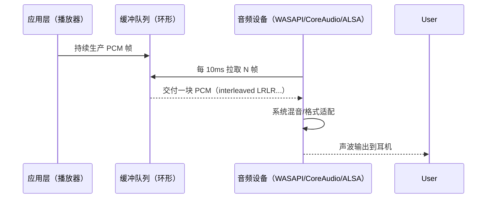
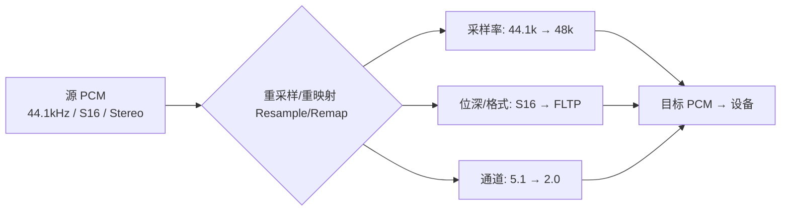

# 11. 音频渲染基础：PCM 怎么变成声音（上篇：理论 + 视觉化）

> 专栏导读：本篇用直观比喻 + Mermaid 流程图 + 中英双语 AI 提示词示意图，带你从“数字的水波（PCM）”一路走到“耳机里的声波”。下一篇将结合 ZenPlay 的 WASAPI 输出、重采样与时钟同步进行实践讲解。

---

## 🎧 开场：数字的水波如何抵达你的耳朵

把 PCM 看作被定时采样的“水波高度”序列，每个采样时刻记录左/右两个声道的幅度值。播放器把这些样本按节拍送到音频设备，设备再把它们还原成连续的电压波形驱动耳机发声。

📊 配图 A：整体工艺流水线（AI 提示词）

- 中文提示词：
  - 白色背景，16:9 横版。从左到右的工艺流水线：源 PCM（磁带图标）→ 应用缓冲（堆叠方块）→ 设备拉取（齿轮）→ 系统混音器（均衡器图标）→ DAC（芯片）→ 耳机（输出）。各模块顶部以中英文标注，如“应用缓冲 App Buffer”“系统混音 System Mixer”。色彩柔和、线条简洁。
- English prompt:
  - White background, 16:9 landscape. Left-to-right pipeline: Source PCM (tape icon) → App Buffer (stacked blocks) → Device Pull (gear) → System Mixer (equalizer icon) → DAC (chip) → Headphones (output). Bilingual labels on top of each block. Soft colors, clean lines.

---

## 🔢 PCM 是什么：样本、帧与数据率

- 样本（sample）：单个声道在某一采样时刻的幅度值（如 16-bit 整数）。
- 帧（frame）：一次采样的所有声道样本的集合（立体声=2 个样本）。
- 数据率（Bytes/s）= 采样率 × 声道数 × 每样本字节数。

示例计算（48 kHz / 16-bit / Stereo）：48000 × 2 × 2 = 192,000 Bytes/s ≈ 187.5 KB/s。

📊 配图 B：常见采样配置与数据率表（AI 提示词）

- 中文提示词：
  - 表格图，白色背景，16:9 横版。表头：采样率（44.1k/48k/96k）、位深（16/24）、声道（Mono/Stereo）、Bytes/s、KB/s。右下角小注：“Bytes/s = rate × channels × bytes_per_sample”。
- English prompt:
  - Table chart, white background, 16:9 landscape. Headers: Sample Rate, Bit Depth, Channels, Bytes/s, KB/s. Bottom-right note: “Bytes/s = rate × channels × bytes_per_sample”.

---

## 🛠 播放器与设备：拉取式回调的节拍

多数平台采用设备拉取（pull）：设备按照固定周期从你的缓冲中取走一小块 PCM 帧。



周期估算：缓冲帧数 / 采样率 = 回调周期（秒）。例如缓冲 480 帧、采样率 48 kHz → 10 ms/次。

---

## ⏱ 延迟画像：从队列到耳朵的毫秒账单

总延迟 ≈ 应用端队列 + 设备缓冲 + 系统混音/DSP（DAC/功放物理延迟通常可忽略）。

```mermaid
flowchart LR
    A[应用队列 App Queue] --> B[设备缓冲 Device Buffer]
    B --> C[系统混音/处理 System Mixer/DSP]
    C --> D[DAC/AMP]
    D --> E[耳机/扬声器]
    subgraph 估算 Estimate
    X[缓冲时延(ms) = 帧数/采样率×1000\n示例: 960/48k = 20ms]
    end
```

📊 配图 C：延迟 vs 稳定性折中曲线（AI 提示词）

- 中文提示词：
  - 折线图，白色背景，16:9 横版。X 轴“缓冲大小（ms）”，两条曲线：延迟（红）线性上升；稳定性（蓝）随缓冲增大而趋稳。标注“低延迟易断音”“大缓冲同步更难”。
- English prompt:
  - Line chart, white background, 16:9 landscape. X-axis “Buffer Size (ms)”, curves: Latency (red, increasing), Stability (blue, saturating). Annotations “Low latency → XRuns”, “Large buffer → Sync harder”.

---

## 🔁 不同格式如何“合拍”：重采样与重映射

当源音频与设备配置不一致（采样率/位深/通道布局），需要重采样（Resample）与通道重映射。



设计目标：在可接受的开销下尽量保持频谱形状与相位一致，避免可感知的失真。

---

## 🧭 时钟选择：为什么“音频主时钟”更稳

- 音频设备由硬件时钟驱动，抖动低、周期稳定。
- 播放器通常以“音频主时钟”为基准，视频去追音频（AUDIO_MASTER）。
- 无音频时才改用“视频主时钟”或外部主时钟。

回调节拍源于设备时钟 → 更容易实现平滑缓冲与时间线管理。

---

## 🎼 最后一公里：从离散到连续的声波

当 PCM 进入声卡/耳放：DAC 将离散幅度值还原为连续电压波形，低通滤波抑制采样带来的高频成分，功放把信号放大驱动负载，最终鼓膜振动形成听感。

📊 配图 D：数字→模拟信号链（AI 提示词）

- 中文提示词：
  - 信号链示意图，白色背景，16:9 横版。模块：PCM（离散点）→ DAC（芯片方块）→ 低通滤波（圆角矩形）→ 功放（三角形）→ 耳机。每个模块上方中英双标：“DAC 数模转换 / DAC”“LPF 低通滤波 / Low-pass Filter”“AMP 功放 / Amplifier”。
- English prompt:
  - Signal chain diagram, white background, 16:9 landscape. Modules: PCM (discrete dots) → DAC (chip square) → LPF (rounded rectangle) → AMP (triangle) → Headphones. Bilingual labels above each.

---

## 🧪 一眼看懂的正弦波：用数学生成 PCM

样本值公式：$s[n] = A\cdot\sin\left(2\pi f\frac{n}{F_s}\right)$，其中 $A$ 为幅度，$f$ 为频率，$F_s$ 为采样率。

📊 配图 E：正弦波与采样点（AI 提示词）

- 中文提示词：
  - 波形图，白色背景，16:9 横版。蓝色连续正弦曲线，上叠均匀黑点采样（每周期 48 点代表 48kHz）。左上角标注“f=440Hz, Fs=48kHz, A=0.8”。
- English prompt:
  - Waveform diagram, white background, 16:9 landscape. Blue continuous sine curve with evenly spaced black sample dots (48 per cycle for 48kHz). Top-left label “f=440Hz, Fs=48kHz, A=0.8”.

示例代码（C++，生成 1 秒 48kHz/16-bit/stereo 正弦波）：

```cpp
#include <cmath>
#include <vector>
#include <cstdint>

struct PCMBuffer {
    std::vector<int16_t> interleaved; // LRLR...
    int sample_rate = 48000;
    int channels = 2;
};

PCMBuffer make_sine(double freq, double seconds, double amplitude = 0.8, int sample_rate = 48000) {
    PCMBuffer buf;
    buf.sample_rate = sample_rate;
    buf.channels = 2;
    int total_frames = static_cast<int>(seconds * sample_rate);
    buf.interleaved.resize(total_frames * buf.channels);

    for (int n = 0; n < total_frames; ++n) {
        double s = amplitude * std::sin(2.0 * M_PI * freq * n / sample_rate);
        int16_t v = static_cast<int16_t>(std::round(s * 32767));
        buf.interleaved[n * 2 + 0] = v; // L
        buf.interleaved[n * 2 + 1] = v; // R
    }
    return buf;
}
```

---

---

## 📚 本篇总结（下一篇预告）

- 你已掌握：PCM 的结构与数据率、设备拉取时序、延迟构成与估算、重采样与重映射、数字到模拟的信号链、正弦波生成实操。
- 下一篇（实践篇）将落地到 ZenPlay：WASAPI 拉取回调与环形缓冲、源→设备的重采样通道、音频主时钟与 A/V 同步策略、与渲染线程/统计系统的协作。

---

> 作者：ZenPlay 团队  
> 更新时间：2025-01-27  
> 专栏地址：[音视频开发入门专栏](../av_column_plan.md)  
> 上一篇：[07. 视频解码实战：把 H.264 码流变成 YUV（上篇：理论 + 实践）](07_video_decode_theory_practice_v2.md)  
> 下一篇：11（下）音频渲染基础：ZenPlay 实践篇（WASAPI + 重采样 + 同步）
