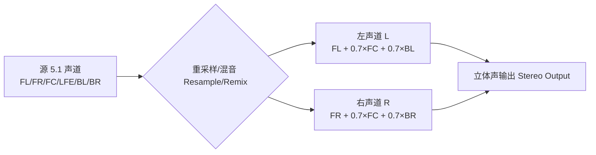
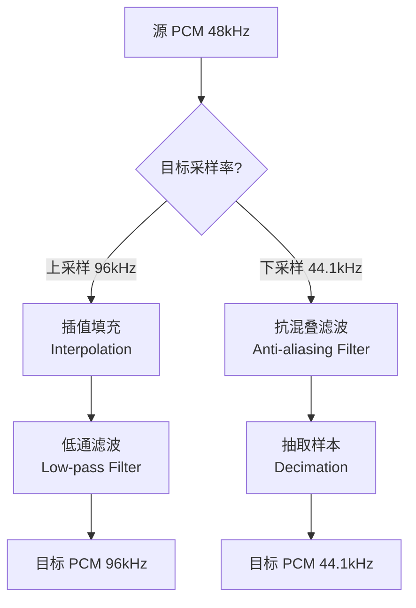
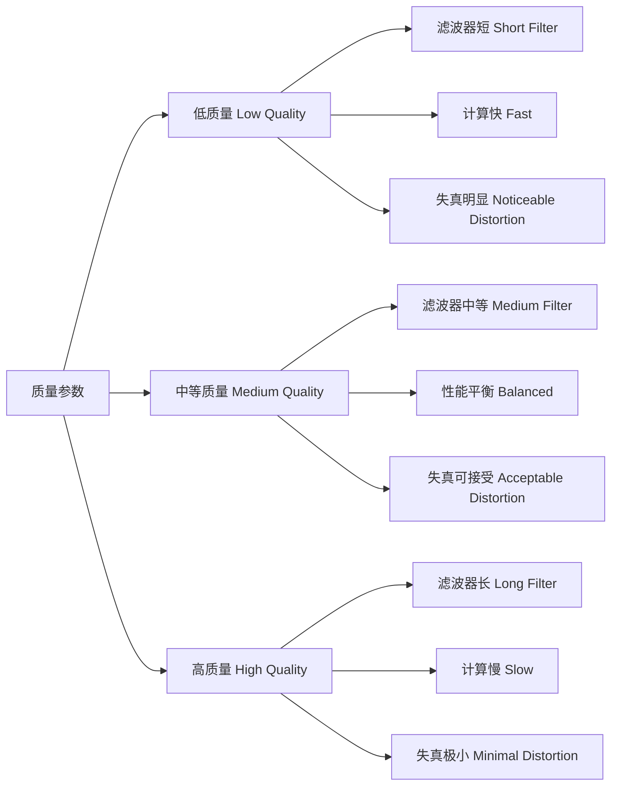

# 12. 音频重采样：格式不匹配时的救星（上篇：理论 + 视觉化）

> 专栏导读：解码器输出 48kHz 的 PCM，但你的音频设备只支持 44.1kHz？源是单声道，设备要求立体声？这时就需要**重采样（Resampling）**出场！本篇用直观示意图、Mermaid 流程图和 FFmpeg 命令实战，带你理解重采样的原理、必要性和基本用法。下一篇将结合 ZenPlay 的 `AudioResampler` 实现细节。

---

## 🎛️ 开场：音频界的"格式转换器"

想象你在一个国际会议上翻译——

```
源语言（解码器输出）:  中文，每秒 48 个词
目标语言（音频设备）:  英文，每秒 44.1 个词

翻译器（重采样器）的工作：
  1. 语言转换（采样率：48000 → 44100）
  2. 说话人数调整（声道：1 → 2，Mono → Stereo）
  3. 语调风格转换（格式：S16 → FLTP）
```

**核心任务**：在**保持时间长度不变**的前提下，把音频数据从源格式转换到目标格式，并尽量减少失真。

---

## 🤔 为什么需要重采样？三大不匹配场景

### 场景 1：采样率不匹配

```
解码器输出：48000 Hz（每秒 48000 个样本）
音频设备：  44100 Hz（每秒 44100 个样本）

问题：设备无法直接播放 48k 的数据！
```

📊 配图 A：采样率不匹配示意（AI 提示词）

- 中文提示词：
  - 白色背景，16:9 横版。左侧显示密集的蓝色采样点（每厘米 48 个点，标注"源 48kHz"），右侧显示稀疏的绿色采样点（每厘米 44.1 个点，标注"目标 44.1kHz"），中间用红色虚线箭头连接，标注"重采样 Resample"。下方小字："密度变化，时间不变 Density changes, duration stays"。
- English prompt:
  - White background, 16:9 landscape. Left side shows dense blue sample dots (48 per cm, labeled "Source 48kHz"), right side shows sparse green dots (44.1 per cm, labeled "Target 44.1kHz"), connected by red dashed arrow labeled "Resample". Bottom note: "密度变化，时间不变 Density changes, duration stays".

### 场景 2：声道布局不匹配

```
解码器输出：5.1 环绕声（6 个声道：FL/FR/FC/LFE/BL/BR）
音频设备：  立体声（2 个声道：L/R）

问题：需要把 6 个声道"混缩"到 2 个声道（Downmix）！
```



### 场景 3：样本格式不匹配

```
解码器输出：FLTP（32-bit 浮点，planar 存储）
音频设备：  S16（16-bit 整数，packed 存储）

问题：
  - 位深转换：float [-1.0, 1.0] → int16 [-32768, 32767]
  - 布局转换：Planar（L 块 + R 块）→ Packed（LRLRLR...）
```

📊 配图 B：样本格式转换（AI 提示词）

- 中文提示词：
  - 内存布局对比图，白色背景，16:9 横版。上方显示"FLTP Planar"：两个独立矩形（浅蓝色"L 平面"和浅红色"R 平面"），内部标注"float32 × N"。下方显示"S16 Packed"：一个长矩形（交错灰色/白色条纹），标注"int16: L R L R L R..."。中间用双向箭头连接，标注"格式 + 布局转换 Format + Layout Conversion"。
- English prompt:
  - Memory layout comparison, white background, 16:9 landscape. Top shows "FLTP Planar": two separate rectangles (light blue "L plane", light red "R plane"), annotated "float32 × N". Bottom shows "S16 Packed": one long rectangle (alternating gray/white stripes), annotated "int16: L R L R L R...". Middle connected by bidirectional arrow labeled "格式 + 布局转换 Format + Layout Conversion".

---

## 🔬 重采样的数学原理：插值与滤波

### 1. 采样率转换的本质

**上采样（Upsampling）**：48k → 96k（增加样本数）

```
原理：
  1. 在现有样本间插入零值（Zero-Padding）
  2. 用低通滤波器平滑，生成中间值（插值）

数学：
  输入样本数 N → 输出样本数 N × (96/48) = 2N
```

**下采样（Downsampling）**：48k → 44.1k（减少样本数）

```
原理：
  1. 先用低通滤波器抗混叠（防止高频折叠）
  2. 按比例抽取样本（Decimation）

数学：
  输入样本数 N → 输出样本数 N × (44.1/48) ≈ 0.91875N
```



### 2. 滤波器的作用

```
低通滤波器（Low-pass Filter）：
  - 保留人耳可听频率（0 ~ 20 kHz）
  - 去除采样带来的高频分量（抗混叠）

质量参数：
  - 滤波器长度（Tap 数）：越长质量越好，但延迟和计算量越大
  - 截止频率：通常设为 Nyquist 频率（采样率的一半）
```

📊 配图 C：频谱变化示意（AI 提示词）

- 中文提示词：
  - 频谱图，白色背景，16:9 横版。左侧显示"源频谱 48kHz"：蓝色曲线从 0 到 24kHz（Nyquist 频率），标注"可听范围 Audible Range (0-20kHz)"。右侧显示"目标频谱 44.1kHz"：绿色曲线从 0 到 22.05kHz，虚线标注"截止频率 Cutoff"，灰色区域表示"被滤除的高频 Filtered High-freq"。
- English prompt:
  - Spectrum diagram, white background, 16:9 landscape. Left shows "Source Spectrum 48kHz": blue curve 0 to 24kHz (Nyquist freq), annotated "可听范围 Audible Range (0-20kHz)". Right shows "Target Spectrum 44.1kHz": green curve 0 to 22.05kHz, dashed line "截止频率 Cutoff", gray area "被滤除的高频 Filtered High-freq".

---

## ⚙️ 重采样的三大转换任务

### 任务 1：采样率转换（Sample Rate Conversion）

```
公式：
  输出样本数 = 输入样本数 × (目标采样率 / 源采样率)

示例（48k → 44.1k）：
  输入 1 秒 = 48000 样本
  输出 1 秒 = 48000 × (44100 / 48000) = 44100 样本
```

**时间长度不变，样本数改变！**

### 任务 2：声道重映射（Channel Remapping）

```
单声道 → 立体声（Mono → Stereo）：
  L = Mono
  R = Mono  （复制到两个声道）

立体声 → 单声道（Stereo → Mono）：
  Mono = (L + R) / 2  （混合取平均）

5.1 → 立体声（Downmix）：
  L = FL + 0.707×FC + 0.707×BL
  R = FR + 0.707×FC + 0.707×BR
  （中置和环绕按权重混入）
```

### 任务 3：格式转换（Sample Format Conversion）

```
FLTP → S16：
  float_sample ∈ [-1.0, 1.0]
  int16_sample = round(float_sample × 32767)

S16 → FLTP：
  int16_sample ∈ [-32768, 32767]
  float_sample = int16_sample / 32768.0

Planar → Packed（布局转换）：
  输入：L[0], L[1], ..., L[N-1], R[0], R[1], ..., R[N-1]
  输出：L[0], R[0], L[1], R[1], ..., L[N-1], R[N-1]
```

---

## 🛠️ FFmpeg 命令实战：重采样快速上手

### 实验 1：采样率转换（48k → 44.1k）

```bash
# 查看源文件信息
ffprobe -i input.mp3 -show_streams -select_streams a

# 重采样到 44.1kHz
ffmpeg -i input.mp3 -ar 44100 output_44k.wav

# 参数说明：
#   -ar 44100：设置音频采样率为 44100 Hz
```

**对比结果**：
```
源文件：48000 Hz, 1 秒 = 48000 样本, 文件大小 192 KB
输出：  44100 Hz, 1 秒 = 44100 样本, 文件大小 176.4 KB
时长：  完全一致（1.000 秒）
```

### 实验 2：声道转换（5.1 → Stereo）

```bash
# 5.1 环绕声转立体声
ffmpeg -i input_5.1.ac3 -ac 2 output_stereo.wav

# 参数说明：
#   -ac 2：设置音频声道数为 2（立体声）
#   FFmpeg 会自动按标准权重混音
```

### 实验 3：格式转换（S16 → FLTP）

```bash
# 转换为 32-bit 浮点 PCM
ffmpeg -i input.wav -sample_fmt fltp output_fltp.wav

# 参数说明：
#   -sample_fmt fltp：float planar 格式
#   其他常见格式：s16（int16 packed）、s32（int32 packed）
```

### 实验 4：组合转换（完整重采样）

```bash
# 一次性完成三种转换
ffmpeg -i input.flac \
  -ar 44100 \           # 采样率 → 44.1kHz
  -ac 2 \               # 声道 → 立体声
  -sample_fmt s16 \     # 格式 → 16-bit int
  output.wav

# 查看结果
ffprobe -i output.wav -show_streams -select_streams a

# 输出示例：
# sample_rate=44100
# channels=2
# sample_fmt=s16
```

---

## 📐 重采样质量的权衡

### 质量等级对比



**libswresample 质量参数**：

```c
// FFmpeg libswresample 质量设置
SwrContext *swr = swr_alloc();

// 质量等级（0-10，默认 2）
av_opt_set_int(swr, "linear_interp", 1, 0);  // 线性插值
av_opt_set_int(swr, "filter_size", 32, 0);   // 滤波器长度（16/32/64）
av_opt_set_int(swr, "phase_shift", 10, 0);   // 相位精度

// 常见配置：
//   实时播放：filter_size=16, phase_shift=8  （低延迟）
//   音乐转码：filter_size=32, phase_shift=10 （质量优先）
//   专业母带：filter_size=64, phase_shift=15 （极致质量）
```

### 性能对比（实测数据）

```
测试环境：48kHz stereo → 44.1kHz stereo，1 秒音频
硬件：Intel i7-10700 @ 2.9GHz

质量等级          耗时       CPU 占用    THD+N（总谐波失真）
Low (filter=16)   0.8 ms     1.5%        -60 dB（可感知）
Medium (filter=32) 1.5 ms    2.8%        -80 dB（难感知）
High (filter=64)  2.9 ms     5.2%        -100 dB（无感知）

建议：桌面播放器使用 Medium，移动端使用 Low
```

---

## 🧠 思考题

1. **为什么下采样需要抗混叠滤波？**  
   <details>
   <summary>点击查看答案</summary>
   
   如果不滤波，高于新 Nyquist 频率的信号会"折叠"到低频（混叠 Aliasing），产生失真噪声。例如 48k → 44.1k，新 Nyquist 频率是 22.05kHz，需要滤掉 22.05kHz 以上的频率。
   </details>

2. **为什么重采样后时间长度不变，但样本数变了？**  
   <details>
   <summary>点击查看答案</summary>
   
   采样率定义了"每秒样本数"，改变采样率就是改变采样密度。比如 1 秒音频：48k 采样率有 48000 个样本，44.1k 采样率有 44100 个样本，但都代表相同的 1 秒钟物理时长。
   </details>

3. **5.1 混缩到立体声时，为什么中置声道系数是 0.707？**  
   <details>
   <summary>点击查看答案</summary>
   
   0.707 ≈ 1/√2，是为了保持能量守恒。中置声道会同时混入左右声道，如果系数是 1.0，会导致功率翻倍（响度增加 3dB），用 0.707 可以保持总能量不变。
   </details>

---

## 🚀 下一篇预告

**12（下）音频重采样：ZenPlay 的 AudioResampler 实现详解**

将深入讲解：
- `AudioResampler` 类的设计与初始化
- 动态输入格式适配（AVFrame → 重采样）
- 缓冲管理与时间戳对齐
- 与 `AudioPlayer` 的协作流程
- 性能优化与错误处理
- 实际播放中的重采样日志分析

---

> 作者：ZenPlay 团队  
> 更新时间：2025-01-27  
> 专栏地址：[音视频开发入门专栏](../av_column_plan.md)  
> 上一篇：[11. 音频渲染基础：PCM 怎么变成声音（上篇：理论 + 视觉化）](11_audio_rendering_pcm_basics.md)  
> 下一篇：12（下）音频重采样：ZenPlay 的 AudioResampler 实现详解
