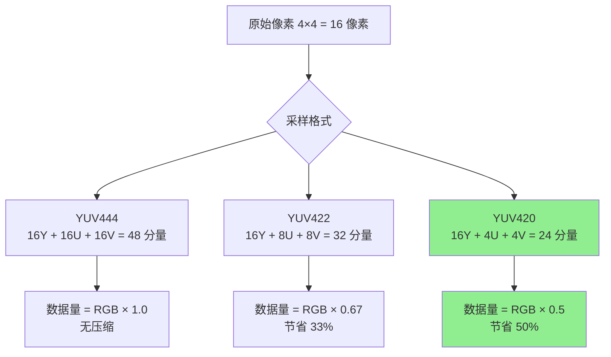

# 15. 视频渲染基础：YUV 到 RGB 的颜色空间转换（上篇：理论 + 视觉化）

> 专栏导读：解码器输出的是 YUV 格式，但显示器只认识 RGB！本篇用直观示意图、Mermaid 流程图和数学公式，带你深入理解 YUV/RGB 颜色空间的本质、为什么视频用 YUV、以及转换的数学原理。下一篇将结合 ZenPlay 的 `D3D11Renderer` 实现细节。

---

## 🎨 开场：两种"画布"的语言

想象你在调色板前作画——

```
RGB（显示器的语言）:
  - 红色（Red）、绿色（Green）、蓝色（Blue）三原色混合
  - 每个像素 = (R, G, B) 三个独立数值
  - 直观、适合显示，但数据量大

YUV（视频编码的语言）:
  - Y（亮度 Luma）：黑白信息，人眼最敏感
  - U/V（色度 Chroma）：颜色信息，人眼不敏感
  - 可以压缩 U/V，节省 50% 空间（YUV420）
```

**核心问题**：如何把 YUV（解码器输出）转换成 RGB（显示器需要）？转换的数学原理是什么？

📊 配图 A：RGB vs YUV 存储对比（AI 提示词）

- 中文提示词：
  - 白色背景，16:9 横版。左侧显示"RGB 存储"：一个 2×2 像素网格，每个格子标注"R G B"三个分量（红绿蓝小方块），下方标注"4 像素 = 12 个分量"。右侧显示"YUV420 存储"：上方 2×2 网格每个格子标注"Y"（灰色），下方两个小格子标注"U""V"（蓝色和红色），下方标注"4 像素 = 6 个分量（节省 50%）"。中间用双向箭头连接，标注"颜色空间转换 Color Space Conversion"。
- English prompt:
  - White background, 16:9 landscape. Left shows "RGB Storage": 2×2 pixel grid, each cell labeled "R G B" components (red/green/blue squares), bottom note "4 pixels = 12 components". Right shows "YUV420 Storage": top 2×2 grid each cell labeled "Y" (gray), bottom two small cells "U""V" (blue/red), note "4 pixels = 6 components (50% saving)". Middle connected by bidirectional arrow labeled "颜色空间转换 Color Space Conversion".

---

## 🔬 YUV 是什么：分离亮度与色度的智慧

### 1. 为什么要发明 YUV？

```
人眼特性：
  - 对亮度变化（明暗）非常敏感
  - 对色彩变化（彩色）相对不敏感

YUV 的设计思路：
  1. 把亮度（Y）和色彩（U/V）分开存储
  2. 亮度保持全分辨率（人眼敏感）
  3. 色彩降低分辨率（人眼不敏感）→ 节省空间！
```

**历史背景**：YUV 最初是为了让黑白电视和彩色电视兼容。黑白电视只需要读取 Y 分量，彩色电视再加上 U/V 分量。

### 2. YUV 的三个分量

```
Y（Luma 亮度）:
  - 表示像素的明暗程度（黑 → 灰 → 白）
  - 范围：通常 [16, 235]（视频级别）或 [0, 255]（JPEG 级别）

U（Cb 色度蓝）:
  - 表示蓝色分量与亮度的差值
  - 范围：通常 [16, 240]，中性值 128

V（Cr 色度红）:
  - 表示红色分量与亮度的差值
  - 范围：通常 [16, 240]，中性值 128
```

📊 配图 B：YUV 三分量示意（AI 提示词）

- 中文提示词：
  - 白色背景，16:9 横版。三张并排的图像示意：左侧"Y 亮度平面"显示灰度梯度（黑到白），标注"Full Resolution 全分辨率 1920×1080"；中间"U 色度平面"显示蓝色梯度（偏蓝到偏黄），标注"Half Resolution 半分辨率 960×540"；右侧"V 色度平面"显示红色梯度（偏绿到偏红），标注"Half Resolution 半分辨率 960×540"。下方总结："YUV420: Y 全尺寸，U/V 各 1/4"。
- English prompt:
  - White background, 16:9 landscape. Three side-by-side image representations: left "Y Luma Plane" shows grayscale gradient (black to white), labeled "Full Resolution 全分辨率 1920×1080"; middle "U Chroma Plane" shows blue gradient (blue-ish to yellow-ish), labeled "Half Resolution 半分辨率 960×540"; right "V Chroma Plane" shows red gradient (green-ish to red-ish), labeled "Half Resolution 半分辨率 960×540". Bottom summary: "YUV420: Y full size, U/V each 1/4".

---

## 📐 YUV 采样格式：4:4:4 / 4:2:2 / 4:2:0

### 采样比例详解

```
YUV444（无压缩）:
  - Y、U、V 都是全分辨率
  - 每个像素都有独立的 Y/U/V 值
  - 数据量 = RGB（无节省）

YUV422（半宽压缩）:
  - Y 全分辨率，U/V 水平减半
  - 水平 2 个像素共享 1 组 U/V
  - 数据量 = RGB × 2/3（节省 33%）

YUV420（最常用）:
  - Y 全分辨率，U/V 水平和垂直都减半
  - 2×2 的 4 个像素共享 1 组 U/V
  - 数据量 = RGB × 1/2（节省 50%）
```



📊 配图 C：YUV420 采样示意（AI 提示词）

- 中文提示词：
  - 像素网格图，白色背景，16:9 横版。画一个 4×4 的像素网格，每个格子标注"Y"（浅灰色）。在网格右侧画一个 2×2 的小网格，标注"U"（浅蓝色）和"V"（浅红色）。用虚线箭头从左侧 2×2 的一组像素指向右侧的一个 U/V 格子，标注"4 像素共享 1 组 U/V"。下方标注："YUV420: 亮度全采样，色度 1/4 采样 Luma full sampled, Chroma 1/4 subsampled"。
- English prompt:
  - Pixel grid diagram, white background, 16:9 landscape. Draw 4×4 pixel grid, each cell labeled "Y" (light gray). Right side shows 2×2 smaller grid labeled "U" (light blue) and "V" (light red). Dashed arrows from left 2×2 pixel group pointing to one U/V cell on right, annotated "4 像素共享 1 组 U/V 4 pixels share 1 U/V pair". Bottom note: "YUV420: 亮度全采样，色度 1/4 采样 Luma full sampled, Chroma 1/4 subsampled".

---

## 🧮 YUV 到 RGB 的转换公式

### 1. 标准转换矩阵（BT.601）

BT.601（标清标准）转换公式：

$$
\begin{aligned}
R &= 1.164(Y - 16) + 1.596(V - 128) \\
G &= 1.164(Y - 16) - 0.391(U - 128) - 0.813(V - 128) \\
B &= 1.164(Y - 16) + 2.018(U - 128)
\end{aligned}
$$

**矩阵形式**：

$$
\begin{bmatrix}
R \\
G \\
B
\end{bmatrix}
=
\begin{bmatrix}
1.164 & 0 & 1.596 \\
1.164 & -0.391 & -0.813 \\
1.164 & 2.018 & 0
\end{bmatrix}
\begin{bmatrix}
Y - 16 \\
U - 128 \\
V - 128
\end{bmatrix}
$$

### 2. 高清标准（BT.709）

BT.709（高清标准，1080p/4K）转换公式：

$$
\begin{aligned}
R &= 1.164(Y - 16) + 1.793(V - 128) \\
G &= 1.164(Y - 16) - 0.213(U - 128) - 0.533(V - 128) \\
B &= 1.164(Y - 16) + 2.112(U - 128)
\end{aligned}
$$

**关键区别**：

```
BT.601（标清 SD，≤576p）:
  - 色域较窄
  - 系数：V→R = 1.596, U→B = 2.018

BT.709（高清 HD/4K，≥720p）:
  - 色域更宽，色彩更鲜艳
  - 系数：V→R = 1.793, U→B = 2.112

⚠️ 用错标准会导致颜色偏差（偏红或偏绿）！
```

### 3. JPEG 格式的特殊处理

```
JPEG/Full Range YUV:
  - Y 范围：[0, 255]（不是 [16, 235]）
  - U/V 范围：[0, 255]（不是 [16, 240]）

转换公式（简化）:
  R = Y + 1.402 × (V - 128)
  G = Y - 0.344 × (U - 128) - 0.714 × (V - 128)
  B = Y + 1.772 × (U - 128)
```

---

## 🔄 转换原理深入：从 YUV 到 RGB 的推导

### 1. RGB 到 YUV 的正向推导

首先理解 YUV 是如何从 RGB 产生的（编码阶段）：

```
正向转换（RGB → YUV）：
  Y  = 0.299×R + 0.587×G + 0.114×B    （亮度加权和）
  U  = 0.492×(B - Y) = -0.147×R - 0.289×G + 0.436×B
  V  = 0.877×(R - Y) =  0.615×R - 0.515×G - 0.100×B

设计原理：
  - Y 系数（0.299, 0.587, 0.114）模拟人眼对 RGB 的敏感度
  - 绿色系数最大（0.587），因为人眼对绿色最敏感
  - U/V 是色度差值，中性色（灰色）时 U=V=0
```

📊 配图 D：RGB 到 YUV 权重分解（AI 提示词）

- 中文提示词：
  - 白色背景，16:9 横版。左侧显示一个 RGB 立方体（红绿蓝三轴），右侧显示 YUV 坐标系。从 RGB 立方体的对角线（灰度轴）引出箭头指向 Y 轴，标注"亮度分量 Luma 0.299R+0.587G+0.114B"。从立方体的蓝色方向引出箭头指向 U 轴，标注"色度蓝 Chroma Blue (B-Y)"。从红色方向引出箭头指向 V 轴，标注"色度红 Chroma Red (R-Y)"。
- English prompt:
  - White background, 16:9 landscape. Left shows RGB cube (red/green/blue axes), right shows YUV coordinate system. Arrow from RGB cube diagonal (grayscale axis) to Y axis, labeled "亮度分量 Luma 0.299R+0.587G+0.114B". Arrow from blue direction to U axis, labeled "色度蓝 Chroma Blue (B-Y)". Arrow from red direction to V axis, labeled "色度红 Chroma Red (R-Y)".

### 2. 逆向转换（YUV → RGB）推导

解码时需要反向计算，从 YUV 还原 RGB：

```
从正向公式推导：
  Y  = 0.299R + 0.587G + 0.114B    ...(1)
  U  = 0.492(B - Y)                ...(2)
  V  = 0.877(R - Y)                ...(3)

从 (2) 解出 B：
  B = Y + U/0.492 = Y + 2.032U

从 (3) 解出 R：
  R = Y + V/0.877 = Y + 1.140V

将 R 和 B 代入 (1) 解出 G：
  Y = 0.299(Y+1.140V) + 0.587G + 0.114(Y+2.032U)
  0.587G = Y - 0.299Y - 0.114Y - 0.341V - 0.232U
  G = Y - 0.394U - 0.581V
```

**JPEG/Full Range 的简化公式**：

$$
\begin{aligned}
R &= Y + 1.402V \\
G &= Y - 0.344U - 0.714V \\
B &= Y + 1.772U
\end{aligned}
$$

### 3. Video Range 的修正

视频标准使用受限范围（Limited Range），需要额外处理：

```
Video Range（BT.601/BT.709）：
  Y  范围：[16, 235]（不是 [0, 255]）
  UV 范围：[16, 240]，中性值 128

归一化步骤：
  Y'  = (Y - 16) / 219    （将 [16,235] 映射到 [0,1]）
  U'  = (U - 128) / 224   （将 [16,240] 中心化到 [-0.5,0.5]）
  V'  = (V - 128) / 224

应用转换：
  R = Y' + aV'
  G = Y' + bU' + cV'
  B = Y' + dU'

缩放回 [0, 255]：
  R_final = clamp(R × 255, 0, 255)
```

### 转换流程图

```mermaid
flowchart TD
    A[YUV 原始值\nY[16,235] U[16,240] V[16,240]] --> B{Range Type?}
    B -->|Video Limited| C[归一化\nY'=(Y-16)/219\nU'=(U-128)/224\nV'=(V-128)/224]
    B -->|Full JPEG| D[中心化\nU'=(U-128)/255\nV'=(V-128)/255]
    C --> E{色彩标准?}
    D --> E
    E -->|BT.601 SD| F[应用 BT.601 系数\nR=Y'+1.596V'\nG=Y'-0.391U'-0.813V'\nB=Y'+2.018U']
    E -->|BT.709 HD| G[应用 BT.709 系数\nR=Y'+1.793V'\nG=Y'-0.213U'-0.533V'\nB=Y'+2.112U']
    F --> H[钳位到 [0,255]\nClamp RGB]
    G --> H
    H --> I[输出 RGB 像素]
```

---

## 🧪 FFmpeg 命令实战：颜色空间转换

### 实验 1：查看视频的颜色空间信息

```bash
# 查看详细信息
ffprobe -v error -show_streams -select_streams v input.mp4

# 关键字段：
# color_space: bt709 或 bt470bg (BT.601)
# color_range: tv (限制范围) 或 pc (全范围)
# pix_fmt: yuv420p, yuv422p, yuv444p 等
```

### 实验 2：YUV 到 RGB 转换（CPU）

```bash
# 转换为 RGB24 格式（CPU 转换）
ffmpeg -i input.mp4 -pix_fmt rgb24 output_rgb.avi

# 指定颜色空间标准
ffmpeg -i input.mp4 \
  -vf "scale=in_color_matrix=bt709:out_color_matrix=bt709" \
  -pix_fmt rgb24 output.mp4
```

### 实验 3：不同标准对比（制造颜色偏差）

```bash
# 正确：用 BT.709 处理 1080p 视频
ffmpeg -i input_1080p.mp4 \
  -vf "scale=in_color_matrix=bt709:out_color_matrix=bt709" \
  output_correct.mp4

# 错误：用 BT.601 处理 1080p 视频（会偏色）
ffmpeg -i input_1080p.mp4 \
  -vf "scale=in_color_matrix=bt601:out_color_matrix=bt601" \
  output_wrong.mp4

# 对比两个文件，可以看到明显的颜色差异
```

### 实验 4：提取 YUV 平面查看

```bash
# 提取 Y 平面（灰度图）
ffmpeg -i input.mp4 -vf "extractplanes=y" -pix_fmt gray output_y.png

# 提取 U 平面（蓝-黄）
ffmpeg -i input.mp4 -vf "extractplanes=u" -pix_fmt gray output_u.png

# 提取 V 平面（绿-红）
ffmpeg -i input.mp4 -vf "extractplanes=v" -pix_fmt gray output_v.png
```

---

## 💡 为什么 YUV 和 RGB 系数会不同？

### 1. BT.601 vs BT.709 的色彩科学

```
标准差异的根源：
  - 色域（Color Gamut）：可以表示的颜色范围
  - 白点（White Point）：参考白色的定义（D65 vs D93）
  - 伽马曲线（Gamma）：非线性亮度映射

BT.601（1982 年，标清时代）：
  - 为 CRT 显示器设计
  - 色域较窄，对应当时的荧光粉特性
  - 系数：R 权重 1.596，B 权重 2.018

BT.709（1990 年，高清时代）：
  - 为现代液晶/OLED 设计
  - 色域更宽，色彩更鲜艳
  - 系数：R 权重 1.793（+12%），B 权重 2.112（+5%）
```

📊 配图 E：BT.601 vs BT.709 色域对比（AI 提示词）

- 中文提示词：
  - 白色背景，16:9 横版。CIE 1931 色度图为底（马蹄形彩色区域），叠加两个三角形色域：内部较小三角形标注"BT.601 色域 SD Color Gamut"（蓝色虚线），外部较大三角形标注"BT.709 色域 HD Color Gamut"（红色实线）。三角形顶点标注 R/G/B。中央标注白点"D65"。右侧文字说明："BT.709 色域更宽，覆盖更多饱和色彩 Wider gamut, more saturated colors"。
- English prompt:
  - White background, 16:9 landscape. CIE 1931 chromaticity diagram as background (horseshoe colored area), overlaid with two triangular gamuts: inner smaller triangle labeled "BT.601 色域 SD Color Gamut" (blue dashed), outer larger triangle labeled "BT.709 色域 HD Color Gamut" (red solid). Triangle vertices labeled R/G/B. Center marked "D65 white point". Right text: "BT.709 色域更宽，覆盖更多饱和色彩 Wider gamut, more saturated colors".

### 2. 实际色差案例

```
测试用例：纯红色像素
  RGB = (255, 0, 0)

用 BT.601 编码再用 BT.709 解码：
  编码（601）: Y=76, U=85, V=255
  解码（709）: R=255×1.122=286 → clamp(286)=255 ❌ 过饱和！
                G= 负值 → clamp=0
                B= 负值 → clamp=0
  
结果：红色会显得"过曝"，失去层次

用 BT.709 编码再用 BT.601 解码：
  编码（709）: Y=76, U=85, V=255
  解码（601）: R=255×0.89=227 ❌ 不饱和！
  
结果：红色会显得"发灰"，不鲜艳
```

---

## 🛠️ 简单 API 示例：libswscale 转换

### 最小代码示例（C）

```c
#include <libswscale/swscale.h>
#include <libavutil/frame.h>
#include <libavutil/imgutils.h>

// 创建转换上下文
struct SwsContext* create_yuv_to_rgb_converter(
    int width, int height,
    enum AVPixelFormat src_fmt,  // AV_PIX_FMT_YUV420P
    enum AVPixelFormat dst_fmt)  // AV_PIX_FMT_RGB24
{
    struct SwsContext *sws = sws_getContext(
        width, height, src_fmt,      // 源参数
        width, height, dst_fmt,      // 目标参数
        SWS_BILINEAR,                // 缩放算法
        NULL, NULL, NULL
    );
    
    // 设置颜色空间标准（BT.709）
    int colorspace = SWS_CS_ITU709;  // 或 SWS_CS_ITU601
    int srcRange = 0;  // 0=limited (16-235), 1=full (0-255)
    int dstRange = 1;  // RGB 通常是 full range
    
    sws_setColorspaceDetails(sws,
        sws_getCoefficients(colorspace), srcRange,  // 源
        sws_getCoefficients(colorspace), dstRange,  // 目标
        0, 1 << 16, 1 << 16);
    
    return sws;
}

// 转换一帧
void convert_yuv_to_rgb(struct SwsContext *sws, AVFrame *yuv_frame, AVFrame *rgb_frame)
{
    // 执行转换
    sws_scale(sws,
        (const uint8_t * const*)yuv_frame->data,  // 源数据
        yuv_frame->linesize,                      // 源步长
        0, yuv_frame->height,                     // 起始行和高度
        rgb_frame->data,                          // 目标数据
        rgb_frame->linesize);                     // 目标步长
}

// 使用示例
int main() {
    int width = 1920, height = 1080;
    
    // 创建转换器
    struct SwsContext *sws = create_yuv_to_rgb_converter(
        width, height,
        AV_PIX_FMT_YUV420P,  // YUV420P 输入
        AV_PIX_FMT_RGB24     // RGB24 输出
    );
    
    // 分配帧
    AVFrame *yuv_frame = av_frame_alloc();
    AVFrame *rgb_frame = av_frame_alloc();
    
    yuv_frame->format = AV_PIX_FMT_YUV420P;
    yuv_frame->width = width;
    yuv_frame->height = height;
    av_frame_get_buffer(yuv_frame, 0);
    
    rgb_frame->format = AV_PIX_FMT_RGB24;
    rgb_frame->width = width;
    rgb_frame->height = height;
    av_frame_get_buffer(rgb_frame, 0);
    
    // 转换（假设 yuv_frame 已填充数据）
    convert_yuv_to_rgb(sws, yuv_frame, rgb_frame);
    
    // 清理
    sws_freeContext(sws);
    av_frame_free(&yuv_frame);
    av_frame_free(&rgb_frame);
    
    return 0;
}
```

### 关键 API 说明

| API | 作用 |
|-----|------|
| `sws_getContext()` | 创建颜色空间/分辨率转换上下文 |
| `sws_setColorspaceDetails()` | 设置 BT.601/BT.709 和 Range |
| `sws_scale()` | 执行转换（CPU 逐像素） |
| `sws_getCoefficients()` | 获取标准转换系数 |
| `sws_freeContext()` | 释放资源 |

---

## 🧠 思考题

1. **为什么 YUV420 能节省 50% 空间，但画质没有明显下降？**  
   <details>
   <summary>点击查看答案</summary>
   
   人眼对色彩细节不敏感（色彩分辨率只有亮度的 1/3），降低色度采样率不会被察觉。而且自然图像的色彩变化通常比较平缓，2×2 像素共享色度不会产生明显色块。
   </details>

2. **如果用 BT.601 标准处理 1080p 视频会怎样？**  
   <details>
   <summary>点击查看答案</summary>
   
   会出现颜色偏差：红色可能偏橙，蓝色可能偏青。因为 BT.601 的色域更窄，用在高清视频上会压缩颜色范围，导致颜色不准确。
   </details>

3. **为什么视频标准要用受限范围（16-235）而不是全范围（0-255）？**  
   <details>
   <summary>点击查看答案</summary>
   
   历史原因：模拟电视时代需要留"余量"防止信号过冲和同步信号干扰。16 以下和 235 以上预留给同步脉冲。数字时代保留这一惯例是为了兼容，但 JPEG 等计算机图像格式使用全范围（0-255）。
   </details>

---

## 📚 本篇总结

### 核心知识点

1. **YUV 的本质**：
   - 分离亮度（Y）和色度（U/V）
   - 利用人眼特性，色度降采样节省空间
   - YUV420 最常用（节省 50%）

2. **转换原理**：
   - RGB → YUV：亮度加权 + 色度差值
   - YUV → RGB：矩阵逆运算 + 范围归一化
   - BT.601（标清）vs BT.709（高清）系数差异
   - 用错标准会导致颜色偏差（过饱和或发灰）

3. **色彩科学**：
   - 色域决定系数：BT.709 覆盖更广色彩空间
   - Video Range（16-235）vs Full Range（0-255）
   - 白点和伽马曲线影响最终显示效果

4. **FFmpeg 实战**：
   - 查看颜色空间：`ffprobe`
   - 转换格式：`-pix_fmt rgb24`
   - 指定标准：`scale=in_color_matrix=bt709`

### 配图汇总

- 📊 RGB vs YUV 存储对比（AI 提示词）
- 📊 YUV 三分量平面示意（AI 提示词）
- 📊 YUV420 采样模式详解（AI 提示词）
- 📊 RGB 到 YUV 权重分解（AI 提示词）
- 📊 BT.601 vs BT.709 色域对比（AI 提示词）
- 🔄 YUV 采样格式对比树（Mermaid）
- 🔄 YUV 到 RGB 转换流程（Mermaid）

---

## 🚀 下一篇预告

**15（下）视频渲染基础：ZenPlay 的 D3D11Renderer 实现详解**

将深入讲解：
- `D3D11Renderer` 的纹理管理与 SRV 池
- Pixel Shader 的动态编译与缓存
- 零拷贝路径：硬解 → GPU 纹理 → 渲染
- BT.601/BT.709 的自动检测与切换
- 性能优化：纹理池、常量缓冲复用
- 实际渲染日志分析

---

> 作者：ZenPlay 团队  
> 更新时间：2025-01-27  
> 专栏地址：[音视频开发入门专栏](../av_column_plan.md)  
> 上一篇：[14. 音频卡顿排查：为何爆音断音](14_audio_playback_issues.md)  
> 下一篇：15（下）视频渲染基础：ZenPlay 的 D3D11Renderer 实现详解
