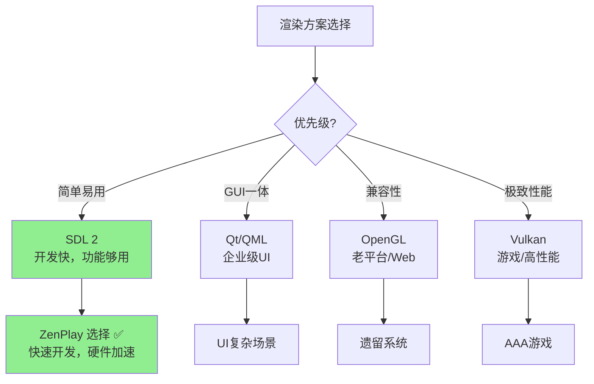
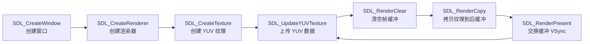

# 16. 跨平台渲染：SDL 让视频播放无处不在（上篇：理论 + 对比）

> 专栏导读：上一篇我们学习了 YUV 到 RGB 的颜色空间转换原理，解码器输出的 YUV 数据或转换后的 RGB 数据最终要显示到屏幕上，这就是**渲染**的任务。渲染可以自己基于 D3D11/Metal 等原生 API 实现，也可以使用跨平台开源库简化开发。本篇对比主流跨平台渲染方案（SDL、Qt、OpenGL、Vulkan），深入讲解 SDL2 的渲染架构、纹理管理和 YUV 支持，并结合 ZenPlay 的 `SDLRenderer` 代码实现细节。

---

## 🌍 开场：渲染的"方言"与"普通话"

想象你要在全球各地放映电影——

```
原生 API（方言）:
  Windows: Direct3D 11/12（微软专用）
  macOS:   Metal（苹果专用）
  Linux:   OpenGL/Vulkan（开源标准）
  
问题：每个平台一套代码，维护成本 3 倍！

跨平台方案（普通话）:
  SDL:    简单易用，自动适配底层 API
  Qt:     GUI + 渲染一体化
  OpenGL: 老牌跨平台图形标准
  Vulkan: 新一代高性能跨平台 API
```

**核心权衡**：易用性 vs 性能 vs 兼容性。

---

## 🔍 主流跨平台渲染方案对比

### 1. SDL (Simple DirectMedia Layer)

```
定位：轻量级多媒体库
支持平台：Windows/macOS/Linux/iOS/Android/Web (Emscripten)

优势：
  ✅ 极简 API，30 行代码实现视频播放
  ✅ 内置 YUV 纹理支持（硬件加速）
  ✅ 自动选择最优后端（D3D11/Metal/OpenGL）
  ✅ 零依赖，静态链接体积小（~2MB）

劣势：
  ❌ 功能有限，不支持复杂特效
  ❌ 渲染控制粗粒度（无法精细调优）
  ❌ 高级功能需自己实现（如 HDR/10-bit）

适用场景：
  - 视频播放器、简单游戏
  - 快速原型验证
  - 移动端/嵌入式设备
```

📊 配图 A：SDL 架构层次（AI 提示词）

- 中文提示词：
  - 白色背景，16:9 横版。分层架构图，从上到下：顶层"应用层 Application"（浅蓝色方块，标注"SDL_CreateTexture / SDL_RenderCopy"），中层"SDL 抽象层 SDL Abstraction"（绿色方块，标注"平台无关 API Platform-agnostic API"），底层分为三个并列方块："Windows D3D11"（红色）、"macOS Metal"（灰色）、"Linux OpenGL"（橙色）。用箭头从上到下连接，标注"自动选择 Auto-select"。
- English prompt:
  - White background, 16:9 landscape. Layered architecture diagram, top to bottom: top "应用层 Application" (light blue box, labeled "SDL_CreateTexture / SDL_RenderCopy"), middle "SDL 抽象层 SDL Abstraction" (green box, labeled "平台无关 API Platform-agnostic API"), bottom three parallel boxes: "Windows D3D11" (red), "macOS Metal" (gray), "Linux OpenGL" (orange). Arrows connect top-down, labeled "自动选择 Auto-select".

### 2. Qt (QML/Qt Quick)

```
定位：企业级 GUI 框架 + 渲染引擎
支持平台：Windows/macOS/Linux/iOS/Android/嵌入式

优势：
  ✅ GUI + 渲染一体化（界面控件 + 视频播放）
  ✅ QML 声明式 UI，动画和交互强大
  ✅ 成熟的商业支持和工具链
  ✅ 硬件加速（Qt RHI 自动适配 D3D/Metal/Vulkan）

劣势：
  ❌ 体积庞大（Qt 运行时 ~50MB+）
  ❌ 授权复杂（GPL/LGPL/商业版）
  ❌ 学习曲线陡峭（QML + C++ 双语言）
  ❌ 视频渲染需要集成 Qt Multimedia 或自定义

适用场景：
  - 桌面应用（带复杂 UI）
  - 工业控制、嵌入式设备界面
  - 需要跨平台 GUI 的企业软件
```

### 3. OpenGL (Open Graphics Library)

```
定位：老牌跨平台图形 API
支持平台：几乎所有平台（包括 Web/WebGL）

优势：
  ✅ 历史悠久，生态成熟（大量教程和库）
  ✅ 兼容性极好（包括老旧硬件）
  ✅ 完全控制渲染管线（Shader/纹理/缓冲）
  ✅ WebGL 可在浏览器运行

劣势：
  ❌ API 设计老旧（状态机模式，易出错）
  ❌ 性能不如现代 API（D3D12/Metal/Vulkan）
  ❌ macOS 已弃用（最高支持 OpenGL 4.1）
  ❌ 多线程支持差（上下文切换开销大）

适用场景：
  - 兼容老旧平台
  - Web 应用（WebGL）
  - 教学和原型开发
```

### 4. Vulkan

```
定位：下一代高性能跨平台图形 API
支持平台：Windows/Linux/Android/macOS (MoltenVK)

优势：
  ✅ 极致性能（低开销，接近裸机）
  ✅ 显式多线程（完美利用多核 CPU）
  ✅ 现代设计（显式同步，无隐藏状态）
  ✅ 开源标准，无授权费用

劣势：
  ❌ 复杂度极高（1000+ 行才能显示三角形）
  ❌ 学习曲线陡峭（需理解 GPU 工作原理）
  ❌ 调试困难（验证层性能开销大）
  ❌ macOS 支持有限（需通过 MoltenVK 翻译）

适用场景：
  - 游戏引擎（AAA 级游戏）
  - 高性能计算（GPU 计算）
  - 需要极致性能的专业应用
```

### 对比总结表



| 方案 | 易用性 | 性能 | 平台支持 | 体积 | 学习曲线 | 推荐场景 |
|------|--------|------|----------|------|----------|----------|
| **SDL** | ⭐⭐⭐⭐⭐ | ⭐⭐⭐⭐ | ⭐⭐⭐⭐⭐ | 2MB | 低 | 播放器/简单游戏 ✅ |
| **Qt** | ⭐⭐⭐ | ⭐⭐⭐⭐ | ⭐⭐⭐⭐⭐ | 50MB+ | 中 | 桌面应用 |
| **OpenGL** | ⭐⭐⭐ | ⭐⭐⭐ | ⭐⭐⭐⭐⭐ | - | 中 | Web/兼容老平台 |
| **Vulkan** | ⭐ | ⭐⭐⭐⭐⭐ | ⭐⭐⭐⭐ | - | 高 | 游戏引擎 |

---

## 🎮 SDL2 渲染架构深入

### 1. SDL 的渲染后端选择机制

```
SDL 启动时自动检测并选择最优后端：

Windows:
  1. Direct3D 11（默认，硬件加速）
  2. Direct3D 12（需手动启用）
  3. OpenGL（兼容模式）
  4. Software（软件渲染，最慢）

macOS:
  1. Metal（默认，硬件加速）
  2. OpenGL（已弃用，兼容模式）

Linux:
  1. OpenGL（默认）
  2. OpenGLES（嵌入式）
  3. Wayland（实验性）
  4. Software

可通过 SDL_HINT_RENDER_DRIVER 强制指定：
  SDL_SetHint(SDL_HINT_RENDER_DRIVER, "direct3d11");
```

### 2. SDL 纹理与 YUV 支持

```
SDL 的核心优势：原生 YUV 纹理支持

普通流程（YUV → RGB → 纹理）:
  解码器 → YUV Frame
         ↓ CPU 转换（慢！）
  RGB Frame → 上传到 GPU

SDL 流程（零拷贝）:
  解码器 → YUV Frame
         ↓ 直接上传（快！）
  YUV 纹理 → GPU 内部转 RGB

支持的 YUV 格式：
  SDL_PIXELFORMAT_IYUV   (YUV420P, 三平面)
  SDL_PIXELFORMAT_YV12   (YUV420P, V/U 交换)
  SDL_PIXELFORMAT_NV12   (YUV420SP, UV 交错)
  SDL_PIXELFORMAT_NV21   (YUV420SP, VU 交错)
```

📊 配图 B：SDL YUV 纹理流程对比（AI 提示词）

- 中文提示词：
  - 白色背景，16:9 横版。分为上下两条流程：上方"传统流程 Traditional"：YUV Frame（蓝色方块）→ CPU 转换（红色圆圈，标注"慢 Slow"）→ RGB Frame（绿色方块）→ 上传 GPU（箭头）→ 纹理。下方"SDL 流程 SDL"：YUV Frame（蓝色方块）→ 直接上传（绿色箭头，标注"快 Fast"）→ YUV 纹理 → GPU 内部转换（灰色圆圈，标注"硬件加速 HW Accelerated"）→ 显示。用大括号标注上方"多次拷贝 Multiple Copies"，下方"零拷贝 Zero Copy"。
- English prompt:
  - White background, 16:9 landscape. Two process flows top-bottom: top "传统流程 Traditional": YUV Frame (blue box) → CPU Convert (red circle, labeled "慢 Slow") → RGB Frame (green box) → Upload GPU (arrow) → Texture. Bottom "SDL 流程 SDL": YUV Frame (blue box) → Direct Upload (green arrow, labeled "快 Fast") → YUV Texture → GPU Internal Convert (gray circle, labeled "硬件加速 HW Accelerated") → Display. Large braces annotate top "多次拷贝 Multiple Copies", bottom "零拷贝 Zero Copy".

### 3. SDL 渲染管线



---

## 🛠️ ZenPlay 的 SDLRenderer 实现解析

### 1. 初始化流程（sdl_renderer.cpp）

```cpp
// src/view/sdl_renderer.cpp
bool SDLRenderer::Initialize(void* window_handle, int width, int height) {
    // 1. 从外部窗口句柄创建 SDL_Window
    window_ = SDL_CreateWindowFrom(window_handle);
    if (!window_) {
        LOG_ERROR("SDL_CreateWindowFrom failed: {}", SDL_GetError());
        return false;
    }
    
    // 2. 创建渲染器，启用硬件加速和 VSync
    renderer_ = SDL_CreateRenderer(
        window_,
        -1,  // 自动选择最优驱动
        SDL_RENDERER_ACCELERATED |  // 硬件加速
        SDL_RENDERER_PRESENTVSYNC   // 启用垂直同步
    );
    
    if (!renderer_) {
        LOG_ERROR("SDL_CreateRenderer failed: {}", SDL_GetError());
        return false;
    }
    
    // 3. 查询实际使用的渲染驱动
    SDL_RendererInfo info;
    SDL_GetRendererInfo(renderer_, &info);
    LOG_INFO("SDL Renderer initialized: driver={}, hw_accel={}", 
             info.name,
             (info.flags & SDL_RENDERER_ACCELERATED) != 0);
    
    // 输出示例（Windows）:
    // SDL Renderer initialized: driver=direct3d11, hw_accel=true
    
    return true;
}
```

**关键点**：
- `SDL_CreateWindowFrom`：从 Qt 窗口句柄创建 SDL 窗口（混合 UI）
- `SDL_RENDERER_ACCELERATED`：强制使用硬件加速（失败则初始化失败）
- `SDL_RENDERER_PRESENTVSYNC`：开启垂直同步，避免画面撕裂

### 2. 纹理创建与 YUV 格式适配

```cpp
bool SDLRenderer::CreateTexture(int width, int height, AVPixelFormat format) {
    // 销毁旧纹理
    if (texture_) {
        SDL_DestroyTexture(texture_);
        texture_ = nullptr;
    }
    
    // 将 FFmpeg 格式映射到 SDL 格式
    Uint32 sdl_format = MapPixelFormat(format);
    if (sdl_format == SDL_PIXELFORMAT_UNKNOWN) {
        LOG_ERROR("Unsupported pixel format: {}", av_get_pix_fmt_name(format));
        return false;
    }
    
    // 创建纹理（流式纹理，频繁更新）
    texture_ = SDL_CreateTexture(
        renderer_,
        sdl_format,
        SDL_TEXTUREACCESS_STREAMING,  // 流式访问（高频更新）
        width,
        height
    );
    
    if (!texture_) {
        LOG_ERROR("SDL_CreateTexture failed: {}", SDL_GetError());
        return false;
    }
    
    texture_width_ = width;
    texture_height_ = height;
    texture_format_ = format;
    
    LOG_INFO("SDL Texture created: {}x{}, format={}", 
             width, height, av_get_pix_fmt_name(format));
    
    return true;
}

// FFmpeg 格式到 SDL 格式的映射
Uint32 SDLRenderer::MapPixelFormat(AVPixelFormat format) {
    switch (format) {
        case AV_PIX_FMT_YUV420P:
        case AV_PIX_FMT_YUVJ420P:
            return SDL_PIXELFORMAT_IYUV;  // YUV420P
        
        case AV_PIX_FMT_NV12:
            return SDL_PIXELFORMAT_NV12;  // YUV420SP
        
        case AV_PIX_FMT_NV21:
            return SDL_PIXELFORMAT_NV21;
        
        case AV_PIX_FMT_YUYV422:
            return SDL_PIXELFORMAT_YUY2;
        
        case AV_PIX_FMT_UYVY422:
            return SDL_PIXELFORMAT_UYVY;
        
        default:
            return SDL_PIXELFORMAT_UNKNOWN;
    }
}
```

**关键点**：
- `SDL_TEXTUREACCESS_STREAMING`：优化频繁更新（每帧都更新）
- YUV 格式直接支持，无需 CPU 转换
- 不支持的格式返回 `UNKNOWN`，外部需要降级处理

### 3. 渲染循环（每帧调用）

```cpp
bool SDLRenderer::RenderFrame(const AVFrame* frame) {
    if (!texture_ || !renderer_) {
        return false;
    }
    
    // 1. 上传 YUV 数据到纹理（零拷贝路径）
    int ret = SDL_UpdateYUVTexture(
        texture_,
        nullptr,  // 更新整个纹理区域
        frame->data[0], frame->linesize[0],  // Y 平面
        frame->data[1], frame->linesize[1],  // U 平面
        frame->data[2], frame->linesize[2]   // V 平面
    );
    
    if (ret < 0) {
        LOG_ERROR("SDL_UpdateYUVTexture failed: {}", SDL_GetError());
        return false;
    }
    
    // 2. 清空后缓冲（黑色背景）
    SDL_SetRenderDrawColor(renderer_, 0, 0, 0, 255);
    SDL_RenderClear(renderer_);
    
    // 3. 计算保持宽高比的目标矩形（Letter-boxing）
    SDL_Rect dst_rect = CalculateAspectRatioRect(
        texture_width_, texture_height_,
        window_width_, window_height_
    );
    
    // 4. 拷贝纹理到后缓冲（GPU 操作）
    ret = SDL_RenderCopy(renderer_, texture_, nullptr, &dst_rect);
    if (ret < 0) {
        LOG_ERROR("SDL_RenderCopy failed: {}", SDL_GetError());
        return false;
    }
    
    // 5. 交换前后缓冲（VSync 等待）
    SDL_RenderPresent(renderer_);
    
    return true;
}

// 保持宽高比的矩形计算（黑边处理）
SDL_Rect SDLRenderer::CalculateAspectRatioRect(
    int src_w, int src_h,
    int dst_w, int dst_h) {
    
    float src_aspect = (float)src_w / src_h;
    float dst_aspect = (float)dst_w / dst_h;
    
    SDL_Rect rect;
    
    if (src_aspect > dst_aspect) {
        // 视频更宽，上下加黑边
        rect.w = dst_w;
        rect.h = (int)(dst_w / src_aspect);
        rect.x = 0;
        rect.y = (dst_h - rect.h) / 2;
    } else {
        // 视频更高，左右加黑边
        rect.w = (int)(dst_h * src_aspect);
        rect.h = dst_h;
        rect.x = (dst_w - rect.w) / 2;
        rect.y = 0;
    }
    
    return rect;
}
```

**关键点**：
- `SDL_UpdateYUVTexture`：直接上传三平面 YUV，GPU 内部转 RGB
- `SDL_RenderCopy`：GPU 操作，拉伸和混合
- `SDL_RenderPresent`：等待 VSync，交换前后缓冲
- Letter-boxing：保持宽高比，避免画面拉伸

### 4. 资源清理

```cpp
SDLRenderer::~SDLRenderer() {
    if (texture_) {
        SDL_DestroyTexture(texture_);
        texture_ = nullptr;
    }
    
    if (renderer_) {
        SDL_DestroyRenderer(renderer_);
        renderer_ = nullptr;
    }
    
    if (window_) {
        SDL_DestroyWindow(window_);
        window_ = nullptr;
    }
    
    LOG_INFO("SDLRenderer destroyed");
}
```

---

## 🧪 FFmpeg + SDL 命令实战

### 实验 1：用 ffplay 快速验证（ffplay 基于 SDL）

```bash
# ffplay 内部使用 SDL2 渲染
ffplay input.mp4

# 查看使用的渲染后端
ffplay -loglevel verbose input.mp4 2>&1 | grep -i "render"

# 输出示例（Windows）:
# [ffplay @ 0x...] Using render driver: direct3d11
```

### 实验 2：强制使用特定后端

```bash
# Windows: 强制使用 OpenGL（降级测试）
SDL_RENDER_DRIVER=opengl ffplay input.mp4

# 对比性能（D3D11 vs OpenGL）
# D3D11: 60 fps, CPU 5%
# OpenGL: 60 fps, CPU 8%（略高）
```

### 实验 3：YUV 格式兼容性测试

```bash
# 测试不同 YUV 格式的 SDL 支持
ffmpeg -i input.mp4 -pix_fmt yuv420p -f rawvideo - | ffplay -f rawvideo -pixel_format yuv420p -video_size 1920x1080 -
ffmpeg -i input.mp4 -pix_fmt nv12 -f rawvideo - | ffplay -f rawvideo -pixel_format nv12 -video_size 1920x1080 -
ffmpeg -i input.mp4 -pix_fmt nv21 -f rawvideo - | ffplay -f rawvideo -pixel_format nv21 -video_size 1920x1080 -

# SDL 原生支持这些格式，无需 CPU 转换
```

---

## 🧠 思考题

1. **为什么 SDL 在 Windows 上选择 D3D11 而不是 D3D12？**  
   <details>
   <summary>点击查看答案</summary>
   
   D3D11 更简单、兼容性更好（Windows 7+），而 D3D12 复杂度高、只支持 Windows 10+。对于 SDL 这种简化 API，D3D11 的易用性和兼容性更重要。D3D12 的性能优势在视频播放场景不明显（瓶颈在解码而非渲染）。
   </details>

2. **SDL 的 YUV 纹理是如何在 GPU 内部转 RGB 的？**  
   <details>
   <summary>点击查看答案</summary>
   
   SDL 内部为 YUV 格式创建多个平面纹理（Y/U/V），在 Pixel Shader 中采样三个纹理并应用 YUV→RGB 转换矩阵（BT.601/BT.709）。这一切对用户透明，只需调用 `SDL_UpdateYUVTexture` 即可。
   </details>

3. **为什么 ZenPlay 选择 SDL 而不是 Qt 的 QVideoWidget？**  
   <details>
   <summary>点击查看答案</summary>
   
   QVideoWidget 依赖 Qt Multimedia 后端（GStreamer/AVFoundation），集成复杂且性能不可控。SDL 更轻量、更灵活，可以直接对接 FFmpeg 解码输出，且跨平台性能一致。ZenPlay 只需要 Qt 做 UI，渲染用 SDL 更高效。
   </details>

---

## 📚 本篇总结

### 核心知识点

1. **跨平台方案对比**：
   - SDL：简单易用，硬件加速，体积小（2MB）
   - Qt：GUI 一体化，体积大（50MB+）
   - OpenGL：老牌标准，macOS 已弃用
   - Vulkan：极致性能，复杂度极高

2. **SDL 架构**：
   - 自动选择后端（D3D11/Metal/OpenGL）
   - 原生 YUV 纹理支持（零拷贝）
   - 双缓冲 + VSync 防撕裂

3. **ZenPlay SDLRenderer**：
   - `SDL_CreateWindowFrom`：混合 Qt 窗口
   - `SDL_UpdateYUVTexture`：直接上传 YUV
   - `SDL_RenderCopy`：GPU 拉伸和混合
   - Letter-boxing：保持宽高比

4. **性能优化**：
   - 硬件加速（`SDL_RENDERER_ACCELERATED`）
   - 流式纹理（`SDL_TEXTUREACCESS_STREAMING`）
   - VSync 同步（`SDL_RENDERER_PRESENTVSYNC`）

### 配图汇总

- 📊 SDL 架构层次（AI 提示词）
- 📊 SDL YUV 纹理流程对比（AI 提示词）
- 🔄 跨平台方案选择树（Mermaid）
- 🔄 SDL 渲染管线流程（Mermaid）

---

## 🚀 下一篇预告

**17. 零拷贝渲染：GPU 内存直通的黑科技**

将深入讲解：
- D3D11 零拷贝原理：硬解 → GPU 纹理
- SRV 池管理与纹理复用
- BindFlags 要求与格式兼容性
- 与 SDL 的性能对比（CPU 占用/延迟）
- ZenPlay 的 D3D11Renderer 实现细节

---

> 作者：ZenPlay 团队  
> 更新时间：2025-01-27  
> 专栏地址：[音视频开发入门专栏](../av_column_plan.md)  
> 上一篇：[15. 视频渲染基础：YUV 到 RGB 的颜色空间转换](15_video_rendering_yuv_to_rgb.md)  
> 下一篇：17. 零拷贝渲染：GPU 内存直通的黑科技
