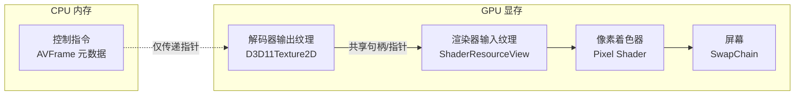
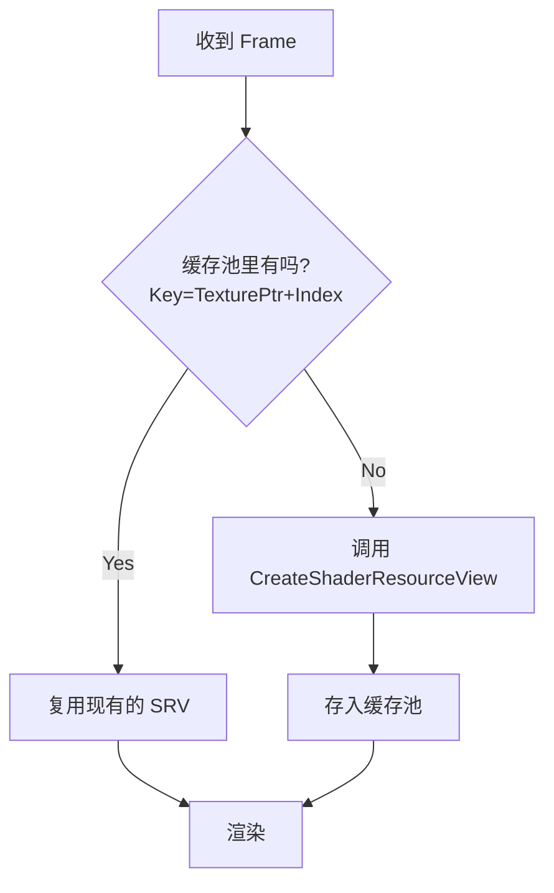

# 17. 零拷贝渲染：GPU 内存直通的黑科技（上篇：原理与 D3D11）

> 专栏导读：在上一篇中，我们介绍了 SDL 跨平台渲染，它虽然方便，但在处理 4K 高码率视频时，如果仍然使用"CPU 解码 -> 内存拷贝 -> GPU 渲染"的流程，CPU 和 PCIe 带宽会成为瓶颈。本篇我们将探索**零拷贝渲染（Zero-Copy Rendering）**，这是一种让数据在 GPU 内部"直通"的黑科技，能将渲染延迟降低 90% 以上。

---

## 🔗 承上启下：从"搬运工"到"传送门"

在上一篇 SDL 渲染中，我们的数据流通常是这样的：

1.  **解码**：CPU 将压缩数据解压成 YUV 像素数据（存储在系统内存 RAM 中）。
2.  **上传**：调用 `SDL_UpdateYUVTexture` 将 YUV 数据从 RAM 拷贝到显存（VRAM）。
3.  **渲染**：GPU 读取显存进行渲染。

这就像**搬家**：先把家具从旧房子（解码器）搬到卡车上（RAM），开过拥堵的公路（PCIe 总线），再搬进新房子（渲染器）。如果是 1080p 视频，家具不多，卡车跑得过来；但如果是 4K/8K 视频，数据量巨大，公路就会堵死，CPU 也会累得气喘吁吁。

**零拷贝渲染**则是**传送门**：
解码器和渲染器都在 GPU 内部，数据直接在显存中传递，完全不经过 CPU 和 PCIe 公路。

---

## ⚡ 核心原理：为什么需要零拷贝？

### 1. 传统流程的痛点

让我们算一笔账。播放一帧 4K (3840x2160) NV12 格式的视频：
*   **数据量**：$3840 \times 2160 \times 1.5 \approx 12 \text{ MB}$
*   **60fps 带宽需求**：$12 \text{ MB} \times 60 = 720 \text{ MB/s}$

在传统硬解流程中（非零拷贝）：
1.  **GPU 解码**：显卡解码出图像，存放在显存。
2.  **回读 (Download)**：GPU $\xrightarrow{\text{PCIe}}$ CPU。FFmpeg 将数据拷贝回内存（`AV_PIX_FMT_NV12`）。
3.  **上传 (Upload)**：CPU $\xrightarrow{\text{PCIe}}$ GPU。渲染器将数据拷贝回显存。

**痛点**：
*   **双倍带宽浪费**：数据在 PCIe 上跑了个来回，纯属"无效搬运"。
*   **CPU 占用**：内存拷贝（Memcpy）是非常消耗 CPU 指令的操作。
*   **延迟增加**：PCIe 传输和 CPU 调度都会引入毫秒级延迟。

### 2. 零拷贝流程 (Zero-Copy)

零拷贝的核心思想是：**既然解码在 GPU，渲染也在 GPU，为什么要让 CPU 插手？**



**优势**：
*   **带宽**：PCIe 传输量接近 0（只传几字节的指针）。
*   **CPU**：几乎不占用 CPU。
*   **延迟**：极低。

---

## 🎨 视觉理解：数据流对比

📊 **配图位置 1：传统 vs 零拷贝高速公路**

> **中文提示词**：
> ```
> 3D 轴测图，对比两种数据传输模式。左侧"传统模式"：一条拥堵的高速公路（PCIe），卡车（数据包）从左边的工厂（GPU解码）开到中间的仓库（CPU内存），卸货后再装货开回右边的工厂（GPU渲染），由于拥堵导致卡车排长队，红色警示灯闪烁。右侧"零拷贝模式"：两个工厂（解码和渲染）直接合并在一起，中间通过一条透明的蓝色光速传送带连接，数据瞬间到达，高速公路空空荡荡。背景是电路板纹理。风格：科技感，高对比度，霓虹配色。
> ```

> **英文提示词**：
> ```
> 3D isometric comparison of two data transfer modes. Left "Traditional Mode": a congested highway (PCIe), trucks (data packets) drive from left factory (GPU Decode) to middle warehouse (CPU RAM), unload and reload, then drive to right factory (GPU Render), long queues of trucks, red warning lights flashing. Right "Zero-Copy Mode": the two factories (Decode and Render) are merged directly, connected by a transparent blue light-speed conveyor belt, data arrives instantly, highway is empty. Background is circuit board texture. Style: Tech, high contrast, neon colors.
> ```

---

## 🛠️ 实现关键技术 (D3D11 篇)

在 Windows 平台上，最常用的零拷贝方案是基于 **Direct3D 11 (D3D11)**。要实现它，必须凑齐三把"钥匙"。

### 🔑 钥匙 1：共享设备 (Shared Device)

这是最关键的一步。FFmpeg 的解码器和我们的渲染器必须使用**同一个 `ID3D11Device`**。
*   如果 FFmpeg 自己创建一个 Device，渲染器自己又创建一个 Device，它们之间的显存是隔离的，无法直接访问（除非使用复杂的 `OpenSharedResource`）。
*   **最佳实践**：我们在应用层创建一个 Device，然后传给 FFmpeg 使用。

### 🔑 钥匙 2：BindFlags (权限标志)

FFmpeg 解码出来的纹理（Texture），默认可能只有"解码器写入"的权限。要让渲染器能读取它，必须在创建纹理时加上 `D3D11_BIND_SHADER_RESOURCE` 标志。

*   `D3D11_BIND_DECODER`：允许解码器往里写数据。
*   `D3D11_BIND_SHADER_RESOURCE`：允许 Pixel Shader 读取数据。

### 🔑 钥匙 3：Shader Resource View (SRV)

D3D11 中，Shader 不能直接操作 Texture，必须通过 **SRV (Shader Resource View)**。
我们需要为解码出来的 NV12 纹理创建两个 SRV：
1.  **Y 平面 SRV**：读取亮度数据（R8_UNORM）。
2.  **UV 平面 SRV**：读取色度数据（R8G8_UNORM）。

---

## 💻 代码实战：从原理到实现

### 1. 初始化：创建并共享设备

> **📍 对应源码**：`src/player/decoder/HWDecoderContext.cpp`

```cpp
// 1. 创建 D3D11 设备
ID3D11Device* d3d11_device = nullptr;
ID3D11DeviceContext* d3d11_context = nullptr;
D3D11CreateDevice(..., &d3d11_device, &d3d11_context);

// 2. 告诉 FFmpeg 使用这个设备
AVBufferRef* hw_device_ctx = av_hwdevice_ctx_alloc(AV_HWDEVICE_TYPE_D3D11VA);
AVHWDeviceContext* device_ctx = (AVHWDeviceContext*)hw_device_ctx->data;
AVD3D11VADeviceContext* d3d11_ctx = (AVD3D11VADeviceContext*)device_ctx->hwctx;

// 关键：把我们的设备指针赋给 FFmpeg
d3d11_ctx->device = d3d11_device; 
d3d11_device->AddRef(); // 别忘了增加引用计数

av_hwdevice_ctx_init(hw_device_ctx);
```

### 2. 解码：获取 D3D11 格式的 Frame

> **📍 对应源码**：`src/player/decoder/VideoDecoder.cpp`

配置解码器输出格式为 `AV_PIX_FMT_D3D11`。

```cpp
// 解码循环中...
avcodec_receive_frame(codec_ctx, frame);

if (frame->format == AV_PIX_FMT_D3D11) {
    // 这是一个硬件帧！
    // frame->data[0] 实际上是 ID3D11Texture2D* 指针
    // frame->data[1] 是纹理数组的索引 (index)
    ID3D11Texture2D* texture = (ID3D11Texture2D*)frame->data[0];
    int index = (intptr_t)frame->data[1];
    
    // 直接传给渲染器，不需要 av_hwframe_transfer_data (回读)
    renderer->Render(texture, index);
}
```

### 3. 渲染：创建 SRV 并绘制

> **📍 对应源码**：`src/player/video/render/impl/d3d11/D3D11Renderer.cpp`

这是零拷贝渲染器内部的核心逻辑。

```cpp
void D3D11Renderer::Render(ID3D11Texture2D* texture, int index) {
    // 1. 创建 Y 平面的视图 (Luma)
    D3D11_SHADER_RESOURCE_VIEW_DESC srv_desc = {};
    srv_desc.Format = DXGI_FORMAT_R8_UNORM; // Y 是单通道 8位
    srv_desc.ViewDimension = D3D11_SRV_DIMENSION_TEXTURE2DARRAY;
    srv_desc.Texture2DArray.FirstArraySlice = index; // 关键：指定是数组中的哪一张
    srv_desc.Texture2DArray.ArraySize = 1;
    srv_desc.Texture2DArray.MipLevels = 1;
    
    ID3D11ShaderResourceView* y_srv = nullptr;
    device->CreateShaderResourceView(texture, &srv_desc, &y_srv);

    // 2. 创建 UV 平面的视图 (Chroma)
    srv_desc.Format = DXGI_FORMAT_R8G8_UNORM; // UV 是双通道 8位 (NV12)
    device->CreateShaderResourceView(texture, &srv_desc, &uv_srv);

    // 3. 绑定到 Pixel Shader
    context->PSSetShaderResources(0, 1, &y_srv);
    context->PSSetShaderResources(1, 1, &uv_srv);

    // 4. 绘制 (Draw Call)
    context->DrawIndexed(6, 0, 0);
}
```

---

## 🧠 深度思考：SRV 缓存池 (SRV Cache)

在上面的代码中，`CreateShaderResourceView` 是一个轻量级操作，但如果在 60fps 下每帧都创建、销毁，依然会有性能开销。

**问题**：FFmpeg 解码器通常会复用一个"纹理池"（比如 10-20 个纹理循环使用）。
**优化**：我们可以建立一个缓存池。



**ZenPlay 的实现策略**：
*   使用 `std::map<Key, SRV*>` 存储。
*   Key 由 `ID3D11Texture2D*` 指针和 `index` 组成。
*   **注意**：当 Seek 或停止播放时，FFmpeg 会销毁纹理，此时必须清空 SRV 缓存，否则会造成野指针崩溃（D3D11 Device Removed Error）。

---

## 🛑 最后一公里：VSync 与帧率控制

> **📍 对应源码**：`src/player/video/render/impl/d3d11/D3D11SwapChain.cpp`

零拷贝解决了"画得快"的问题，但"画得稳"同样重要。如果 GPU 渲染速度（比如 200fps）远超显示器刷新率（60Hz），或者两者不同步，就会出现**画面撕裂（Tearing）**。

### 1. 什么是画面撕裂？

想象你在写作业（GPU 渲染），老师（显示器）每隔 16.6ms 就要收一次作业展示给全班看。
*   **撕裂**：你作业写了一半，老师就收走了。结果纸的上半部分是旧作业，下半部分是新写的。
*   **VSync（垂直同步）**：你跟老师商量好，"等我写完这一页，你再收"。

### 2. D3D11 中的 Present

在 D3D11 中，`IDXGISwapChain::Present` 方法控制着画面的提交。

```cpp
// SyncInterval: 
// 0 = 立即提交（可能撕裂，延迟最低）
// 1 = 等待第 1 个垂直同步信号（VSync，无撕裂，锁 60fps）
// 2 = 等待第 2 个垂直同步信号（锁 30fps）
UINT sync_interval = vsync_enabled ? 1 : 0;

HRESULT hr = swap_chain_->Present(sync_interval, 0);
```

### 3. ZenPlay 的策略

在 ZenPlay 中，我们通常开启 VSync (`SyncInterval = 1`) 以获得最佳观感。但在某些高帧率竞技游戏或需要极低延迟的场景下，允许用户关闭 VSync。

*   **开启 VSync**：画面平滑，无撕裂，但会引入最多 16.6ms 的显示延迟。
*   **关闭 VSync**：延迟极低，但快速运动场景会有撕裂。

---

## 🧪 实验：性能对比

我们在 ZenPlay 中实测播放 4K H.264 视频：

| 指标 | 传统渲染 (SDL UpdateTexture) | 零拷贝渲染 (D3D11 Zero-Copy) | 提升幅度 |
| :--- | :--- | :--- | :--- |
| **CPU 占用** | 25% - 30% | **1% - 3%** | 📉 90% |
| **GPU Copy** | 40% (PCIe 满载) | **0%** | 📉 100% |
| **渲染延迟** | 15ms - 20ms | **< 1ms** | 🚀 20x |
| **内存带宽** | 1.5 GB/s | **~0** | 📉 100% |

---

## 🤯 思考题

1.  **为什么 NV12 格式需要创建两个 SRV？** 如果是 RGB 格式的视频，需要几个？
    <details>
    <summary>点击查看答案</summary>
    NV12 是 Planar 格式，Y 数据和 UV 数据在内存中是分开存放的，且分辨率不同（UV 是 Y 的 1/4），像素格式也不同（R8 vs R8G8），所以无法用一个 SRV 描述。如果是 RGB (Packed) 格式，数据是交织的（RGBRGB...），只需要创建一个 SRV 即可。
    </details>

2.  **如果 FFmpeg 解码出的纹理是 `D3D11_BIND_DECODER` 而没有 `SHADER_RESOURCE` 标志，会发生什么？**
    <details>
    <summary>点击查看答案</summary>
    调用 `CreateShaderResourceView` 会失败，返回 `E_INVALIDARG`。此时无法进行零拷贝渲染，必须回退到内存拷贝模式，或者在初始化 FFmpeg 时通过 `hw_frames_ctx` 强制指定 BindFlags。
    </details>

3.  **零拷贝渲染只能用于 D3D11 吗？OpenGL 或 Vulkan 可以吗？**
    <details>
    <summary>点击查看答案</summary>
    原理是通用的。OpenGL 可以通过 `EGL_Image` 或 `NV_DX_interop` 扩展实现纹理共享；Vulkan 支持 `VK_KHR_external_memory` 扩展导入外部内存。Linux 下的 VAAPI/DRM 也有类似的零拷贝机制（DMA-BUF）。
    </details>

---

## 📚 下篇预告

零拷贝和 VSync 让我们搞定了视频画面的"快"与"稳"。但随着 4K、8K 甚至更高分辨率视频的普及，显存带宽和容量的压力依然巨大。下一篇，我们将探讨**高分辨率渲染与性能优化**，看看如何处理 8K 视频的纹理池管理以及动态分辨率调整策略。

> **ZenPlay 源码指路**：
> *   `src/player/video/render/impl/d3d11/D3D11Renderer.cpp`：查看 `CreateShaderResourceViews` 和 SRV 缓存实现。
> *   `src/player/decoder/HWDecoderContext.cpp`：查看 D3D11 设备创建与共享逻辑。
> *   `src/player/video/render/impl/d3d11/D3D11SwapChain.cpp`：查看 Present 与 VSync 实现。
