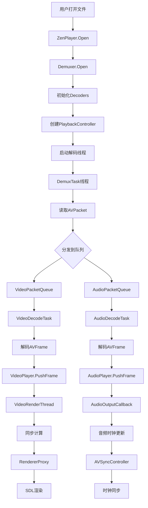

# 🏗️ ZenPlay媒体播放器架构设计文档

## 📋 **项目概述**

ZenPlay是一个基于C++17的跨平台多媒体播放器，采用现代化的分层架构设计，支持音视频播放和精确的音视频同步。

### 技术栈
- **语言**: C++17
- **UI框架**: Qt6 (Core, Widgets, Gui)
- **多媒体**: FFmpeg (avutil, avcodec, avformat, avfilter, swscale, swresample)
- **音频输出**: WASAPI (Windows), ALSA (Linux)
- **视频渲染**: SDL2 (硬件加速)
- **线程框架**: Loki (自定义任务调度系统)
- **日志**: spdlog
- **JSON**: nlohmann_json

---

## 🏛️ **整体架构**

### 架构分层

```
┌─────────────────────────────────────────────────────────────┐
│                     UI Layer (Qt6)                         │
│                  MainWindow + VideoDisplayWidget           │
├─────────────────────────────────────────────────────────────┤
│                 Application Layer                           │
│                      ZenPlayer                              │
├─────────────────────────────────────────────────────────────┤
│                     Core Layer                              │
│  ┌─────────────────┐ ┌──────────────┐ ┌─────────────────┐   │
│  │ PlaybackController│ │AVSyncController│ │ThreadSafeQueues│   │
│  └─────────────────┘ └──────────────┘ └─────────────────┘   │
├─────────────────────────────────────────────────────────────┤
│                   Component Layer                           │
│  ┌─────────────┐ ┌─────────────┐ ┌──────────────────────┐   │
│  │AudioPlayer  │ │VideoPlayer  │ │  Media Processing    │   │
│  │             │ │             │ │ Demuxer,Decoders    │   │
│  └─────────────┘ └─────────────┘ └──────────────────────┘   │
├─────────────────────────────────────────────────────────────┤
│                    Platform Layer                           │
│  ┌─────────────┐ ┌─────────────┐ ┌─────────────────────┐    │
│  │AudioOutput  │ │ Renderer    │ │     Threading       │    │
│  │WASAPI/ALSA  │ │SDL2/OpenGL  │ │   Loki + std::thread│    │
│  └─────────────┘ └─────────────┘ └─────────────────────┘    │
└─────────────────────────────────────────────────────────────┘
```

---

## 🧩 **核心组件详解**

### 1. **ZenPlayer (应用层主入口)**
```cpp
class ZenPlayer {
    // 职责：统一的播放器接口，生命周期管理
    ├── Open(url) → 打开媒体文件
    ├── Play/Pause/Stop → 播放控制
    ├── SetRenderWindow() → 设置渲染窗口
    └── Seek() → 播放位置跳转
}
```

**组件关系**：
- 拥有: Demuxer, VideoDecoder, AudioDecoder, Renderer
- 创建和管理: PlaybackController
- 生命周期: 整个播放会话

### 2. **PlaybackController (核心协调器)**
```cpp
class PlaybackController {
    // 职责：统一协调音视频播放和同步
    ├── 线程管理: DemuxTask, VideoDecodeTask, AudioDecodeTask, SyncControlTask
    ├── 数据流: ThreadSafeQueue<AVPacket*> 
    ├── 播放器协调: AudioPlayer, VideoPlayer
    └── 同步控制: AVSyncController
}
```

**线程架构**：
```
PlaybackController
├── DemuxTask (std::thread) → 解封装循环
├── VideoDecodeTask (std::thread) → 视频解码循环  
├── AudioDecodeTask (std::thread) → 音频解码循环
└── SyncControlTask (std::thread) → 同步监控循环
```

### 3. **音频子系统**
```cpp
AudioPlayer {
    ├── 音频队列管理 → ThreadSafeQueue<AVFrame>
    ├── 格式转换 → SwrContext (重采样)
    ├── 跨平台输出 → AudioOutput接口
    └── 时钟更新 → AVSyncController
}

AudioOutput接口 {
    ├── WasapiAudioOutput (Windows) → WASAPI低延迟播放
    └── AlsaAudioOutput (Linux) → ALSA兼容性播放
}
```

### 4. **视频子系统**
```cpp
VideoPlayer {
    ├── 视频队列管理 → ThreadSafeQueue<VideoFrame>
    ├── 同步计算 → CalculateFrameDisplayTime()
    ├── 丢帧策略 → ShouldDropFrame()
    ├── 渲染调度 → VideoRenderThread
    └── 时钟更新 → AVSyncController
}

Renderer接口 {
    └── SDLRenderer → SDL2硬件加速渲染
}

RendererProxy → 线程安全渲染代理
```

### 5. **音视频同步系统**
```cpp
AVSyncController {
    ├── 时钟管理: AudioClock, VideoClock, SystemClock
    ├── 同步策略: AUDIO_MASTER (推荐)
    ├── 偏移计算: CalculateVideoDelay()
    ├── 同步统计: SyncStats
    └── 质量监控: is_in_sync(), sync_quality()
}
```

---

## 🔄 **数据流和处理流程**

### 媒体播放完整流程



### 线程模型详解

```
┌─────────────────┐    ┌──────────────────┐    ┌─────────────────┐
│   UI Thread     │    │  Worker Threads  │    │ Loki Task Pool  │
│   (loki::UI)    │    │  (std::thread)   │    │ (IO/NET/DB)    │
├─────────────────┤    ├──────────────────┤    ├─────────────────┤
│ • UI更新        │    │ • DemuxTask      │    │ • 异步IO       │
│ • 用户交互      │    │ • VideoDecodeTask│    │ • 网络请求     │
│ • 渲染调度      │◄─► │ • AudioDecodeTask│◄─► │ • 文件操作     │
│ • 状态通知      │    │ • SyncControlTask│    │ • 短任务       │
│ • RendererProxy │    │ • VideoRenderThread│   │ • 定时任务     │
└─────────────────┘    │ • AudioCallback  │    └─────────────────┘
                       └──────────────────┘
```

### 音视频同步流程

```
时间轴: ───────────────────────────────────────→

音频: ♪──♪──♪──♪──♪──♪──♪──♪──♪──♪──♪ (主时钟)
       │  │  │  │  │  │  │  │  │  │  │
       ▼  ▼  ▼  ▼  ▼  ▼  ▼  ▼  ▼  ▼  ▼
同步: 计算同步偏移 → 调整视频显示时间
       ▲  ▲  ▲  ▲  ▲  ▲  ▲  ▲  ▲  ▲  ▲
       │  │  │  │  │  │  │  │  │  │  │
视频: 🎬─🎬─🎬─🎬─🎬─🎬─🎬─🎬─🎬─🎬─🎬
     (跟随音频时钟，丢帧/等待调整)
```

---

## 📊 **核心类职责矩阵**

| 类名 | 主要职责 | 依赖关系 | 线程模型 |
|------|---------|----------|----------|
| **ZenPlayer** | 统一播放接口，生命周期管理 | 拥有所有组件 | UI线程 |
| **PlaybackController** | 协调所有播放线程和组件 | 管理所有播放器组件 | 多线程管理器 |
| **AudioPlayer** | 音频播放和格式转换 | AVSyncController, AudioOutput | 内部线程+回调 |
| **VideoPlayer** | 视频渲染和帧时序 | AVSyncController, Renderer | 内部渲染线程 |
| **AVSyncController** | 音视频时钟同步 | 被音视频播放器使用 | 线程安全 |
| **Demuxer** | 媒体解封装 | FFmpeg | DemuxTask线程 |
| **VideoDecoder** | 视频解码 | FFmpeg | VideoDecodeTask线程 |
| **AudioDecoder** | 音频解码 | FFmpeg | AudioDecodeTask线程 |
| **AudioOutput** | 跨平台音频输出 | 系统音频API | 音频设备回调线程 |
| **Renderer** | 跨平台视频渲染 | SDL2/OpenGL | UI线程(通过RendererProxy) |
| **RendererProxy** | 线程安全渲染代理 | Loki线程框架 | 跨线程调度 |

---

## ⚠️ **架构问题分析与改进建议**

### 🔍 **发现的问题**

#### 1. **线程架构混合问题** ⚠️
```cpp
// 问题：混合使用std::thread和Loki线程系统
PlaybackController {
    std::thread demux_thread_;      // ✅ 正确：长期运行
    std::thread decode_threads_;    // ✅ 正确：持续处理
}

// 但是：
RendererProxy → loki::UI           // ✅ 正确：UI任务调度
某些短任务可能错误使用std::thread    // ❌ 应该用Loki
```

#### 2. **UI层与播放器层耦合** ⚠️
```cpp
// 问题：MainWindow直接使用VideoPlayer
MainWindow {
    std::unique_ptr<VideoPlayer> player_;  // ❌ 应该使用ZenPlayer
}

// 应该是：
MainWindow {
    std::unique_ptr<ZenPlayer> player_;    // ✅ 正确的抽象层次
}
```

#### 3. **错误处理不统一** ⚠️
- 有些组件使用bool返回值
- 有些使用异常
- 缺乏统一的错误处理策略

#### 4. **资源管理可能存在问题** ⚠️
```cpp
// 潜在问题：AVFrame/AVPacket的生命周期管理
AVFramePtr frame(...);  // 需要确保正确的deleter
AVPacket* packet;       // 需要确保av_packet_free调用
```

### 🔧 **改进建议**

#### 1. **统一UI层接口**
```cpp
// 修改前
class MainWindow {
    std::unique_ptr<VideoPlayer> player_;  // ❌
};

// 修改后
class MainWindow {
    std::unique_ptr<ZenPlayer> player_;    // ✅
};
```

#### 2. **完善错误处理系统**
```cpp
// 建议：统一错误处理机制
enum class PlayerError {
    None,
    FileNotFound,
    CodecNotSupported,
    AudioDeviceError,
    MemoryError
};

class Result<T> {
    PlayerError error;
    T value;
};
```

#### 3. **优化线程使用策略**
```cpp
// 明确线程使用原则：
// ✅ std::thread: 长期运行的数据处理循环
// ✅ loki::PostTask: 短任务和UI更新
// ✅ 音频回调: 系统管理的实时线程
```

#### 4. **增强同步监控**
```cpp
// 建议：添加更详细的性能监控
struct DetailedStats {
    // 队列监控
    size_t video_queue_depth;
    size_t audio_queue_depth;
    
    // 性能监控
    double decode_fps;
    double render_fps;
    double cpu_usage;
    
    // 同步质量
    double avg_sync_error;
    int64_t sync_corrections;
};
```

#### 5. **配置系统**
```cpp
// 建议：添加可配置参数
struct PlayerConfig {
    // 音频配置
    int audio_buffer_size = 1024;
    int target_sample_rate = 44100;
    
    // 视频配置  
    bool enable_hardware_decode = true;
    int max_frame_queue_size = 30;
    
    // 同步配置
    double sync_threshold_ms = 40.0;
    bool enable_frame_drop = true;
};
```

---

## 🎯 **架构优势**

### ✅ **设计亮点**
1. **清晰的职责分离** - 每个组件职责明确
2. **对称的音视频架构** - AudioPlayer和VideoPlayer地位平等
3. **精确的同步系统** - 专业级AVSyncController
4. **线程安全设计** - ThreadSafeQueue和RendererProxy
5. **跨平台抽象** - AudioOutput和Renderer接口
6. **现代C++特性** - 智能指针、RAII、原子操作

### 🚀 **扩展性**
- 支持新的音频/视频格式 (通过FFmpeg)
- 支持新的平台 (通过AudioOutput/Renderer接口)
- 支持插件系统 (通过抽象接口)
- 支持网络流媒体 (Demuxer已支持)

---

## 📈 **性能特性**

### 🔥 **高性能设计**
1. **多线程并行处理** - 解封装、解码、渲染并行
2. **硬件加速渲染** - SDL2 + OpenGL/D3D
3. **低延迟音频** - WASAPI独占模式支持
4. **智能缓冲管理** - 动态队列大小控制
5. **自适应丢帧** - 保持同步性能

### 📊 **内存管理**
- RAII资源管理
- 智能指针自动释放
- 循环缓冲区复用
- 及时释放解码帧

---

## 🛡️ **稳定性保证**

### 🔒 **线程安全**
- 所有队列使用mutex保护
- 原子操作控制状态
- RendererProxy确保UI线程渲染
- AVSyncController内部同步

### 🚨 **错误恢复**
- 解码失败自动跳过帧
- 音频设备断开重连
- 网络中断自动重试
- 内存不足优雅降级

这个架构设计在保持高性能的同时，确保了良好的可维护性和扩展性，是一个现代化的多媒体播放器架构！🎉
